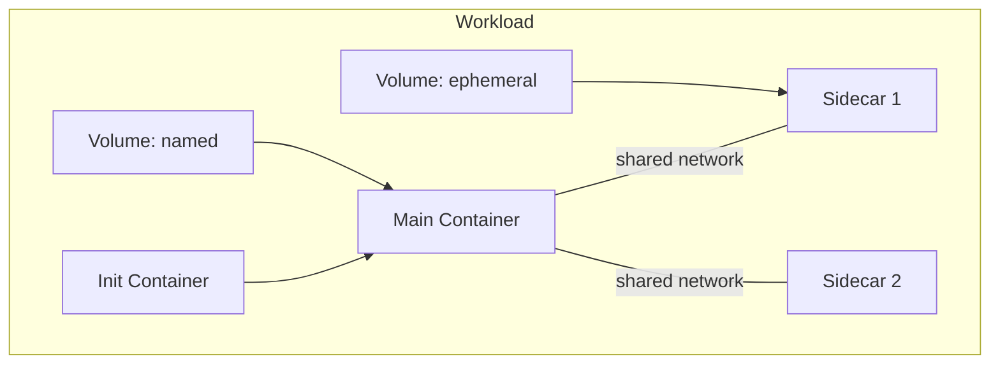

# Runner

## Overview

The Runner executes workloads (agent containers, workspace containers, sidecars). It is a **data plane** service — it does not decide what to run, it executes what it is told.

The current implementation is the [`k8s-runner`](k8s-runner.md), which translates workload operations into Kubernetes API calls.

## gRPC API

Defined in `agynio/api` at `proto/agynio/api/runner/v1/runner.proto`.

### Workload Lifecycle

| RPC | Description |
|-----|-------------|
| `StartWorkload` | Start a workload. The spec includes labels with the Orchestrator-generated `workload_key` and per-volume `volume_key`s. Returns a runner-assigned `instance_id` |
| `StopWorkload` | Stop a running workload |
| `RemoveWorkload` | Remove a workload and optionally its volumes |
| `InspectWorkload` | Inspect workload state (id, image, labels, mounts, status) |
| `TouchWorkload` | Update last-used timestamp (TTL keepalive) |

### Query

| RPC | Description |
|-----|-------------|
| `ListWorkloads` | List all workloads on this runner. Returns `instance_id` and `workload_key` label (set from the spec at start time) for each |
| `GetWorkloadLabels` | Get labels for a workload |
| `FindWorkloadsByLabels` | Find workloads matching a label set |
| `ListWorkloadsByVolume` | List workloads using a specific volume |

### Execution

| RPC | Description |
|-----|-------------|
| `Exec` | Bidirectional streaming exec |
| `CancelExecution` | Cancel a running execution |

Exec supports:
- Interactive (TTY) and non-interactive modes.
- Wall timeout, idle timeout, kill-on-timeout.
- Stdin streaming, stdout/stderr separation.
- Exit code and reason (completed, timeout, idle_timeout, cancelled, error).

### Streaming

| RPC | Description |
|-----|-------------|
| `StreamWorkloadLogs` | Server-streaming log output for a specific container in a workload, addressed by `container_name` (unique within the workload, stable across restarts — matches the Pod container name in Kubernetes). Accepts `tail_lines`, `since_time`, and `follow` parameters — snapshot and follow modes are the same RPC, identical to `kubectl logs` semantics. Returns `NotFound` for unknown workload or container; closes cleanly (OK) when logs are exhausted or the container terminates with the Pod still present; returns `Unavailable` if the Pod is deleted mid-stream. Logs are only available while the container exists on the runner (no external persistence) |
| `StreamEvents` | Server-streaming runtime events |

### Storage

| RPC | Description |
|-----|-------------|
| `PutArchive` | Upload a tar archive into a workload filesystem |
| `ListVolumes` | List all persistent volumes on this runner. Returns `instance_id` and `volume_key` label (set on the PVC at creation time) for each |
| `RemoveVolume` | Remove a named volume |

## Workload Model

A workload consists of:
- **Init containers** — run before the main container to populate shared volumes.
- **Main container** — the primary process.
- **Sidecars** — optional containers sharing the same network namespace.
- **Volumes** — ephemeral or named (persistent), mounted into containers.
- **Image pull credentials** — optional registry credentials for pulling container images from private registries. The Runner receives resolved credentials (registry, username, password) from the Orchestrator.
- **Inline files** — small files materialized into specific paths inside listed containers. See [Inline Files](#inline-files).

## Inline Files

`StartWorkloadRequest.inline_files` carries small files that must be materialized into the workload pod by the Runner. Each entry maps an absolute container path to the file's bytes; the Runner creates the underlying storage primitive (per-pod Kubernetes Secret or projected volume) and mounts it read-only at the requested path in every container that lists the path in its spec.

| Aspect | Detail |
|---|---|
| Key | Absolute path inside the container (e.g., `/etc/agyn/egress-ca/ca.crt`) |
| Value | File contents (bytes) |
| Per-container or pod-wide | Per-container — each container's spec references which inline files it mounts |
| Mount mode | Read-only |
| Size limit | Few KB per file (the entire `StartWorkloadRequest` is constrained by gRPC message-size limits and downstream K8s manifest size; the platform uses inline files only for small config like CA certs) |

Primary use: distributing the platform's [Egress CA](egress-gateway.md#egress-ca) public certificate to agent pods uniformly across in-cluster and external runners. See [Agents Orchestrator — Egress CA Distribution](agents-orchestrator.md#egress-ca-distribution).

Workload-namespace egress restrictions (blocking cluster-internal addresses while permitting the OpenZiti overlay and public-internet egress) are out of scope for the workload spec — they are installed alongside the runner deployment as static infrastructure. See [k8s-runner — Workload Egress NetworkPolicy](k8s-runner.md#workload-egress-networkpolicy).

## Authentication

All runners use the same provisioning model: register via Terraform provider or CLI, receive a service token, enroll on startup. There is no internal/external distinction — the protocol is uniform regardless of where the runner is deployed.

The Runner embeds the [OpenZiti Go SDK](https://github.com/openziti/sdk-golang) and binds its per-runner OpenZiti service (`runner-{runnerId}`). The Agents Orchestrator dials runners by service name via OpenZiti — `zitiContext.Dial("runner-{runnerId}")`. See [Authentication — SDK Embedding](authn.md#sdk-embedding).

On startup, the runner calls `EnrollRunner` with its service token. The Runners service validates the token, creates an OpenZiti identity via [Ziti Management](openziti.md) `CreateRunnerIdentity` (which deletes any previous identity for this runner first), and returns the enrolled identity (certificate + key) along with the service name. The runner writes the identity to disk, loads it via the OpenZiti SDK, and binds its service. See [OpenZiti Integration — Runner Provisioning](openziti.md#runner-provisioning) and [Runners — Enrollment](runners.md#enrollment).

The service token is long-lived and reusable. If the runner restarts, it re-enrolls with the same token and receives a new OpenZiti identity. The previous identity is deleted by Ziti Management as part of `CreateRunnerIdentity` before creating the new one.

The Runner does not manage OpenZiti identities for agents. It receives the enrollment JWT from the Orchestrator as opaque configuration and passes it to the agent pod's Ziti sidecar container. Identity creation and deletion are managed by the Agents Orchestrator via the Ziti Management service. See [OpenZiti Integration](openziti.md).
