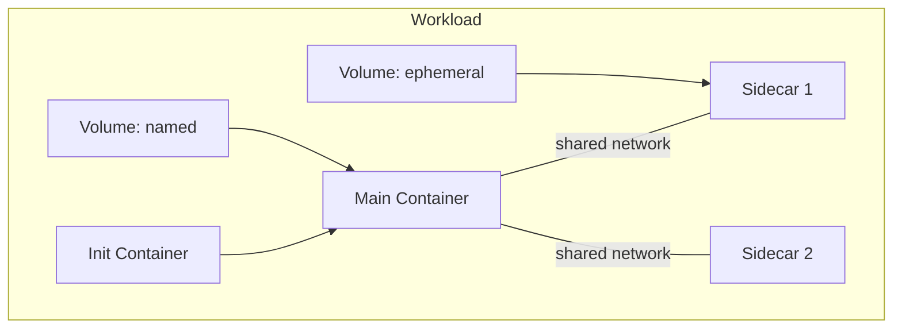

# Runner

## Overview

The Runner executes workloads (agent containers, workspace containers, sidecars). It is a **data plane** service — it does not decide what to run, it executes what it is told.

The current implementation is the [`k8s-runner`](k8s-runner.md), which translates workload operations into Kubernetes API calls.

## gRPC API

Defined in `agynio/api` at `proto/agynio/api/runner/v1/runner.proto`.

### Workload Lifecycle

| RPC | Description |
|-----|-------------|
| `StartWorkload` | Start a workload (init containers + main container + optional sidecars with shared network) |
| `StopWorkload` | Stop a running workload |
| `RemoveWorkload` | Remove a workload and optionally its volumes |
| `InspectWorkload` | Inspect workload state (id, image, labels, mounts, status) |
| `TouchWorkload` | Update last-used timestamp (TTL keepalive) |

### Query

| RPC | Description |
|-----|-------------|
| `GetWorkloadLabels` | Get labels for a workload |
| `FindWorkloadsByLabels` | Find workloads matching a label set |
| `ListWorkloadsByVolume` | List workloads using a specific volume |

### Execution

| RPC | Description |
|-----|-------------|
| `Exec` | Bidirectional streaming exec |
| `CancelExecution` | Cancel a running execution |

Exec supports:
- Interactive (TTY) and non-interactive modes.
- Wall timeout, idle timeout, kill-on-timeout.
- Stdin streaming, stdout/stderr separation.
- Exit code and reason (completed, timeout, idle_timeout, cancelled, error).

### Streaming

| RPC | Description |
|-----|-------------|
| `StreamWorkloadLogs` | Server-streaming log output (follow mode) |
| `StreamEvents` | Server-streaming runtime events |

### Storage

| RPC | Description |
|-----|-------------|
| `PutArchive` | Upload a tar archive into a workload filesystem |
| `RemoveVolume` | Remove a named volume |

## Workload Model

A workload consists of:
- **Init containers** — run before the main container to populate shared volumes.
- **Main container** — the primary process.
- **Sidecars** — optional containers sharing the same network namespace.
- **Volumes** — ephemeral or named (persistent), mounted into containers.

## Authentication

All runners use the same provisioning model: register via Terraform provider or CLI, receive a service token, enroll on startup. There is no internal/external distinction — the protocol is uniform regardless of where the runner is deployed.

The Runner embeds the [OpenZiti Go SDK](https://github.com/openziti/sdk-golang) and binds its per-runner OpenZiti service (`runner-{runnerId}`). The Agents Orchestrator dials runners by service name via OpenZiti — `zitiContext.Dial("runner-{runnerId}")`. See [Authentication — SDK Embedding](authn.md#sdk-embedding).

On startup, the runner presents its service token to the platform enrollment endpoint, which validates the token, creates an OpenZiti identity via [Ziti Management](openziti.md), and returns the enrolled identity (certificate + key) along with the service name. The runner writes the identity to disk, loads it via the OpenZiti SDK, and binds its service. See [OpenZiti Integration — Runner Provisioning](openziti.md#runner-provisioning) and [Runners — Enrollment](runners.md#enrollment).

The service token is long-lived and reusable. If the runner restarts, it re-enrolls with the same token and receives a new OpenZiti identity. The previous identity is cleaned up by Ziti Management lease GC.

The Runner does not manage OpenZiti identities for agents. It receives the enrollment JWT from the Orchestrator as opaque configuration and passes it to the agent pod's Ziti sidecar container. Identity creation and deletion are managed by the Agents Orchestrator via the Ziti Management service. See [OpenZiti Integration](openziti.md).
