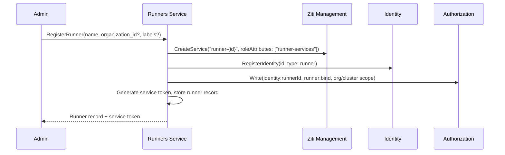

# Runners

## Overview

The Runners service manages runner registrations and workload runtime state. It is the central registry for:

1. **Runners** — registered runner instances (cluster-scoped and org-scoped), their enrollment state, and metadata.
2. **Workloads** — the runtime state of workloads running on registered runners. Which workloads are running, on which runner, with which containers.

The [Agents Orchestrator](agents-orchestrator.md) reads and writes workload state through this service. The [Gateway](gateway.md) exposes query methods for the UI. The [Terminal Proxy](terminal-proxy.md) resolves which runner hosts a workload to route exec connections.

## API

### Runner Management

| Method | Description |
|--------|-------------|
| **RegisterRunner** | Register a new runner. Creates the runner record, creates a per-runner OpenZiti service via [Ziti Management](openziti.md) `CreateService`, registers an identity (type `runner`) in [Identity](identity.md), writes authorization tuples, and generates a service token |
| **GetRunner** | Get a runner by ID |
| **ListRunners** | List registered runners. Supports filtering by organization |
| **UpdateRunner** | Update a runner's mutable fields (name, labels) |
| **DeleteRunner** | Delete a runner registration. Deletes the runner's OpenZiti identity and per-runner OpenZiti service via Ziti Management `DeleteRunnerIdentity` |

### Workload State

| Method | Description |
|--------|-------------|
| **CreateWorkload** | Record a new workload before it is started on the runner. The Orchestrator generates the workload ID and sets `status=starting`. Called before `Runner.StartWorkload` to avoid a reconciliation race |
| **UpdateWorkload** | Update mutable workload fields: status, containers, `removed_at`, `last_metering_sampled_at`. When `status` or any element of `containers` changed, emits a `workload.updated` event on the organization's [Notifications](notifications.md) topic so subscribers (e.g., the Console) can refresh without polling |
| **BatchUpdateWorkloadSampledAt** | Set `last_metering_sampled_at` for a list of workload IDs in a single DB write. Used by the metering sampling loop after a successful batch publish |
| **GetWorkload** | Get a workload by ID. Returns workload details including runner ID and containers |
| **ListWorkloads** | List workloads in an organization with server-side sort, filter, and pagination. Response items include denormalized `agent_name` and `runner_name`. See [ListWorkloads request shape](#listworkloads-request-shape) |
| **ListWorkloadsByThread** | List workloads for a thread. Supports optional filtering by `agent_id` and `status_in`. Results are ordered by `created_at DESC` — used by the [Agents Orchestrator](agents-orchestrator.md#start-decision) to inspect the most recent terminal workload for a `(thread_id, agent_id)` pair |
| **TouchWorkload** | Update `last_activity_at` timestamp on a workload. Called by [`agynd`](agynd-cli.md) (via [Gateway](gateway.md)) as a keepalive while the agent is actively processing. Lightweight — updates only the timestamp |

### Volume State

| Method | Description |
|--------|-------------|
| **CreateVolume** | Record a volume before its PVC is provisioned. Sets `status=provisioning`. Called before `Runner.StartWorkload` to avoid a reconciliation race. All fields come from the Orchestrator's trusted sources (Agents service + workload spec) |
| **UpdateVolume** | Update mutable volume fields: `status`, `removed_at`, `last_metering_sampled_at` |
| **BatchUpdateVolumeSampledAt** | Set `last_metering_sampled_at` for a list of volume IDs in a single DB write |
| **GetVolume** | Get a volume by ID |
| **ListVolumes** | List volumes in an organization with server-side sort, filter, and pagination. See [ListVolumes request shape](#listvolumes-request-shape) |
| **ListVolumesByThread** | List volumes for a thread |

## Runner Resource

| Field | Type | Description |
|-------|------|-------------|
| `id` | string (UUID) | Unique runner identifier |
| `name` | string | Display name |
| `organization_id` | string (UUID), nullable | Organization scope. Null for cluster-scoped runners |
| `labels` | map<string, string> | Key-value labels for routing and metadata (e.g., `region: "eu-west-1"`, `tier: "gpu"`). Used for [runner selection](#runner-selection). Set at registration time, mutable via `UpdateRunner` |
| `capabilities` | list<string> | Capability names this runner implements (e.g., `["docker", "gpu"]`). The orchestrator uses this to match workloads that require specific capabilities. Set at registration time, mutable via `UpdateRunner` |
| `identity_id` | string (UUID) | Runner's identity in the [Identity](identity.md) service |
| `service_token_hash` | string | SHA-256 hash of the service token |
| `openziti_service_name` | string | Per-runner OpenZiti service name (`runner-{id}`) |
| `status` | enum | `pending`, `enrolled`, `offline` |
| `created_at` | timestamp | Creation time |
| `updated_at` | timestamp | Last modification time |

### Organization Scoping

Cluster-scoped runners (`organization_id: null`) are available to all organizations. Org-scoped runners are available only to the owning organization. See [Runner Selection](#runner-selection) for how the orchestrator picks a runner.

## Runner Selection

The [Agents Orchestrator](agents-orchestrator.md) selects a runner for each agent workload using organization scoping, label matching, and capability matching:

1. **Scope filtering** — collect eligible runners: org-scoped runners matching the agent's `organization_id`, plus all cluster-scoped runners. Only runners with status `enrolled` are eligible.
2. **Label matching** — if the agent defines `runner_labels` (see [Agent — runner_labels](resource-definitions.md#agent)), filter eligible runners to those whose `labels` contain all key-value pairs from the agent's `runner_labels`. Exact string equality on both key and value. A runner may have additional labels beyond what the agent requires.
3. **Capability matching** — if the agent defines `capabilities`, filter eligible runners to those whose `capabilities` list contains every capability the agent requires. A runner may advertise additional capabilities beyond what the agent requires.
4. **Random selection** — from the filtered set, pick one runner at random.

If the agent defines no `runner_labels`, step 2 is skipped. If the agent defines no `capabilities`, step 3 is skipped. If no runners remain after filtering, the workload fails to schedule with an error indicating which constraint could not be satisfied.

## Workload Resource

| Field | Type | Description |
|-------|------|-------------|
| `id` | string (UUID) | Primary key, generated by the Orchestrator. Set as a label on the Pod so the reconciliation loop can match runner workloads back to Runners service records |
| `instance_id` | string (nullable) | Runner-assigned workload identifier returned by `StartWorkload`. NULL until `StartWorkload` completes |
| `runner_id` | string (UUID) | Runner hosting this workload |
| `thread_id` | string (UUID) | Thread this workload serves |
| `agent_id` | string (UUID) | Agent this workload runs |
| `organization_id` | string (UUID) | Organization scope (denormalized from agent) |
| `status` | enum | `starting`, `running`, `stopping`, `stopped`, `failed` |
| `containers` | list | Containers in the workload (see below) |
| `created_at` | timestamp | Creation time |
| `updated_at` | timestamp | Last status update |
| `last_activity_at` | timestamp | Last activity reported by [`agynd`](agynd-cli.md) via `TouchWorkload`. Set to `created_at` on workload creation. Updated by `agynd` keepalive calls while the agent is actively processing. Used by the [Agents Orchestrator](agents-orchestrator.md) for [idle timeout](#idle-timeout) enforcement |
| `last_metering_sampled_at` | timestamp (nullable) | Timestamp through which compute usage has been recorded to the [Metering Service](metering.md). NULL until the first metering sample is emitted. Updated via `UpdateWorkload` after each successful emission |
| `removed_at` | timestamp (nullable) | When the workload was actually stopped on the runner. NULL while active or stopping. Set after `StopWorkload` succeeds. Record is retained as audit history |
| `failure_reason` | enum, nullable | Machine-readable cause when `status=failed`. One of `start_failed`, `image_pull_failed`, `config_invalid`, `crashloop`, `runtime_lost`. NULL for non-failed workloads. Set by the [Agents Orchestrator](agents-orchestrator.md#workload-reconciliation) at the moment of the `failed` transition |
| `failure_message` | string, nullable | Human-readable detail, typically copied from the offending container's `reason` / `message` at the time of failure. NULL for non-failed workloads |

## Volume Resource

Tracks persistent volumes actually provisioned on runners. Each record represents one provisioned instance of an Agents service [Volume](resource-definitions.md#volume) on a specific thread — one Volume can have many instances, one per thread.

| Field | Type | Description |
|-------|------|-------------|
| `id` | string (UUID) | Primary key, generated by the Orchestrator. Set as a label on the PVC so the reconciliation loop can match runner volumes back to Runners service records |
| `instance_id` | string (nullable) | Runner-assigned PVC identifier. NULL until the reconciliation loop confirms the PVC exists on the runner |
| `volume_id` | string (UUID) | ID of the [Volume](resource-definitions.md#volume) in the Agents service. Together with `thread_id`, uniquely identifies the provisioned instance |
| `thread_id` | string (UUID) | Thread this volume instance serves |
| `runner_id` | string (UUID) | Runner on which the volume is provisioned |
| `agent_id` | string (UUID) | Agent that owns the volume |
| `organization_id` | string (UUID) | Organization scope |
| `size_gb` | decimal | Size in gigabytes, from the Agents service Volume definition |
| `status` | enum | `provisioning`, `active`, `deprovisioning`, `deleted`, `failed` — see [Volume Reconciliation](agents-orchestrator.md#volume-reconciliation) |
| `created_at` | timestamp | When the record was created by the Orchestrator |
| `removed_at` | timestamp (nullable) | When the volume reached `deleted` status. NULL while active. Record is retained for audit history |
| `last_metering_sampled_at` | timestamp (nullable) | Timestamp through which storage usage has been recorded to the [Metering Service](metering.md). NULL until the first sample |

### Container

| Field | Type | Description |
|-------|------|-------------|
| `container_id` | string, nullable | Runtime-assigned identifier from the container runtime (e.g., `containerd://<hash>`). Opaque; may change on restart. Used for audit only — not for RPC addressing |
| `name` | string | Stable name, unique within the workload across init, main, and sidecars. Matches the Pod container name in Kubernetes. Used to address the container in RPCs like `StreamWorkloadLogs` |
| `role` | enum | `main`, `sidecar`, `init` |
| `image` | string | Container image |
| `status` | enum | `running`, `terminated`, `waiting` |
| `reason` | string, nullable | Short machine-readable cause reported by the runtime (e.g., `ContainerCreating`, `ImagePullBackOff`, `CrashLoopBackOff`, `Completed`, `Error`, `OOMKilled`). NULL when the runtime does not provide one |
| `message` | string, nullable | Human-readable detail from the runtime (e.g., the image pull error body). NULL when none |
| `exit_code` | int32, nullable | Exit code of the last termination. NULL unless `status=terminated` |
| `restart_count` | int32 | Number of times the container has restarted inside the workload |
| `started_at` | timestamp, nullable | When the container last entered `running`. NULL if it has never started |
| `finished_at` | timestamp, nullable | When the container last entered `terminated`. NULL unless `status=terminated` |

Per-container fields are refreshed by the [Agents Orchestrator](agents-orchestrator.md#workload-reconciliation) — on each reconciliation tick it calls `Runner.InspectWorkload` for every workload present on the runner and persists the refreshed container list via `UpdateWorkload`.

## List Query Shape

`ListWorkloads` and `ListVolumes` are the Activity-view read paths exposed through the Gateway. Both lists are too large to load in one shot, so sort, filter, and pagination are server-side. Callers must not filter or sort across pages on the client. See [Console — Resource Lists](../product/console/console.md#resource-lists).

### ListWorkloads request shape

| Field | Type | Required | Description |
|-------|------|----------|-------------|
| `organization_id` | string (UUID) | Yes | Authorization scope. Caller must hold `can_view_workloads` on this organization |
| `filter.agent_id_in` | list<string (UUID)> | No | Return only workloads for these agents (OR across ids) |
| `filter.runner_id_in` | list<string (UUID)> | No | Return only workloads on these runners (OR across ids) |
| `filter.status_in` | list<Workload.Status> | No | Return only workloads in these statuses |
| `filter.started_after` | timestamp | No | Return only workloads with `created_at >= started_after` |
| `filter.started_before` | timestamp | No | Return only workloads with `created_at < started_before` |
| `filter.pending_sample` | bool | No | Metering sampler only: when true, return workloads where `removed_at IS NULL OR removed_at > last_metering_sampled_at`. Not exposed through the Gateway |
| `sort.field` | enum | No | One of `started`, `agent`, `runner`, `status`, `duration`. Default: `started` |
| `sort.direction` | enum | No | `asc` or `desc`. Default: `desc` |
| `page_token` | string | No | Opaque cursor returned by the previous response. Empty on the first page |
| `page_size` | int32 | No | Maximum items to return. Server enforces an upper bound |

Each filter field is optional and independent. Multiple filters combine with AND; within a list field (`*_in`), values combine with OR. Changing `sort` or `filter` resets pagination — callers must discard any previous `page_token`.

**Response item** includes every field on the [Workload Resource](#workload-resource) plus two denormalized strings the UI renders instead of IDs:

| Field | Type | Description |
|-------|------|-------------|
| `agent_name` | string | Current name of the agent at `agent_id`. Resolved at query time |
| `runner_name` | string | Current name of the runner at `runner_id`. Resolved at query time |

The Runners service owns neither agents nor runners' names — it resolves them via batch lookups against the [Agents service](agents-service.md) and its own `runners` table when assembling the response. `agent_id` / `runner_id` remain in the response for stable linking.

### ListVolumes request shape

Same sort/filter/pagination envelope as `ListWorkloads`. Filters:

| Field | Type | Required | Description |
|-------|------|----------|-------------|
| `organization_id` | string (UUID) | Yes | Authorization scope. Caller must hold `can_view_volumes` on this organization |
| `filter.status_in` | list<Volume.Status> | No | Return only volumes in these statuses |
| `filter.runner_id_in` | list<string (UUID)> | No | Return only volumes provisioned on these runners |
| `filter.attached_to_kind_in` | list<enum> | No | `agent`, `mcp`, `hook`, or `unattached` |
| `filter.pending_sample` | bool | No | Metering sampler only. Not exposed through the Gateway |

Sort fields: `name`, `size`, `status`, `created`. Default: `name` asc.

Response items include the [Volume Resource](#volume-resource) fields plus `volume_name` (from the Agents service Volume) and `attached_to_name` (agent/MCP/hook name) so the Storage view renders names, not IDs.

## Registration Flow

1. Admin calls `RegisterRunner` (via `agyn` CLI or Terraform).
2. Runners service creates a per-runner OpenZiti service `runner-{id}` with `roleAttributes: ["runner-services"]` via [Ziti Management](openziti.md) `CreateService`. This service is what callers will dial to reach this specific runner.
3. Runners service registers the runner's identity in the [Identity](identity.md) service with `identity_type: runner`.
4. Runners service writes authorization tuples granting the runner its permissions.
5. Runners service generates a service token, stores the runner record (including `openziti_service_name`), and returns the token.
6. The service token is provided to the runner deployment.

Static OpenZiti policies handle access — `runners-bind` allows identities with `#runners` to bind `#runner-services`, and `orchestrators-dial-runners` allows identities with `#orchestrators` to dial `#runner-services`. No per-runner policy creation is needed. See [OpenZiti Integration — Service Policies](openziti.md#static-policies).

Cluster-scoped runners are registered by the cluster admin. Org-scoped runners are registered by an organization admin.

### Terraform Provisioning

The [Terraform provider](operations/terraform-provider.md) exposes the `agyn_runner` resource for runner provisioning as code. The resource maps to the `RegisterRunner`, `GetRunner`, `UpdateRunner`, and `DeleteRunner` RPCs on the `RunnersGateway`.

#### Schema

| Attribute | Type | Required | Computed | Mutable | Description |
|-----------|------|----------|----------|---------|-------------|
| `id` | string | | ✓ | | UUID, assigned by the Runners service |
| `name` | string | ✓ | | ✓ | Display name |
| `organization_id` | string | | | | Organization scope. Omit for cluster-scoped runners. Immutable after creation |
| `labels` | map(string) | | | ✓ | Key-value labels for routing and metadata. Used for [runner selection](#runner-selection) |
| `capabilities` | list(string) | | | ✓ | Capability names this runner implements. Used for [runner selection](#runner-selection) |
| `identity_id` | string | | ✓ | | Runner's identity in the [Identity](identity.md) service |
| `service_token` | string (sensitive) | | ✓ | | Service token returned on creation. Stored in Terraform state. Used by the runner to [enroll](#enrollment) |

`name` and `labels` can be updated in place via `UpdateRunner`. Changing `organization_id` forces replacement (destroy + create).

The `service_token` output is provided to the runner deployment (e.g., as a Kubernetes Secret) so the runner can enroll at startup.

## Enrollment

When a runner starts, it calls `EnrollRunner` with its service token. The Runners service validates the token, creates an OpenZiti identity via [Ziti Management](openziti.md) `CreateRunnerIdentity` (which deletes any previous identity for this runner first), enrolls it, and returns the enrolled identity (certificate + key) along with the service name (`runner-{runnerId}`). See [OpenZiti Integration — Runner Provisioning](openziti.md#runner-provisioning) for the full enrollment sequence.

After enrollment, the runner binds its per-runner OpenZiti service (`runner-{runnerId}`) and begins accepting workload commands from the Orchestrator.

The service token is long-lived and reusable. If the runner restarts, it re-enrolls with the same token and receives a new OpenZiti identity. The previous identity is deleted by Ziti Management as part of `CreateRunnerIdentity` before creating the new one. All runners — whether deployed as platform infrastructure or by an enterprise admin — follow this same flow.

## Deletion

`DeleteRunner` cleans up all associated resources:

1. Deletes the runner's current OpenZiti identity (if any) and the per-runner OpenZiti service (`runner-{runnerId}`) via Ziti Management `DeleteRunnerIdentity`.
2. Removes authorization tuples.
3. Removes the runner record from PostgreSQL.

## Workload State Management

The [Agents Orchestrator](agents-orchestrator.md) and [`agynd`](agynd-cli.md) write workload state. The orchestrator manages lifecycle; `agynd` reports activity.

**Orchestrator** calls the Runners service to record workload lifecycle events:

1. **Start**: orchestrator starts a workload on a runner via Runner `StartWorkload`, then calls `CreateWorkload` on the Runners service with the runner ID, workload ID, thread ID, agent ID, and initial container list. `last_activity_at` is set to `created_at`. Volume records are populated separately by the volume sync loop — not as part of the start flow.
2. **Update**: orchestrator detects status changes during reconciliation (via Runner `InspectWorkload`) and calls `UpdateWorkload` to update status and container states.
3. **Stop**: orchestrator calls `UpdateWorkload(status=stopping)`, stops the workload via Runner `StopWorkload`, then calls `UpdateWorkload(status=stopped, removed_at=now)`. The record is retained for audit. The metering sampling loop handles the tail sample on its next tick.

**`agynd`** calls `TouchWorkload` (via [Gateway](gateway.md)) to update `last_activity_at` while the agent is actively processing. See [Idle Timeout](#idle-timeout).

The Runners service is a passive store — it does not interact with runners directly. It records what the orchestrator and `agynd` tell it.

## Idle Timeout

The Runners service supports idle timeout enforcement by tracking `last_activity_at` on each workload. The mechanism involves three components:

1. **[`agynd`](agynd-cli.md)** — while the agent CLI is actively processing (executing LLM calls, running tools), `agynd` calls `TouchWorkload` via [Gateway](gateway.md) every 10 seconds. When the agent is idle (waiting for new messages), `agynd` stops calling `TouchWorkload`. This gives the orchestrator a clear signal of agent activity.
2. **Runners service** — stores `last_activity_at` on the workload record. `TouchWorkload` is a lightweight RPC that updates only this timestamp.
3. **[Agents Orchestrator](agents-orchestrator.md)** — during each reconciliation pass, queries the Runners service for running workloads. For each workload, compares `now - last_activity_at` against the agent's `idle_timeout` (from the [Agent resource definition](resource-definitions.md#agent), default `"5m"`). If the timeout is exceeded, the orchestrator stops the workload.

This design ensures that long-running agent tasks (which may take hours) are never prematurely terminated — as long as the agent is working, `agynd` keeps touching. The idle clock only starts when the agent finishes processing and enters a wait state.

## Authorization

Runner management authorization depends on the runner's scope. Workload state operations are split between internal (Orchestrator) and external (Gateway-exposed) paths.

| Operation | Check |
|-----------|-------|
| `RegisterRunner` (cluster-scoped) | `admin` on `cluster:global` |
| `RegisterRunner` (org-scoped) | `owner` on `organization:<org_id>` |
| `GetRunner`, `ListRunners` (org-scoped runners) | `member` on `organization:<org_id>` |
| `GetRunner`, `ListRunners` (cluster-scoped runners) | Any authenticated identity |
| `UpdateRunner`, `DeleteRunner` (cluster-scoped) | `admin` on `cluster:global` |
| `UpdateRunner`, `DeleteRunner` (org-scoped) | `owner` on `organization:<org_id>` |
| `EnrollRunner` | Service token validation — no OpenFGA check |
| `CreateWorkload`, `UpdateWorkload`, `BatchUpdateWorkloadSampledAt` | Internal only (Orchestrator via Istio) |
| `ListWorkloads` | `can_view_workloads` on `organization:<org_id>` (required request parameter) |
| `GetWorkload`, `StreamWorkloadLogs` | `can_view_workloads` on `organization:<workload.org_id>` |
| `ListWorkloadsByThread` | `can_read` on `thread:<thread_id>` |
| `TouchWorkload` | Agent's own identity — `workload.agent_identity_id == caller.identity_id` |
| `CreateVolume`, `UpdateVolume`, `BatchUpdateVolumeSampledAt` | Internal only (Orchestrator via Istio) |
| `ListVolumes` | `can_view_volumes` on `organization:<org_id>` (required request parameter) |
| `GetVolume` | `can_view_volumes` on `organization:<volume.org_id>` |
| `ListVolumesByThread` | `can_read` on `thread:<thread_id>` |

See [Authorization — Runners Service](authz.md#runners-service) for the full reference.

## Gateway Exposure

The following methods are exposed through the [Gateway](gateway.md):

| Gateway Service | Methods |
|----------------|---------|
| `RunnersGateway` | `RegisterRunner`, `GetRunner`, `ListRunners`, `UpdateRunner`, `DeleteRunner`, `EnrollRunner`, `ListWorkloads`, `ListWorkloadsByThread`, `GetWorkload`, `TouchWorkload`, `StreamWorkloadLogs`, `GetVolume`, `ListVolumes`, `ListVolumesByThread` |

Runner management methods (`RegisterRunner`, `GetRunner`, `ListRunners`, `UpdateRunner`, `DeleteRunner`) are used for runner provisioning via the [Terraform provider](operations/terraform-provider.md) and [agyn CLI](agyn-cli.md). `EnrollRunner` is called by runners at startup to exchange a service token for an OpenZiti identity (see [Enrollment](#enrollment)).

Workload query methods (`ListWorkloads`, `ListWorkloadsByThread`, `GetWorkload`) provide external access to workload state. `TouchWorkload` is called by [`agynd`](agynd-cli.md) to report agent activity for [idle timeout](#idle-timeout) enforcement.

`StreamWorkloadLogs` is a server-streaming method for reading container logs. The Runners service authorizes the caller as a member of the workload's organization, looks up the hosting runner from the workload record, dials the runner via OpenZiti (`zitiContext.Dial("runner-{runnerId}")`), and forwards [`Runner.StreamWorkloadLogs`](runner.md#streaming) output back to the caller. The Gateway exposes the method as a pass-through — it does not interpret the stream.

Volume query methods (`GetVolume`, `ListVolumes`, `ListVolumesByThread`) provide external access to provisioned volume state. Used by the Console's Storage view to list persistent volumes across the organization.

Internal-only methods (`CreateWorkload`, `UpdateWorkload`, `BatchUpdateWorkloadSampledAt`, `CreateVolume`, `UpdateVolume`, `BatchUpdateVolumeSampledAt`) are called by the [Agents Orchestrator](agents-orchestrator.md) and are not exposed through the Gateway.

## Terminal Proxy Integration

The [Terminal Proxy](terminal-proxy.md) needs to reach the specific runner hosting a workload. The flow:

1. UI calls `GetWorkload` (via Gateway) to get workload details including `runner_id`.
2. UI opens a WebSocket to the Terminal Proxy with `workloadId` and `containerId`.
3. Terminal Proxy calls `GetWorkload` on the Runners service to resolve `runner_id`.
4. Terminal Proxy dials the specific runner via OpenZiti: `zitiContext.Dial("runner-{runnerId}")`.

Per-runner OpenZiti addressing is established at registration time — each runner has its own OpenZiti service. See [OpenZiti Integration — Runner Provisioning](openziti.md#runner-provisioning).

## Data Store

PostgreSQL. The Runners service owns its database with `runners`, `workloads`, and `volumes` tables. Workload and volume records are retained after soft-deletion for audit history.

## Classification

| Aspect | Detail |
|--------|--------|
| **Plane** | Mixed — control (registration) + data (workload state queries) |
| **API** | gRPC (internal) + Gateway (external via ConnectRPC) |
| **State** | PostgreSQL |
