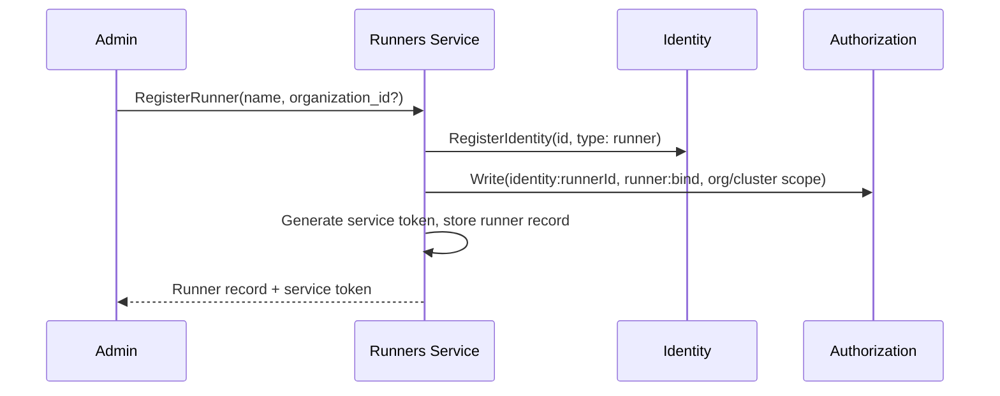

# Runners

## Overview

The Runners service manages runner registrations and workload runtime state. It is the central registry for:

1. **Runners** — registered runner instances (cluster-scoped and org-scoped), their enrollment state, and metadata.
2. **Workloads** — the runtime state of workloads running on registered runners. Which workloads are running, on which runner, with which containers.

The [Agents Orchestrator](agents-orchestrator.md) reads and writes workload state through this service. The [Gateway](gateway.md) exposes query methods for the UI. The [Terminal Proxy](terminal-proxy.md) resolves which runner hosts a workload to route exec connections.

## API

### Runner Management

| Method | Description |
|--------|-------------|
| **RegisterRunner** | Register a new runner. Creates the runner record, registers an identity (type `runner`) in [Identity](identity.md), and generates a service token |
| **GetRunner** | Get a runner by ID |
| **ListRunners** | List registered runners. Supports filtering by organization |
| **DeleteRunner** | Delete a runner registration. Revokes the runner's OpenZiti identity |

### Workload State

| Method | Description |
|--------|-------------|
| **CreateWorkload** | Record a new running workload (runner ID, workload ID, thread ID, agent ID, containers, status) |
| **UpdateWorkloadStatus** | Update workload status and container states |
| **DeleteWorkload** | Remove a workload record |
| **GetWorkload** | Get a workload by ID. Returns workload details including runner ID and containers |
| **ListWorkloadsByThread** | List workloads for a thread. Used by the UI to populate the container popover |

## Runner Resource

| Field | Type | Description |
|-------|------|-------------|
| `id` | string (UUID) | Unique runner identifier |
| `name` | string | Display name |
| `organization_id` | string (UUID), nullable | Organization scope. Null for cluster-scoped runners |
| `identity_id` | string (UUID) | Runner's identity in the [Identity](identity.md) service |
| `service_token_hash` | string | SHA-256 hash of the service token |
| `status` | enum | `pending`, `enrolled`, `offline` |
| `created_at` | timestamp | Creation time |
| `updated_at` | timestamp | Last modification time |

### Organization Scoping

Cluster-scoped runners (`organization_id: null`) are available to all organizations. Org-scoped runners are available only to the owning organization. Runner selection for a workload is determined by the [Agents Orchestrator](agents-orchestrator.md) based on the agent's organization and available runners.

## Workload Resource

| Field | Type | Description |
|-------|------|-------------|
| `id` | string (UUID) | Workload ID (matches the ID on the Runner) |
| `runner_id` | string (UUID) | Runner hosting this workload |
| `thread_id` | string (UUID) | Thread this workload serves |
| `agent_id` | string (UUID) | Agent this workload runs |
| `organization_id` | string (UUID) | Organization scope (denormalized from agent) |
| `status` | enum | `starting`, `running`, `stopping`, `stopped`, `failed` |
| `containers` | list | Containers in the workload (see below) |
| `created_at` | timestamp | Creation time |
| `updated_at` | timestamp | Last status update |

### Container

| Field | Type | Description |
|-------|------|-------------|
| `container_id` | string | Container identifier within the workload |
| `name` | string | Display name |
| `role` | enum | `main`, `sidecar`, `init` |
| `image` | string | Container image |
| `status` | enum | `running`, `terminated`, `waiting` |

## Registration Flow

1. Admin calls `RegisterRunner` (via `agyn` CLI or Terraform).
2. Runners service registers the runner's identity in the [Identity](identity.md) service with `identity_type: runner`.
3. Runners service writes authorization tuples granting the runner its permissions.
4. Runners service generates a service token, stores the runner record, and returns the token.
5. The service token is provided to the runner deployment.

Cluster-scoped runners are registered by the cluster admin. Org-scoped runners are registered by an organization admin.

## Enrollment

When a runner starts, it presents the service token to the platform enrollment endpoint. The platform validates the token against the Runners service, creates an OpenZiti identity via [Ziti Management](openziti.md), enrolls it, and returns the enrolled identity (certificate + key). This follows the same pattern as [app enrollment](apps-service.md#enrollment).

After enrollment, the runner binds the `runner` OpenZiti service and begins accepting workload commands.

Internal runners (deployed as platform infrastructure) use [self-enrollment](openziti.md#service-identity-self-enrollment) instead of service tokens. They are still registered as runner records — Terraform creates the runner resource at bootstrap and the runner self-enrolls at startup.

## Workload State Management

The [Agents Orchestrator](agents-orchestrator.md) is the sole writer of workload state. The orchestrator calls the Runners service to record workload lifecycle events:

1. **Start**: orchestrator starts a workload on a runner via Runner `StartWorkload`, then calls `CreateWorkload` on the Runners service with the runner ID, workload ID, thread ID, agent ID, and initial container list.
2. **Update**: orchestrator detects status changes during reconciliation (via Runner `InspectWorkload`) and calls `UpdateWorkloadStatus`.
3. **Stop**: orchestrator stops a workload via Runner `StopWorkload`, then calls `DeleteWorkload`.

The Runners service is a passive store — it does not interact with runners directly. It records what the orchestrator tells it.

## Gateway Exposure

The following methods are exposed through the [Gateway](gateway.md) for the UI:

| Gateway Service | Methods |
|----------------|---------|
| `RunnersGateway` | `ListWorkloadsByThread`, `GetWorkload` |

The UI calls `ListWorkloadsByThread` to populate the container popover in the conversation header. It calls `GetWorkload` to get container details before opening a terminal session.

## Terminal Proxy Integration

The [Terminal Proxy](terminal-proxy.md) needs to reach the specific runner hosting a workload. The flow:

1. UI calls `GetWorkload` (via Gateway) to get workload details including `runner_id`.
2. UI opens a WebSocket to the Terminal Proxy with `workloadId` and `containerId`.
3. Terminal Proxy calls `GetWorkload` on the Runners service to resolve `runner_id`.
4. Terminal Proxy dials the specific runner via OpenZiti using the runner's identity.

This requires per-runner OpenZiti addressing — see [Open Questions](../open-questions.md#per-runner-openziti-addressing) for the routing mechanism.

## Data Store

PostgreSQL. The Runners service owns its database with `runners` and `workloads` tables.

## Classification

| Aspect | Detail |
|--------|--------|
| **Plane** | Mixed — control (registration) + data (workload state queries) |
| **API** | gRPC (internal) + Gateway (external via ConnectRPC) |
| **State** | PostgreSQL |
