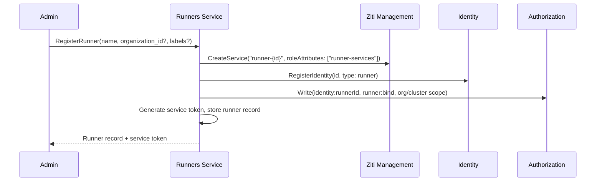

# Runners

## Overview

The Runners service manages runner registrations and workload runtime state. It is the central registry for:

1. **Runners** — registered runner instances (cluster-scoped and org-scoped), their enrollment state, and metadata.
2. **Runner catalogs** — the flavors, storage classes, and capabilities each runner reports about itself. See [Runner Catalog](#runner-catalog).
3. **Workloads** — the runtime state of workloads running on registered runners. Which workloads are running, on which runner, with which containers.
4. **Provisioned volumes** — storage instances provisioned on runners for specific runtime owners.

**Naming note:** `instance_id` on workload and volume records is the **runner-assigned runtime identifier** (Pod name, PVC name). It is unrelated to the platform owner. Platform ownership is recorded separately as `owner_kind` + `owner_id`.

The [Agents Orchestrator](agents-orchestrator.md) reads and writes workload state through this service. The [Gateway](gateway.md) exposes query methods for the UI. The [Terminal Proxy](terminal-proxy.md) resolves which runner hosts a workload to route exec connections.

## API

### Runner Management

| Method | Description |
|--------|-------------|
| **RegisterRunner** | Register a new runner. Creates the runner record, creates a per-runner OpenZiti service via [Ziti Management](openziti.md) `CreateService`, registers an identity (type `runner`) in [Identity](identity.md), writes authorization tuples, and generates a service token |
| **GetRunner** | Get a runner by ID |
| **ListRunners** | List registered runners. Supports filtering by organization |
| **UpdateRunner** | Update a runner's mutable fields (name, labels) |
| **DeleteRunner** | Delete a runner registration. Deletes the runner's OpenZiti identity and per-runner OpenZiti service via Ziti Management `DeleteRunnerIdentity` |

### Catalog

| Method | Description |
|--------|-------------|
| **ReportRunnerCatalog** | Replace the runner's stored catalog (flavors, storage classes, capabilities) with the reported state. Called by the runner itself — at startup after enrollment and on configuration change. Authenticated by service token, like `EnrollRunner`. See [Catalog Reporting](#catalog-reporting) |
| **ListFlavors** | List the flavors a runner last reported. Visibility follows runner visibility |
| **ListStorageClasses** | List the storage classes a runner last reported. Visibility follows runner visibility |

### Workload State

| Method | Description |
|--------|-------------|
| **CreateWorkload** | Record a new workload before it is started on the runner. The Orchestrator generates the workload ID, sets `status=starting`, and supplies the generalized owner (`owner_kind=agent_instance` or `sandbox`, `owner_id=<id>`). Called before `Runner.StartWorkload` to avoid a reconciliation race |
| **UpdateWorkload** | Update mutable workload fields: status, containers, `removed_at`, `last_metering_sampled_at`. When `status`, any element of `containers`, or `agent_state` changed, emits a `workload.updated` event on the organization's [Notifications](notifications.md) topic so subscribers (e.g., the Console) can refresh without polling |
| **ReportWorkloadState** | A runner reports the runtime state it observes for a workload on itself — status, containers, `observed_at`. Writes through the same path as `UpdateWorkload`, so the same events fire, and rejects a report older than the recorded state. Runner-facing, on the [Runners Gateway](gateway.md). See [Runner-Reported Workload State](#runner-reported-workload-state) |
| **BatchUpdateWorkloadSampledAt** | Set `last_metering_sampled_at` for a list of workload IDs in a single DB write. Used by the metering sampling loop after a successful batch publish |
| **GetWorkload** | Get a workload by ID. Returns workload metadata and containers for views such as Console Workload Detail |
| **ListWorkloads** | List workloads in an organization with server-side sort, filter, and pagination. Response items include owner-aware display fields and `runner_name`. See [ListWorkloads request shape](#listworkloads-request-shape) |
| **ListWorkloadsByAgentInstance** | List workload records whose `agent_instance_id` matches the requested [agent instance](agent-instances.md). Supports optional filtering by `status_in`. Results are ordered by `created_at DESC` — used by the [Agents Orchestrator](agents-orchestrator.md#start-decision) to inspect the most recent terminal workload for an instance, by [Chat](chat.md#activity-status) to derive activity status, and by Console Thread Detail to show workloads for a thread's instance participants |
| **TouchWorkload** | Update `last_activity_at` timestamp on a workload. Called by [`agynd`](agynd-cli.md) (via [Gateway](gateway.md)) as a keepalive while the agent is actively processing, and by the [Terminal Proxy](terminal-proxy.md#sandbox-activity-reporting) for each attached sandbox terminal session. When an agent workload's `agent_state` is `idle`, atomically transitions it to `processing` and emits a `workload.updated` event. Otherwise lightweight — updates only the timestamp with no event |

### Volume State

| Method | Description |
|--------|-------------|
| **CreateVolume** | Record a volume before its PVC is provisioned. Sets `status=provisioning`. Called before `Runner.StartWorkload` to avoid a reconciliation race. All fields come from the Orchestrator's trusted sources (Agents service + workload spec) |
| **UpdateVolume** | Update mutable volume fields: `status`, `removed_at`, `last_metering_sampled_at` |
| **BatchUpdateVolumeSampledAt** | Set `last_metering_sampled_at` for a list of volume IDs in a single DB write |
| **GetVolume** | Get a volume by ID |
| **ListVolumes** | List volumes in an organization with server-side sort, filter, and pagination. See [ListVolumes request shape](#listvolumes-request-shape) |
| **ListVolumesByAgentInstance** | List provisioned volume records whose `agent_instance_id` matches the requested agent instance. This is an instance-associated storage query, not a workload-mounted-volume list. Used by the [Agents Orchestrator](agents-orchestrator.md#runner-selection) for runner pinning and by Console Workload Detail to show storage associated with the workload's instance |

## Runner Resource

| Field | Type | Description |
|-------|------|-------------|
| `id` | string (UUID) | Unique runner identifier |
| `name` | string | Display name |
| `organization_id` | string (UUID), nullable | Organization scope. Null for cluster-scoped runners |
| `labels` | map<string, string> | Key-value metadata (e.g., `region: "eu-west-1"`, `tier: "gpu"`). Informational — placement is determined by the [environment's runner reference](#runner-selection), not labels. Set at registration time, mutable via `UpdateRunner` |
| `capabilities` | list<string> | Capability names this runner implements (e.g., `["docker", "gpu"]`). The orchestrator uses this to match workloads that require specific capabilities. Reported by the runner as part of its [catalog report](#catalog-reporting) — not set by admins. Empty until the runner's first report |
| `identity_id` | string (UUID) | Runner's identity in the [Identity](identity.md) service |
| `service_token_hash` | string | SHA-256 hash of the service token |
| `openziti_service_name` | string | Per-runner OpenZiti service name (`runner-{id}`) |
| `status` | enum | `pending`, `enrolled`, `offline` |
| `created_at` | timestamp | Creation time |
| `updated_at` | timestamp | Last modification time |

### Organization Scoping

Cluster-scoped runners (`organization_id: null`) are available to all organizations. Org-scoped runners are available only to the owning organization. See [Runner Selection](#runner-selection) for how the orchestrator picks a runner.

## Runner Catalog

Each runner declares a **catalog** in its own deployment configuration and reports it to the Runners service: the [flavors](#flavors) it offers, the [storage classes](#storage-classes) it offers, and the capabilities it implements. The catalog is not managed through platform APIs — the runner's configuration is the source of truth, and the Runners service stores what the runner last reported. The runner is in charge of the implementation behind every catalog entry, so the entries are defined next to that implementation (for the k8s-runner: in its ConfigMap/Helm values — see [k8s-runner — Runner Catalog](k8s-runner.md#runner-catalog)).

Catalog visibility follows runner visibility (see [Organization Scoping](#organization-scoping)): catalogs of cluster-scoped runners are visible to every organization, catalogs of org-scoped runners only to the owning organization. `ListFlavors` and `ListStorageClasses` expose the stored catalog to Console and CLI pickers.

See [Flavors and Environments](../product/environments/environments.md) for the product behavior.

### Flavors

A [Flavor](resource-definitions.md#flavor) is a named compute size (CPU/memory requests and limits) offered by a specific runner. [Environments](resource-definitions.md#environment) reference flavors **by name**, scoped to the environment's runner. The reference is late-bound: it is resolved against the runner's reported catalog at workload start and is deliberately not validated when the environment is created — an environment may name a flavor that does not exist yet, and its workloads simply fail to schedule until a runner report includes that name.

A flavor entry may be marked `deprecated` — a soft signal surfaced in Console and CLI pickers; deprecated flavors still resolve and schedule. Removing an entry from the runner's configuration removes it from the catalog on the next report; environments referencing the removed name become unschedulable and are flagged in the Console. Renaming an entry is a removal plus an addition.

### Storage Classes

A [Storage Class](resource-definitions.md#storage-class) is a named storage tier offered by a specific runner. What backs a class is runner-internal — the k8s-runner maps each entry to a Kubernetes StorageClass in its configuration; other runners may map classes to whatever their storage layer provides.

[Volume](resource-definitions.md#volume) definitions reference storage classes by name with the same late binding as flavors: the name is resolved against the catalog of the runner the workload lands on when the volume is provisioned. A volume that names no class uses the runner's `default` class. Storage class entries support `default` (at most one per runner) and `deprecated` exactly like flavors.

### Catalog Reporting

The runner reports its full catalog via `ReportRunnerCatalog` — at startup, immediately after [enrollment](#enrollment) and before binding its service, and again whenever its configuration changes. The report is declarative: the Runners service atomically replaces the runner's stored catalog with the reported state. There are no per-entry create/update/delete RPCs and no delete-versus-deprecate enforcement — an entry absent from the report is gone, and anything referencing its name stops scheduling until it reappears.

The report carries three sections; the whole report is rejected on any violation, keeping the previously stored catalog:

| Section | Constraints |
|---------|-------------|
| `flavors` | Names unique within the report, max 64 chars, pattern `^[a-z0-9-]+$`. Compute resources present and well-formed. At most one entry marked `default` |
| `storage_classes` | Same name constraints. At most one entry marked `default` |
| `capabilities` | List of capability name strings. Replaces the runner's `capabilities` field |

`ReportRunnerCatalog` is authenticated by the runner's service token — the same mechanism as `EnrollRunner`, no OpenFGA check.

## Runner Selection

Placement is determined by the workload's [Environment](resource-definitions.md#environment): the environment references a runner directly (`runner_id`) and names a [flavor](#flavors) within that runner's catalog. The [Agents Orchestrator](agents-orchestrator.md) does not choose among runners; it validates the referenced runner and resolves catalog names at schedule time:

1. **Resolve the runner** — read the environment from the Agents service; its `runner_id` is the target runner.
2. **Validate enrollment** — the runner's status must be `enrolled`. Otherwise the workload fails to schedule and the standard retry policy applies.
3. **Resolve the flavor** — look up the environment's flavor name (or the runner's `default` flavor when the environment names none) in the runner's reported catalog. A name not present in the catalog fails scheduling the same way, and the environment is flagged unschedulable in Console and CLI.
4. **Resolve storage classes** — every persistent volume in the workload that names a storage class must find that name in the runner's catalog; volumes naming none use the runner's `default` class. A missing class name — including a missing default when one is needed — fails scheduling the same way.
5. **Validate capabilities** — if the agent defines `capabilities`, the runner's reported `capabilities` list must contain every one of them. A runner may advertise additional capabilities. (Sandboxes define no capabilities.)

Environment create/update validated only that the runner is visible to the organization (cluster-scoped, or org-scoped to the same org), so a "wrong runner" pairing cannot reach scheduling. Flavor and storage class names are deliberately **not** validated at create time — they are late-bound so platform resources and runner configuration can be applied in either order; Console and CLI warn (not reject) when a name does not match anything currently reported. There is no fallback runner — a different runner has no contract to honor the names. Runner `labels` remain as metadata; they do not participate in placement.

## Workload Resource

| Field | Type | Description |
|-------|------|-------------|
| `id` | string (UUID) | Primary key, generated by the Orchestrator. Set as a label on the Pod so the reconciliation loop can match runner workloads back to Runners service records |
| `instance_id` | string (nullable) | Runner-assigned **runtime** identifier (Pod name) returned by `StartWorkload`. NULL until `StartWorkload` completes. Unrelated to the platform owner (`owner_id`) |
| `runner_id` | string (UUID) | Runner hosting this workload |
| `flavor` | string, nullable | Flavor name resolved at start time from the [Environment](resource-definitions.md#environment), against this runner's [reported catalog](#runner-catalog). Recorded for audit and metering; it does not change retroactively when the environment is repointed or the runner's catalog changes. NULL for a workload started without an environment — the deprecated inline-resources shape, which emits no compute usage |
| `owner_kind` | enum | `agent_instance` \| `sandbox`. What kind of entity this workload runs for. Sandboxes are first-class workload owners — no synthetic agent instances are created for them |
| `owner_id` | string (UUID) | The owning [agent instance](agent-instances.md) (whose inbox the workload processes) or [Sandbox](resource-definitions.md#sandbox). For `agent_instance` owners this is the field previously named `agent_instance_id` |
| `agent_id` | string (UUID), nullable | Agent class the owning instance was spawned from (denormalized for filtering and display). NULL for sandbox-owned workloads |
| `organization_id` | string (UUID) | Organization scope (denormalized from the owner) |
| `status` | enum | Container lifecycle state: `starting`, `running`, `stopping`, `stopped`, `failed`. `running` means all init containers completed and main containers are up — it does **not** imply the agent process is currently producing output. See [`agent_state`](#workload-resource) for that signal |
| `agent_state` | enum, nullable/not meaningful for sandboxes | For `agent_instance` workloads: `idle` or `processing`, whether the agent process inside a `running` workload is currently producing output. Initialized to `processing` on `CreateWorkload`, transitioned `idle → processing` by [`TouchWorkload`](#workload-state), and transitioned `processing → idle` by the [Agent Activity Sweep](#agent-activity-sweep). For `sandbox` workloads this field is not an agent signal and must not be used for lifecycle decisions; sandbox idleness is derived from `last_activity_at` touches driven by terminal sessions |
| `containers` | list | Containers in the workload (see below) |
| `created_at` | timestamp | Creation time |
| `updated_at` | timestamp | Last status update |
| `last_activity_at` | timestamp | Last activity reported via `TouchWorkload`. Set to `created_at` on workload creation, and reset to `now()` when `status` transitions from `starting` to `running` so activity reporters receive a fresh keepalive window after the workload boots. Updated by [`agynd`](agynd-cli.md) keepalive calls for agent workloads and Terminal Proxy session touches for sandbox workloads. Used by the [Agents Orchestrator](agents-orchestrator.md) for [idle timeout](#idle-timeout) enforcement and by the Runners service for the [Agent Activity Sweep](#agent-activity-sweep) |
| `last_metering_sampled_at` | timestamp (nullable) | Timestamp through which compute usage has been recorded to the [Metering Service](metering.md). NULL until the first metering sample is emitted. Updated via `UpdateWorkload` after each successful emission |
| `removed_at` | timestamp (nullable) | When the workload was actually stopped on the runner. NULL while active or stopping. Set after `StopWorkload` succeeds. Record is retained as audit history |
| `failure_reason` | enum, nullable | Machine-readable cause when `status=failed`. One of `start_failed`, `image_pull_failed`, `config_invalid`, `crashloop`, `runtime_lost`. NULL for non-failed workloads. Set by the [Agents Orchestrator](agents-orchestrator.md#workload-reconciliation) at the moment of the `failed` transition |
| `failure_message` | string, nullable | Human-readable detail, typically copied from the offending container's `reason` / `message` at the time of failure. NULL for non-failed workloads |

## Volume Resource

Tracks persistent volumes actually provisioned on runners. Each record is one disk provisioned from an Agents service [Volume](resource-definitions.md#volume) definition for one owner — an [agent instance](agent-instances.md) or a [Sandbox](resource-definitions.md#sandbox). A definition can have many disks behind it, one per owner; nothing is shared between owners. Every provisioned volume has a definition, so `volume_id` is always set: the platform provisions no implicit storage of its own.

| Field | Type | Description |
|-------|------|-------------|
| `id` | string (UUID) | Primary key, generated by the Orchestrator. Set as a label on the PVC so the reconciliation loop can match runner volumes back to Runners service records |
| `instance_id` | string (nullable) | Runner-assigned **runtime** identifier (PVC name). NULL until the reconciliation loop confirms the PVC exists on the runner. Unrelated to the platform owner (`owner_id`) |
| `volume_id` | string (UUID) | ID of the [Volume](resource-definitions.md#volume) definition in the Agents service — owned by an environment or an MCP. Together with `owner_id`, uniquely identifies the disk |
| `owner_kind` | enum | `agent_instance` \| `sandbox` |
| `owner_id` | string (UUID) | The owning agent instance or [Sandbox](resource-definitions.md#sandbox) |
| `runner_id` | string (UUID) | Runner on which the volume is provisioned |
| `agent_id` | string (UUID), nullable | Agent class of the owning instance (denormalized). NULL for sandbox-owned volumes |
| `organization_id` | string (UUID) | Organization scope |
| `size_gb` | decimal | Size in gigabytes, from the Agents service Volume definition |
| `storage_class` | string | Storage class name resolved at provisioning time — the [Volume](resource-definitions.md#volume) definition's requested class, or the runner's `default` class when none was requested. Recorded for audit and metering; the PVC does not change class retroactively when the runner's catalog changes |
| `status` | enum | `provisioning`, `active`, `deprovisioning`, `deleted`, `failed` — see [Volume Reconciliation](agents-orchestrator.md#volume-reconciliation) |
| `created_at` | timestamp | When the record was created by the Orchestrator |
| `removed_at` | timestamp (nullable) | When the volume reached `deleted` status. NULL while active. Record is retained for audit history |
| `last_metering_sampled_at` | timestamp (nullable) | Timestamp through which storage usage has been recorded to the [Metering Service](metering.md). NULL until the first sample |

## Agent Instance Associations

Agent-owned workloads and provisioned volumes are associated to [agent instances](agent-instances.md) through `owner_kind=agent_instance` + `owner_id`. Runners owns those runtime records; the Agents service owns the instance entity and its inbox (and the [Sandbox](resource-definitions.md#sandbox) entity for sandbox-owned records); Threads owns messages and participants. Instance-scoped queries (`ListWorkloadsByAgentInstance`, `ListVolumesByAgentInstance`) match `owner_kind=agent_instance` records only.

There is no direct thread association on runtime records — a workload serves an instance's inbox, which may receive items from many threads. Thread-context views derive the association in two steps: resolve the thread's agent-instance participants (from Threads), then call `ListWorkloadsByAgentInstance` / `ListVolumesByAgentInstance` per instance. Console Thread Detail and [Chat activity status](chat.md#activity-status) both follow this pattern.

`ListVolumesByAgentInstance(agent_instance_id)` returns storage associated with the instance; it is not a guaranteed exact list of volumes mounted by the workload's current pod.

### Container

| Field | Type | Description |
|-------|------|-------------|
| `container_id` | string, nullable | Runtime-assigned identifier from the container runtime (e.g., `containerd://<hash>`). Opaque; may change on restart. Used for audit only — not for RPC addressing |
| `name` | string | Stable name, unique within the workload across init, main, and sidecars. Matches the Pod container name in Kubernetes. Used to address the container in RPCs like `StreamWorkloadLogs` |
| `role` | enum | `main`, `sidecar`, `init` |
| `image` | string | Container image |
| `status` | enum | `running`, `terminated`, `waiting` |
| `reason` | string, nullable | Short machine-readable cause reported by the runtime (e.g., `ContainerCreating`, `ImagePullBackOff`, `CrashLoopBackOff`, `Completed`, `Error`, `OOMKilled`). NULL when the runtime does not provide one |
| `message` | string, nullable | Human-readable detail from the runtime (e.g., the image pull error body). NULL when none |
| `exit_code` | int32, nullable | Exit code of the last termination. NULL unless `status=terminated` |
| `restart_count` | int32 | Number of times the container has restarted inside the workload |
| `started_at` | timestamp, nullable | When the container last entered `running`. NULL if it has never started |
| `finished_at` | timestamp, nullable | When the container last entered `terminated`. NULL unless `status=terminated` |

Per-container fields are refreshed by the [Agents Orchestrator](agents-orchestrator.md#workload-reconciliation) — on each reconciliation tick it calls `Runner.InspectWorkload` for every workload present on the runner and persists the refreshed container list via `UpdateWorkload`.

## List Query Shape

`ListWorkloads` and `ListVolumes` are the Activity-view read paths exposed through the Gateway. Console Thread Detail uses `ListWorkloadsByAgentInstance` (per instance participant), and Console Workload Detail uses `GetWorkload` plus `ListVolumesByAgentInstance`. The organization-wide lists are too large to load in one shot, so sort, filter, and pagination are server-side. Callers must not filter or sort across pages on the client. See [Console — Resource Lists](../product/console/console.md#resource-lists).

### ListWorkloads request shape

| Field | Type | Required | Description |
|-------|------|----------|-------------|
| `organization_id` | string (UUID) | Yes | Authorization scope. Caller must hold `can_view_workloads` on this organization |
| `filter.agent_id_in` | list<string (UUID)> | No | Return only agent-instance-owned workloads for these agent classes (OR across ids). Sandbox workloads do not match this filter |
| `filter.owner_kind_in` | list<enum> | No | Return only workloads owned by these owner kinds (`agent_instance`, `sandbox`) |
| `filter.owner_id_in` | list<string (UUID)> | No | Return only workloads for these agent instance or sandbox owners (OR across ids) |
| `filter.runner_id_in` | list<string (UUID)> | No | Return only workloads on these runners (OR across ids) |
| `filter.status_in` | list<Workload.Status> | No | Return only workloads in these statuses |
| `filter.started_after` | timestamp | No | Return only workloads with `created_at >= started_after` |
| `filter.started_before` | timestamp | No | Return only workloads with `created_at < started_before` |
| `filter.pending_sample` | bool | No | Metering sampler only: when true, return workloads where `removed_at IS NULL OR removed_at > last_metering_sampled_at`. Not exposed through the Gateway |
| `sort.field` | enum | No | One of `started`, `agent`, `runner`, `status`, `duration`. Default: `started` |
| `sort.direction` | enum | No | `asc` or `desc`. Default: `desc` |
| `page_token` | string | No | Opaque cursor returned by the previous response. Empty on the first page |
| `page_size` | int32 | No | Maximum items to return. Server enforces an upper bound |

Each filter field is optional and independent. Multiple filters combine with AND; within a list field (`*_in`), values combine with OR. Changing `sort` or `filter` resets pagination — callers must discard any previous `page_token`.

The server applies a stable secondary sort by `id` (ascending) on every response, so ties on the primary sort field produce a deterministic order and pagination does not skip or duplicate rows.

**Response item** includes every field on the [Workload Resource](#workload-resource) plus two denormalized strings the UI renders instead of IDs:

| Field | Type | Description |
|-------|------|-------------|
| `agent_name` | string, nullable | Current name of the agent class for agent-instance-owned workloads. NULL for sandbox-owned workloads |
| `owner_name` | string, nullable | Display name for the runtime owner when available, such as the sandbox name for `owner_kind=sandbox` |
| `runner_name` | string | Current name of the runner at `runner_id`. Resolved at query time |

The Runners service owns neither agents nor sandbox records — it resolves names via batch lookups against the [Agents service](agents-service.md) and its own `runners` table when assembling the response. `owner_kind`, `owner_id`, `agent_id`, and `runner_id` remain in the response for stable linking.

### ListVolumes request shape

Same sort/filter/pagination envelope as `ListWorkloads`. Filters:

| Field | Type | Required | Description |
|-------|------|----------|-------------|
| `organization_id` | string (UUID) | Yes | Authorization scope. Caller must hold `can_view_volumes` on this organization |
| `filter.status_in` | list<Volume.Status> | No | Return only volumes in these statuses |
| `filter.runner_id_in` | list<string (UUID)> | No | Return only volumes provisioned on these runners |
| `filter.mounted_by_kind_in` | list<enum> | No | `agent` or `mcp`. Every provisioned volume is mounted by at least one container — there is no unattached state |
| `filter.owner_kind_in` | list<enum> | No | Return only volumes owned by these owner kinds (`agent_instance`, `sandbox`) |
| `filter.owner_id_in` | list<string (UUID)> | No | Return only volumes for these agent instance or sandbox owners (OR across ids) |
| `filter.pending_sample` | bool | No | Metering sampler only. Not exposed through the Gateway |

Sort fields: `name`, `size`, `status`, `created`. Default: `name` asc.

Response items include the [Volume Resource](#volume-resource) fields plus:

| Field | Type | Description |
|-------|------|-------------|
| `volume_name` | string | Current `name` of the [Agents service Volume](resource-definitions.md#volume) definition at `volume_id` |
| `volume_source` | object | Where the definition lives: `kind` (`environment` / `mcp`), `id`, and `name`. An environment volume and an MCP volume can share a `volume_name`, so this is what disambiguates them in a list |
| `owner_name` | string, nullable | Display name for the runtime owner when available, such as the sandbox name for `owner_kind=sandbox` |
| `attachments` | list<Attachment> | All containers currently mounting this disk — more than one when an environment volume is also named in an MCP's `shared_volumes`. Each `Attachment` has `kind` (`agent` / `mcp`), `id`, and `name` |

The Runners service resolves `volume_name`, `volume_source`, `owner_name`, and each attachment's `name` via batch lookups against the [Agents service](agents-service.md) when assembling the response. `volume_id`, `owner_kind`, `owner_id`, and each `attachments[].id` remain in the response for stable linking.

## Registration Flow

```mermaid
sequenceDiagram
    participant Admin as Admin
    participant RS as Runners Service
    participant ZM as Ziti Management
    participant I as Identity
    participant Auth as Authorization

    Admin->>RS: RegisterRunner(name, organization_id?, labels?)
    RS->>ZM: CreateService("runner-{id}", roleAttributes: ["runner-services"])
    RS->>I: RegisterIdentity(id, type: runner)
    RS->>Auth: Write(identity:runnerId, runner:bind, org/cluster scope)
    RS->>RS: Generate service token, store runner record
    RS-->>Admin: Runner record + service token
```

1. Admin calls `RegisterRunner` (via `agyn` CLI or Terraform).
2. Runners service creates a per-runner OpenZiti service `runner-{id}` with `roleAttributes: ["runner-services"]` via [Ziti Management](openziti.md) `CreateService`. This service is what callers will dial to reach this specific runner.
3. Runners service registers the runner's identity in the [Identity](identity.md) service with `identity_type: runner`.
4. Runners service writes authorization tuples granting the runner its permissions.
5. Runners service generates a service token, stores the runner record (including `openziti_service_name`), and returns the token.
6. The service token is provided to the runner deployment.

Static OpenZiti policies handle access — `runners-bind` allows identities with `#runners` to bind `#runner-services`, and `orchestrators-dial-runners` allows identities with `#orchestrators` to dial `#runner-services`. No per-runner policy creation is needed. See [OpenZiti Integration — Service Policies](openziti.md#static-policies).

Cluster-scoped runners are registered by the cluster admin. Org-scoped runners are registered by an organization admin.

### Terraform Provisioning

The [Terraform provider](operations/terraform-provider.md) exposes the `agyn_runner` resource for runner provisioning as code. The resource maps to the `RegisterRunner`, `GetRunner`, `UpdateRunner`, and `DeleteRunner` RPCs on the `RunnersGateway`.

#### Schema

| Attribute | Type | Required | Computed | Mutable | Description |
|-----------|------|----------|----------|---------|-------------|
| `id` | string | | ✓ | | UUID, assigned by the Runners service |
| `name` | string | ✓ | | ✓ | Display name |
| `organization_id` | string | | | | Organization scope. Omit for cluster-scoped runners. Immutable after creation |
| `labels` | map(string) | | | ✓ | Key-value metadata. Informational — labels do not participate in [placement](#runner-selection) |
| `identity_id` | string | | ✓ | | Runner's identity in the [Identity](identity.md) service |
| `service_token` | string (sensitive) | | ✓ | | Service token returned on creation. Stored in Terraform state. Used by the runner to [enroll](#enrollment) |

`name` and `labels` can be updated in place via `UpdateRunner`. Changing `organization_id` forces replacement (destroy + create).

The `service_token` output is provided to the runner deployment (e.g., as a Kubernetes Secret) so the runner can enroll at startup.

## Enrollment

When a runner starts, it calls `EnrollRunner` with its service token. The Runners service validates the token, creates an OpenZiti identity via [Ziti Management](openziti.md) `CreateRunnerIdentity` (which deletes any previous identity for this runner first), enrolls it, and returns the enrolled identity (certificate + key) along with the service name (`runner-{runnerId}`). See [OpenZiti Integration — Runner Provisioning](openziti.md#runner-provisioning) for the full enrollment sequence.

After enrollment, the runner reports its [catalog](#catalog-reporting) via `ReportRunnerCatalog`, then binds its per-runner OpenZiti service (`runner-{runnerId}`) and begins accepting workload commands from the Orchestrator.

The service token is long-lived and reusable. If the runner restarts, it re-enrolls with the same token and receives a new OpenZiti identity. The previous identity is deleted by Ziti Management as part of `CreateRunnerIdentity` before creating the new one. All runners — whether deployed as platform infrastructure or by an enterprise admin — follow this same flow.

## Deletion

`DeleteRunner` cleans up all associated resources:

1. Deletes the runner's current OpenZiti identity (if any) and the per-runner OpenZiti service (`runner-{runnerId}`) via Ziti Management `DeleteRunnerIdentity`.
2. Removes authorization tuples.
3. Removes the runner record from PostgreSQL.

## Workload State Management

The [Agents Orchestrator](agents-orchestrator.md), [`agynd`](agynd-cli.md), and Terminal Proxy write workload state. The orchestrator manages lifecycle; `agynd` and Terminal Proxy report activity.

**Orchestrator** calls the Runners service to record workload lifecycle events:

1. **Start**: orchestrator starts a workload on a runner via Runner `StartWorkload`, then calls `CreateWorkload` on the Runners service with the runner ID, workload ID, `owner_kind`, `owner_id`, nullable agent class fields for agent-instance workloads, and initial container list. `last_activity_at` is set to `created_at`; `agent_state` is initialized to `processing` for agent-instance workloads (the orchestrator only starts those workloads in response to unacked messages, so the agent is expected to begin producing output immediately). Sandbox workloads do not use `agent_state` for lifecycle decisions. Volume records are populated separately by the volume sync loop — not as part of the start flow.
2. **Update**: the runner reports the transition as it observes it (see [Runner-Reported Workload State](#runner-reported-workload-state)); the orchestrator's reconciliation pass is the fallback that catches whatever a report missed, detecting status changes via Runner `InspectWorkload` and calling `UpdateWorkload`. Either writer promoting `status` from `starting` to `running` also resets `last_activity_at = now()` so the [Agent Activity Sweep](#agent-activity-sweep) gives `agynd` a fresh window to make its first `TouchWorkload`.
3. **Stop**: orchestrator calls `UpdateWorkload(status=stopping)`, stops the workload via Runner `StopWorkload`, then calls `UpdateWorkload(status=stopped, removed_at=now)`. The record is retained for audit. The metering sampling loop handles the tail sample on its next tick.

**Activity reporters** call `TouchWorkload` to update `last_activity_at`: [`agynd`](agynd-cli.md) calls it via [Gateway](gateway.md) while an agent workload is actively processing, and Terminal Proxy calls it internally while a sandbox terminal session is attached. See [Idle Timeout](#idle-timeout).

The Runners service is a passive store — it does not interact with runners directly. It records what the orchestrator, the runner, `agynd`, and Terminal Proxy tell it.

## Runner-Reported Workload State

A runner reports the runtime state it observes, as it observes it, through `ReportWorkloadState` on the [Runners Gateway](gateway.md) — the same outbound, authenticated path it already uses for [`EnrollRunner`](#enrollment) and [`ReportRunnerCatalog`](#catalog-reporting).

**Because the runner is the only thing that can see the pod.** Every other arrangement has the platform asking. The orchestrator used to be the sole writer of `running`, discovering it by dialing the runner and calling `InspectWorkload` on its reconcile interval — so a workload was ready and serving for up to a full interval before anything recorded it, and the sandbox behind it stayed `starting` for exactly that long. The [`workload.status_changed`](notifications.md) event existed the whole time, but it fired *from the orchestrator's own write*, which meant subscribing to it told the orchestrator only what it had just concluded.

| | |
|---|---|
| **Reports** | Observed runtime state only — running, failed, gone — plus the container list, for workloads on that runner |
| **Never reports** | Desired state. A runner cannot mark a workload `stopped` that the platform intends to keep running; lifecycle stays with the orchestrator |
| **Carries** | `observed_at`. Reports are retried and resent on resync, so the service drops any report older than the record it would overwrite — otherwise a delayed message walks a status backwards |
| **Idempotent** | Re-reporting a state already recorded changes nothing and publishes nothing, since notifications fire only on an actual change |

The orchestrator's reconciliation remains, unchanged, as the fallback. A runner that restarts, loses its watch, or predates this RPC simply leaves the platform converging on the interval it always did — the report removes latency, never correctness.

### Version skew

A runner reporting to a platform that does not implement the RPC receives `Unimplemented` and continues serving, exactly as [catalog reporting](#catalog-reporting) already does. Reporting is an optimization a runner offers, not a contract the platform requires.

## Idle Timeout

The Runners service supports idle timeout enforcement by tracking `last_activity_at` on each workload. The mechanism involves three components:

1. **Activity reporters** — while the agent CLI is actively processing (executing LLM calls, running tools), [`agynd`](agynd-cli.md) calls `TouchWorkload` via [Gateway](gateway.md) every 10 seconds. When the agent is idle (waiting for new messages), `agynd` stops calling `TouchWorkload`. While a sandbox terminal session is attached, Terminal Proxy calls `TouchWorkload` internally every 10 seconds. These signals give the orchestrator a clear view of agent or sandbox activity.
2. **Runners service** — stores `last_activity_at` on the workload record. `TouchWorkload` is a lightweight RPC that updates only this timestamp.
3. **[Agents Orchestrator](agents-orchestrator.md)** — during each reconciliation pass, queries the Runners service for running workloads. For each workload, compares `now - last_activity_at` against the applicable idle timeout: the agent's `idle_timeout` for agent-instance workloads (from the [Agent resource definition](resource-definitions.md#agent), default `"5m"`) or the sandbox's snapshotted `idle_timeout`. If the timeout is exceeded, the orchestrator stops the workload.

This design ensures that long-running agent tasks (which may take hours) and attached sandbox terminal sessions are never prematurely terminated — as long as activity continues, the reporter keeps touching. The idle clock starts when the agent finishes processing or the sandbox terminal session detaches.

## Agent Activity Sweep

The Runners service runs a background sweep at a fixed interval (default `5s`) that maintains the [`agent_state`](#workload-resource) field on running workloads. Without this sweep, a workload whose agent finishes its turn would remain at `agent_state=processing` until the [Idle Timeout](#idle-timeout) reconciliation stops the workload entirely (default `5m` later) — and Chat's [`activity_status`](chat.md#activity-status) would show `running` for the full idle tail. The sweep is the only writer of the `processing → idle` transition.

On each tick:

1. Select workloads where `status='running' AND agent_state='processing' AND last_activity_at < now() - KEEPALIVE_GRACE AND removed_at IS NULL`.
2. For each match, atomically update `agent_state='idle'` and emit a `workload.updated` event on the organization's [Notifications](notifications.md) topic.

| Threshold | Default | Purpose |
|-----------|---------|---------|
| `KEEPALIVE_GRACE` | `25s` | Time since the last `TouchWorkload` after which a `processing` workload is considered idle. Set above the [`agynd` keepalive interval](agynd-cli.md#5-activity-keepalive) (`10s`) with tolerance for one missed beat |
| Sweep interval | `5s` | How often the sweep runs. The maximum delay between the agent stopping and the chat indicator transitioning to `finished` is `KEEPALIVE_GRACE + sweep interval` — `~30s` by default |

The sweep is independent of [Idle Timeout](#idle-timeout) enforcement. The sweep flips a workload's activity bit after seconds (chat-indicator scope); the orchestrator stops the workload entirely after the applicable idle timeout (agent default `5m`, sandbox value snapshotted at creation; lifecycle scope). Both consume the same `last_activity_at` signal but act on different timescales.

The sweep does not interact with runners — it is a DB scan plus notification emit — so the [Workload State Management](#workload-state-management) classification of Runners as a passive store still holds.

## Authorization

Runner management authorization depends on the runner's scope. Workload and volume read methods have two call paths: external (via [Gateway](gateway.md), authorized via OpenFGA) and internal (Orchestrator via Istio, gated by `AuthorizationPolicy`). Write methods are internal-only. See [Internal RPC Authorization](authz.md#internal-rpc-authorization) for the enforcement model.

| Operation | Check |
|-----------|-------|
| `RegisterRunner` (cluster-scoped) | `admin` on `cluster:global` |
| `RegisterRunner` (org-scoped) | `owner` on `organization:<org_id>` |
| `GetRunner`, `ListRunners` (via Gateway, org-scoped runners) | `member` on `organization:<org_id>` |
| `GetRunner`, `ListRunners` (via Gateway, cluster-scoped runners) | Any authenticated identity |
| `GetRunner` (internal) | Internal only (Orchestrator via Istio) — used by [runner selection](agents-orchestrator.md#runner-selection); returns the runner regardless of scope |
| `UpdateRunner`, `DeleteRunner` (cluster-scoped) | `admin` on `cluster:global` |
| `UpdateRunner`, `DeleteRunner` (org-scoped) | `owner` on `organization:<org_id>` |
| `EnrollRunner` | Service token validation — no OpenFGA check |
| `ReportRunnerCatalog` | Service token validation — no OpenFGA check |
| `ListFlavors`, `ListStorageClasses` (via Gateway, org-scoped runners) | `member` on `organization:<org_id>` |
| `ListFlavors`, `ListStorageClasses` (via Gateway, cluster-scoped runners) | Any authenticated identity |
| `ListFlavors`, `ListStorageClasses` (internal) | Internal only (Orchestrator via Istio) — used by [runner selection](agents-orchestrator.md#runner-selection) to resolve flavor and storage class names |
| `CreateWorkload`, `UpdateWorkload`, `BatchUpdateWorkloadSampledAt` | Internal only (Orchestrator via Istio) |
| `ListWorkloads` (via Gateway) | `can_view_workloads` on `organization:<org_id>` (required request parameter) |
| `ListWorkloads` (internal) | Internal only (Orchestrator via Istio) — supports `runner_id_in`, `pending_sample`, and `status_in` filters across organizations; `organization_id` not required |
| `GetWorkload`, `StreamWorkloadLogs` | `can_view_workloads` on `organization:<workload.org_id>` |
| `ListWorkloadsByAgentInstance` (via Gateway) | `member` on `organization:<workload.org_id>` |
| `ListWorkloadsByAgentInstance` (internal) | Internal only (Orchestrator via Istio) — used by the [start decision](agents-orchestrator.md#start-decision) |
| `TouchWorkload` | For `owner_kind=agent_instance`: agent instance's own identity (`workload.owner_id == caller.identity_id`). For `owner_kind=sandbox`: internal only from Terminal Proxy via Istio, after ticket validation, to report attached-session activity |
| `CreateVolume`, `UpdateVolume`, `BatchUpdateVolumeSampledAt` | Internal only (Orchestrator via Istio) |
| `ListVolumes` (via Gateway) | `can_view_volumes` on `organization:<org_id>` (required request parameter) |
| `ListVolumes` (internal) | Internal only (Orchestrator via Istio) — supports `runner_id_in`, `pending_sample`, and `status_in` filters across organizations; `organization_id` not required |
| `GetVolume` | `can_view_volumes` on `organization:<volume.org_id>` |
| `ListVolumesByAgentInstance` (via Gateway) | `member` on `organization:<volume.org_id>` |
| `ListVolumesByAgentInstance` (internal) | Internal only (Orchestrator via Istio) — used by [runner selection](agents-orchestrator.md#runner-selection) |

See [Authorization — Runners Service](authz.md#runners-service) for the full reference.

## Gateway Exposure

The following methods are exposed through the [Gateway](gateway.md):

| Gateway Service | Methods |
|----------------|---------|
| `RunnersGateway` | `RegisterRunner`, `GetRunner`, `ListRunners`, `UpdateRunner`, `DeleteRunner`, `EnrollRunner`, `ReportRunnerCatalog`, `ListFlavors`, `ListStorageClasses`, `ListWorkloads`, `ListWorkloadsByAgentInstance`, `GetWorkload`, `TouchWorkload`, `StreamWorkloadLogs`, `GetVolume`, `ListVolumes`, `ListVolumesByAgentInstance` |

Runner management methods (`RegisterRunner`, `GetRunner`, `ListRunners`, `UpdateRunner`, `DeleteRunner`) are used for runner provisioning via the [Terraform provider](operations/terraform-provider.md) and [agyn CLI](agyn-cli.md). `EnrollRunner` is called by runners at startup to exchange a service token for an OpenZiti identity (see [Enrollment](#enrollment)); `ReportRunnerCatalog` is called by runners after enrollment and on configuration change (see [Catalog Reporting](#catalog-reporting)). `ListFlavors` and `ListStorageClasses` back the Console and CLI catalog pickers.

Workload query methods (`ListWorkloads`, `ListWorkloadsByAgentInstance`, `GetWorkload`) provide external access to workload state. `TouchWorkload` is exposed for [`agynd`](agynd-cli.md) to report agent activity; sandbox activity reports are internal calls from Terminal Proxy after terminal ticket validation. Both paths feed [idle timeout](#idle-timeout) enforcement.

`StreamWorkloadLogs` is a server-streaming method for reading container logs. The Runners service authorizes the caller as a member of the workload's organization, looks up the hosting runner from the workload record, dials the runner via OpenZiti (`zitiContext.Dial("runner-{runnerId}")`), and forwards [`Runner.StreamWorkloadLogs`](runner.md#streaming) output back to the caller. The Gateway exposes the method as a pass-through — it does not interpret the stream.

Volume query methods (`GetVolume`, `ListVolumes`, `ListVolumesByAgentInstance`) provide external access to provisioned volume state. The Console's Storage view uses `ListVolumes` to list persistent volumes across the organization. Console Workload Detail uses `ListVolumesByAgentInstance` to show storage associated with the workload's agent instance; that instance-scoped query is not a workload-mounted-volume list.

Internal-only methods (`CreateWorkload`, `UpdateWorkload`, `BatchUpdateWorkloadSampledAt`, `CreateVolume`, `UpdateVolume`, `BatchUpdateVolumeSampledAt`) are called by the [Agents Orchestrator](agents-orchestrator.md) and are not exposed through the Gateway.

The Orchestrator also reaches `ListWorkloads`, `ListVolumes`, `ListWorkloadsByAgentInstance`, `ListVolumesByAgentInstance`, `GetRunner`, `ListFlavors`, and `ListStorageClasses` via Istio, with filter shapes (`runner_id_in`, `pending_sample`, owner filters, and cross-organization instance queries) that are not accepted on the Gateway path. The Gateway-exposed variants of those RPCs require `organization_id` and apply OpenFGA checks; the internal variants are gated by [Istio `AuthorizationPolicy`](authz.md#internal-rpc-authorization) restricted to the Orchestrator's ServiceAccount.

## Terminal Proxy Integration

The [Terminal Proxy](terminal-proxy.md) needs to reach the specific runner hosting a workload. The flow:

1. The client (Console or `agyn` CLI) calls `CreateTerminalSession` (via Gateway), which authorizes the caller and returns a short-lived single-use ticket.
2. The client opens a WebSocket to the Terminal Proxy with the ticket.
3. Terminal Proxy calls `GetWorkload` on the Runners service to resolve `runner_id`.
4. Terminal Proxy dials the specific runner via OpenZiti (`zitiContext.Dial("runner-{runnerId}")`) and opens [`Runner.Exec`](runner.md#execution).

While TTY sessions are attached to a sandbox workload, the Terminal Proxy calls `TouchWorkload` on this service every 10 seconds — the same activity path `agynd` uses — so the [idle timeout](#idle-timeout) machinery applies to sandboxes unchanged. [Sync sessions](sandbox-sync.md) deliberately do not touch, so a sandbox still idles out under one. See [Terminal Proxy — Sandbox Activity Reporting](terminal-proxy.md#sandbox-activity-reporting).

Per-runner OpenZiti addressing is established at registration time — each runner has its own OpenZiti service. See [OpenZiti Integration — Runner Provisioning](openziti.md#runner-provisioning).

## Data Store

PostgreSQL. The Runners service owns its database with `runners`, `workloads`, and `volumes` tables. Workload and volume records are retained after soft-deletion for audit history.

## Classification

| Aspect | Detail |
|--------|--------|
| **Plane** | Mixed — control (registration) + data (workload state queries) |
| **API** | gRPC (internal) + Gateway (external via ConnectRPC) |
| **State** | PostgreSQL |
