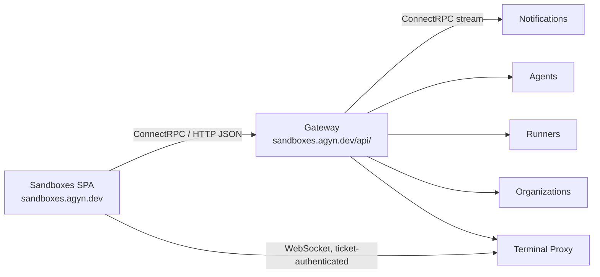

# Sandboxes App

## Overview

The Sandboxes app is a single-page application (SPA) hosted at `sandboxes.agyn.dev`, through which organization members create, enter, share, and stop their own [sandboxes](../product/sandboxes/sandboxes.md). See the [product spec](../product/sandboxes/sandboxes-app.md) for the full feature description.

It is the fourth user-facing SPA, alongside the [Console](console.md), Chat, and [Tracing](tracing.md). Unlike the Console it is open to every organization member, which is what makes it a separate app: `can_create_sandbox` is computed from `member`, while Console access is limited to organization owners and cluster admins.

Like the Console, it performs OIDC Authorization Code + PKCE in the browser and attaches the `access_token` as a Bearer token on all Gateway requests. See [Authentication — User Authentication](authn.md#user-authentication-oidc).

## Architecture

The app is a static SPA served by its own Kubernetes deployment with no backend. It holds three connections: ConnectRPC to the Gateway for all resource operations, a long-lived ConnectRPC server stream to [Notifications](notifications.md) — also through the Gateway — for live status, and one WebSocket per open terminal to the [Terminal Proxy](terminal-proxy.md).

## Routes

| Route | Description |
|-------|-------------|
| `/` | Redirects to the last-used organization, or the only one when the user belongs to exactly one |
| `/organizations/:orgId/sandboxes` | The caller's sandboxes and the sandboxes shared with them |
| `/organizations/:orgId/sandboxes/new` | Create form |
| `/organizations/:orgId/sandboxes/:sandboxId` | Sandbox detail and terminal |

The selected organization persists in local storage, as in the Console.

## Gateway API Surface

| Gateway Service | Methods | Authorization |
|-----------------|---------|---------------|
| `AgentsGateway` | `CreateSandbox`, `GetSandbox`, `ListSandboxes`, `StopSandbox`, `DeleteSandbox`, `EnsureSandboxRunning` | See [Agents Service — Authorization](agents-service.md#authorization). `CreateSandbox` additionally requires `can_use` on the environment |
| `AgentsGateway` | `ShareSandbox`, `UnshareSandbox`, `ListSandboxShares` | `can_share` on the sandbox — the owner |
| `AgentsGateway` | `ListEnvironments`, `GetEnvironment` (metadata) | `member` on the organization. The response's `can_use` field drives the environment picker — see [Agents Service — Environment Metadata](agents-service.md#environment-metadata) |
| `RunnersGateway` | `ListVolumes` filtered to `owner_kind=sandbox` | `can_view_volumes` on the organization — organization owners only. The app degrades without it and does not require it |
| `AgentsGateway` | `GetSandboxLayout`, `SetSandboxLayout` | `can_connect` on the sandbox. Always the caller's own layout — see [Agents Service — Sandbox Layout](agents-service.md#sandbox-layout) |
| `TerminalGateway` | `CreateTerminalSession` (`kind: SHELL`, with `shell_id`) | `can_connect` on the sandbox, checked in the [Terminal Proxy](terminal-proxy.md#authorization) at ticket issuance |
| `ExposeGateway` | `ListExposures`, `AddExposure`, `RemoveExposure` — all passing the sandbox's `workload_id` explicitly | `can_connect` on the sandbox for add and remove; `member` on the organization for list. See [Expose Service — Authorization](expose-service.md#authorization) |
| `OrganizationsGateway` | `ListMyMemberships` | Any authenticated user — populates the organization switcher |
| `UsersGateway` | `GetMe`, `SearchUsers` | Any authenticated user. `SearchUsers` backs the share picker |
| `GroupsGateway` | `ListGroups` | `member` on the organization — the share picker offers groups as principals |

The app calls no method that requires organization ownership. A member with no elevated permission can use every feature except those that read another owner's data.

## Terminal

Each tab follows the standard two-step establishment: `CreateTerminalSession(workload_id, container_name, kind: SHELL, shell_id, shell_cwd)` over the Gateway returns a ticket, then a WebSocket to the Terminal Proxy carrying the ticket and a handshake with the initial size and the app's `TERM`. Long-lived credentials never appear in the WebSocket URL. Rendering is xterm.js over the [wire protocol](terminal-proxy.md#wire-protocol); resize is forwarded on every pane resize.

The `workload_id` comes from the sandbox record. A sandbox in any state other than `running` has no workload to attach to, so the detail page calls `EnsureSandboxRunning` first and attaches once the sandbox reports `running`.

**The tab strip is drawn from the [layout](resource-definitions.md#sandbox-layout), not from the container.** `GetSandboxLayout` on mount gives the tabs, their order, and each one's last known directory; `SetSandboxLayout` writes back on open, close, rename, and reorder, carrying the version it read. Because [attaching creates a shell that does not exist](terminal-proxy.md#persistent-shells), the app never asks whether one is live — a tab whose shell the sandbox lost simply opens.

**Nothing the strip displays requires a call into the container.** A tab's name comes from the title its shell announces, which xterm.js already parses out of the byte stream it is rendering; failing that, from the stored directory; failing that, from the tab's number. Directories are written by the [Orchestrator](agents-orchestrator.md#layout-snapshot-before-stop) before a stop, not polled by the app.

**Attaching displaces whatever held the shell**, including this app on another device. A tab whose session ends with `reason: displaced` says so and offers to take it back, rather than reconnecting into a fight with the other device.

Every open tab holds its own session, so a background tab keeps rendering and keeps its scrollback. It no longer has to: a detached shell survives, so a client could attach only what is visible. Keeping them attached is what makes a background tab's output live, and the cost is one WebSocket per tab rather than the loss of the shell it used to be.

## Ports

The detail page lists the sandbox's [exposures](expose-service.md#hostname) and can add and remove them. All three calls pass the sandbox's `workload_id` explicitly — the browser is not the workload, so the header-derived path the CLI uses inside the container does not apply, and the Expose service authorizes the caller as someone who could open a shell instead.

`workload_id` is read from the same sandbox record the terminal uses. A sandbox that is not `running` has no workload and therefore no exposures; the app renders the empty state rather than calling `ListExposures` with nothing to pass.

**No live updates.** The Expose service publishes no [Notifications](notifications.md) events, so there is no room to subscribe to and the app cannot learn about a port exposed from inside the shell as it happens. It refetches `ListExposures` on mount, after each `AddExposure` / `RemoveExposure` it issues, and on the `sandbox.updated` transition into `running`. Adding an exposure room is the fix and is not specified here — the list is short, the staleness is visible, and a refetch is cheap.

Each attached session drives the sandbox's activity clock through the Terminal Proxy — see [Sandbox Activity Reporting](terminal-proxy.md#sandbox-activity-reporting). The app does not report activity itself and must not attempt to; an open tab keeps a sandbox alive only for as long as a session is genuinely attached.

## Real-Time Updates

The app subscribes to [Notifications](notifications.md) rooms over a `NotificationsGateway.Subscribe` server stream:

| Room | Where | Carries |
|------|-------|---------|
| `sandbox_owner:{caller_identity_id}` | Sandboxes list | `sandbox.updated` for the caller's own sandboxes |
| `sandbox:{sandbox_id}` | Sandbox detail; one per shared sandbox on the list | `sandbox.updated` for a single sandbox, reaching collaborators as well as the owner |
| `sandbox_layout:{caller_identity_id}` | Sandbox detail | `sandbox_layout.updated` — a tab opened, closed, renamed, or reordered by this person somewhere else |

The owner room covers a member's own list in one subscription. Collaborated sandboxes are not covered by it — it is keyed by owner identity — so the app subscribes per shared sandbox. It follows the [Consumer Sync Protocol](notifications.md#consumer-sync-protocol): subscribe, buffer, fetch through `ListSandboxes`/`GetSandbox`, then apply. On reconnect it refetches the current view.

The layout room is what makes a second device converge: it is keyed by the caller rather than by the sandbox, because a layout is only ever their own. The event carries a version, so the client that made the change recognizes its own write and refetches nothing.

Status changes therefore surface whatever their cause — the idle timeout stopping a workload, the CLI starting one, a collaborator stopping a shared sandbox.

## Ingress

| Path | Host | Target | Description |
|------|------|--------|-------------|
| Subdomain | `sandboxes.agyn.dev` | `sandboxes-app:3000` | SPA static assets |
| Path-based API | `sandboxes.agyn.dev/api/*` | `gateway-gateway:8080` | Gateway API route (prefix `/api/` stripped). Same-origin with the SPA, no CORS required |

The Notifications stream needs no route of its own: it is a Gateway method and rides `/api/*` with every other call. Only the terminal WebSocket leaves this origin, for the [Terminal Proxy](terminal-proxy.md)'s own ingress host, as it does for every other client.

## Deployment

| Aspect | Detail |
|--------|--------|
| **Repository** | `agynio/sandboxes-app` |
| **Language** | TypeScript (React SPA) |
| **Build** | Static assets (HTML, JS, CSS) |
| **Serving** | Static file server in a container |
| **Kubernetes** | Deployment + Service, packaged as a chart and included in the `agyn-platform` umbrella chart |
| **CI/CD** | See [CI/CD](operations/ci-cd.md) |
| **Configuration** | Runtime environment variables: OIDC issuer, client ID, Gateway base URL |

## Related

- [Sandboxes App — product](../product/sandboxes/sandboxes-app.md)
- [Sandboxes — product](../product/sandboxes/sandboxes.md)
- [Terminal Proxy](terminal-proxy.md)
- [Agents Service](agents-service.md)
- [Authorization — sandbox](authz.md#sandbox)
- [Notifications](notifications.md)
- [Console](console.md)
