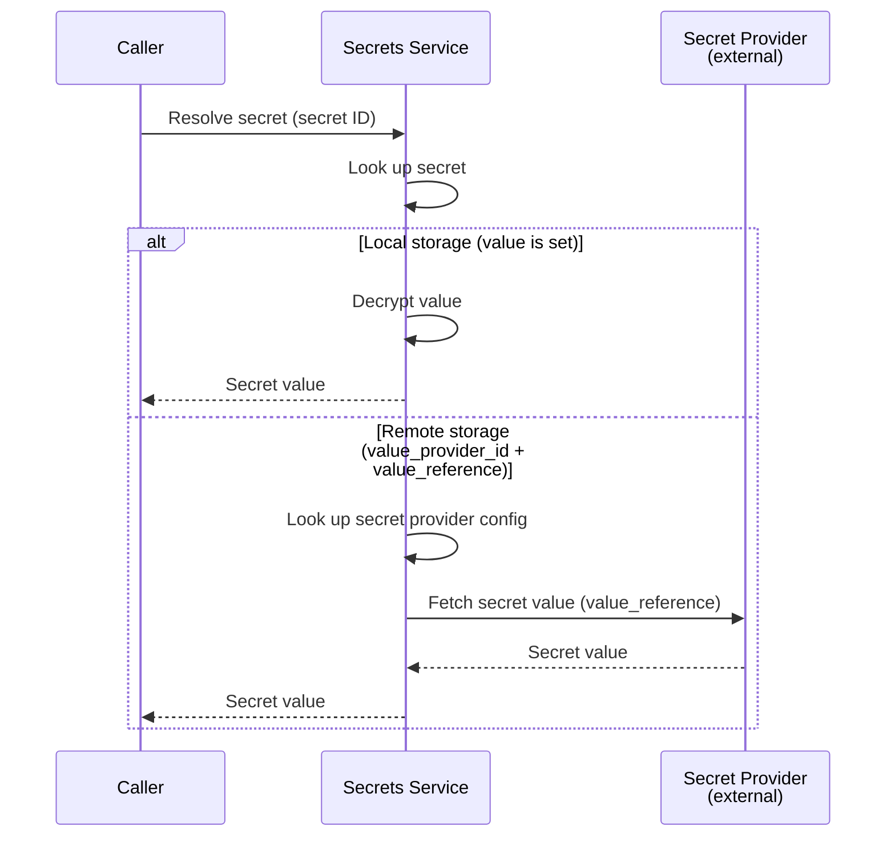
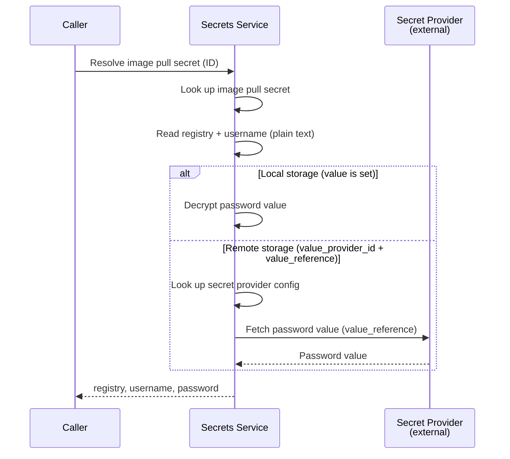

# Secrets Service

## Overview

The Secrets service manages secret providers, secrets, and image pull secrets as internal resources. It provides CRUD operations for all three and a resolution endpoint that retrieves the actual secret value — either from the local encrypted store or from an external provider.

## Responsibilities

| Responsibility | Description |
|---------------|-------------|
| **Secret Provider CRUD** | Create, read, update, delete secret provider resources |
| **Secret CRUD** | Create, read, update, delete secret resources |
| **Image Pull Secret CRUD** | Create, read, update, delete image pull secret resources |
| **Secret Resolution** | Resolve a secret ID to its actual value (local decryption or remote fetch) |
| **Image Pull Secret Resolution** | Resolve an image pull secret ID to registry, username, and password (local decryption or remote fetch for the password) |

## Classification

The Secrets service is a **data plane** service — it is called at runtime to resolve secrets during workload startup and environment variable injection.

## Value Storage Model

Secrets and image pull secrets use the same dual storage model for sensitive values:

- **Local:** The value is stored directly in the Secrets service database, encrypted at rest. The encryption key is a symmetric key stored in a Kubernetes Secret and mounted into the Secrets service pod at startup.
- **Remote:** The value is a reference to an external secret provider (e.g., Vault). The Secrets service resolves the value from the provider at runtime.

See [Providers, Models, and Secrets — Secret](providers.md#secret) and [Providers, Models, and Secrets — Image Pull Secret](providers.md#image-pull-secret) for resource definitions.

### Encryption Key

The encryption key for locally-stored secret values is a symmetric key stored in a Kubernetes Secret. The Secrets service reads the key from a mounted volume at startup. The key is used for both encryption (on create/update) and decryption (on resolve).

## Secret Resolution

Given a secret ID, the service resolves the full value:

For remote Vault secrets, `value_reference` is a composite key (`<mount>/<path>/<key>`). The service parses it and calls the Vault KV v2 API to read the specific key.

## Image Pull Secret Resolution

Given an image pull secret ID, the service resolves the full credential:

The caller receives the full credential triple needed to construct a Docker registry authentication entry.

## Authorization

All secret resources are org-scoped. Resolution calls are split between an internal path (trusted) and the Gateway-exposed path (authorized).

| Operation | Check |
|-----------|-------|
| Create, Update, Delete (providers, secrets, image pull secrets) | `owner` on `organization:<org_id>` |
| Get, List (providers, secrets, image pull secrets) | `member` on `organization:<org_id>` |
| `ResolveSecretValue` (via Gateway) | `admin` on `cluster:global` |
| `ResolveSecretValue`, `ResolveImagePullSecret` (internal) | Internal only — Orchestrator via Istio, no OpenFGA check |

See [Authorization — Secrets Service](authz.md#secrets-service) for the full reference.

## Provider Management

CRUD operations for secret provider resources. See [Providers, Models, and Secrets](providers.md#secret-provider) for the resource definition.

## Secret Management

CRUD operations for secret resources. See [Providers, Models, and Secrets](providers.md#secret) for the resource definition.

## Image Pull Secret Management

CRUD operations for image pull secret resources. See [Providers, Models, and Secrets](providers.md#image-pull-secret) for the resource definition.
