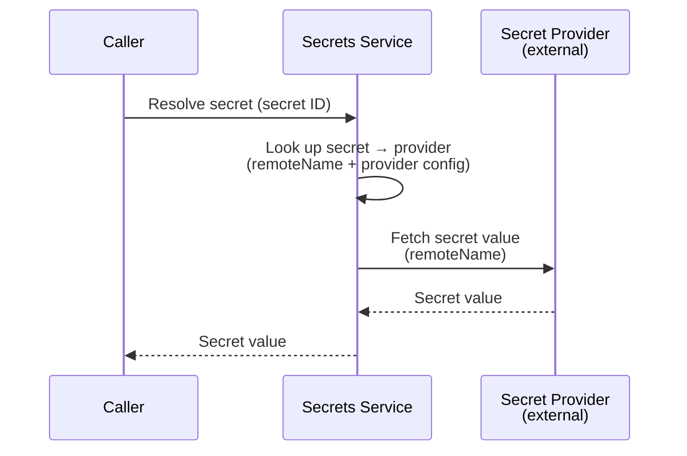

# Secrets Service

## Overview

The Secrets service manages secret providers and secrets as internal resources. It provides CRUD operations for both and a resolution endpoint that retrieves the actual secret value from the external provider.

## Responsibilities

| Responsibility | Description |
|---------------|-------------|
| **Secret Provider CRUD** | Create, read, update, delete secret provider resources |
| **Secret CRUD** | Create, read, update, delete secret resources |
| **Secret Resolution** | Resolve a secret ID to its actual value by fetching from the external provider |

## Classification

The Secrets service is a **data plane** service — it is called at runtime to resolve secrets during workload startup and environment variable injection.

## Secret Resolution

Given a secret ID, the service resolves the full value:

1. Caller requests resolution of a secret by its internal ID.
2. The service looks up the secret resource to get the secret provider reference and remote name.
3. The service looks up the secret provider resource to get the connection configuration.
4. The service fetches the secret value from the external provider using the remote name.
5. The resolved value is returned to the caller.

For Vault, `remoteName` is a composite key (`<mount>/<path>/<key>`). The service parses it and calls the Vault KV v2 API to read the specific key.

## Provider Management

CRUD operations for secret provider resources. See [Providers, Models, and Secrets](providers.md#secret-provider) for the resource definition.

## Secret Management

CRUD operations for secret resources. See [Providers, Models, and Secrets](providers.md#secret) for the resource definition.
