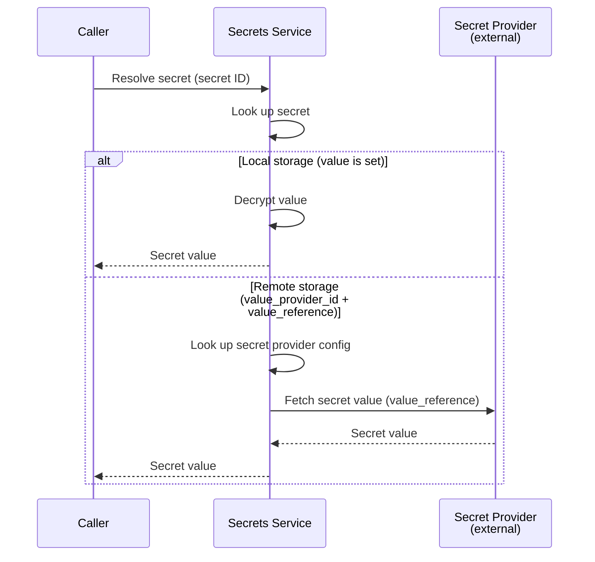

# Secrets Service

## Overview

The Secrets service manages secret providers and secrets as internal resources. It provides CRUD operations for both and a resolution endpoint that retrieves the actual secret value — either from the local encrypted store or from an external provider.

## Responsibilities

| Responsibility | Description |
|---------------|-------------|
| **Secret Provider CRUD** | Create, read, update, delete secret provider resources |
| **Secret CRUD** | Create, read, update, delete secret resources. Delete is rejected if the secret is referenced by an active [EgressRule.effect.inject](resource-definitions.md#egress-rule) or by a [Subscription](providers.md#subscription) |
| **Secret Resolution** | Resolve a secret ID to its actual value (local decryption or remote fetch) |
| **Secret Existence Check** | `ResolveSecretExists(secret_id)` — verify a secret exists, used to validate a `secret_id` reference before it is persisted |

## Classification

The Secrets service is a **data plane** service — it is called at runtime to resolve secrets during workload startup and environment variable injection.

## Value Storage Model

Secrets use a dual storage model for sensitive values:

- **Local:** The value is stored directly in the Secrets service database, encrypted at rest. The encryption key is a symmetric key stored in a Kubernetes Secret and mounted into the Secrets service pod at startup.
- **Remote:** The value is a reference to an external secret provider (e.g., Vault). The Secrets service resolves the value from the provider at runtime.

See [Providers, Models, and Secrets — Secret](providers.md#secret) for the resource definition. Registry credentials are ordinary secrets referenced by an [Image](resource-definitions.md#image); the Secrets service has no separate image pull secret resource.

### Encryption Key

The encryption key for locally-stored secret values is a symmetric key stored in a Kubernetes Secret. The Secrets service reads the key from a mounted volume at startup. The key is used for both encryption (on create/update) and decryption (on resolve).

## Secret Resolution

Given a secret ID, the service resolves the full value:

```mermaid
sequenceDiagram
    participant C as Caller
    participant S as Secrets Service
    participant P as Secret Provider<br/>(external)

    C->>S: Resolve secret (secret ID)
    S->>S: Look up secret
    alt Local storage (value is set)
        S->>S: Decrypt value
        S-->>C: Secret value
    else Remote storage (value_provider_id + value_reference)
        S->>S: Look up secret provider config
        S->>P: Fetch secret value (value_reference)
        P-->>S: Secret value
        S-->>C: Secret value
    end
```

For remote Vault secrets, `value_reference` is a composite key (`<mount>/<path>/<key>`). The service parses it and calls the Vault KV v2 API to read the specific key.

## Authorization

All secret resources are org-scoped. Resolution calls are split between an internal path (trusted) and the Gateway-exposed path (authorized).

| Operation | Check |
|-----------|-------|
| Create, Update, Delete (providers, secrets) | `owner` on `organization:<org_id>` |
| Get, List (providers, secrets) | `member` on `organization:<org_id>` |
| `ResolveSecretValue` (via Gateway) | `admin` on `cluster:global` |
| `ResolveSecretValue` (internal) | Internal only — via Istio, no OpenFGA check |
| `ResolveSecretExists` (internal) | Internal only — via Istio, no OpenFGA check |

### Referential Integrity

`DeleteSecret` checks for live references before deleting, and is rejected with an error naming the referencing resources when any exist:

| Referencing resource | Check | Owner |
|---|---|---|
| [EgressRule.effect.inject](resource-definitions.md#egress-rule) | `CountRulesReferencingSecret(secret_id)` | [EgressRules service](egress-rules-service.md) |
| [Subscription.secret_id](providers.md#subscription) | `CountSubscriptionsReferencingSecret(secret_id)` | [LLM service](llm.md#referential-integrity-with-secrets) |

A service that cannot be reached makes the secret undeletable too, but it is reported differently: known references are named first and the unreachable check is listed after them. An operator told only "cannot verify subscription references" would detach an egress rule and be refused again for a reason nobody mentioned.

These are the only places the Secrets service makes outbound calls. Neither is a dependency cycle: Secrets calls out only on `DeleteSecret`, and each referencing service calls in only on create/update (existence check via `ResolveSecretExists`) — the two directions never recurse into each other.

See [Authorization — Secrets Service](authz.md#secrets-service) for the full reference.

## Provider Management

CRUD operations for secret provider resources. See [Providers, Models, and Secrets](providers.md#secret-provider) for the resource definition.

## Secret Management

CRUD operations for secret resources. See [Providers, Models, and Secrets](providers.md#secret) for the resource definition.
