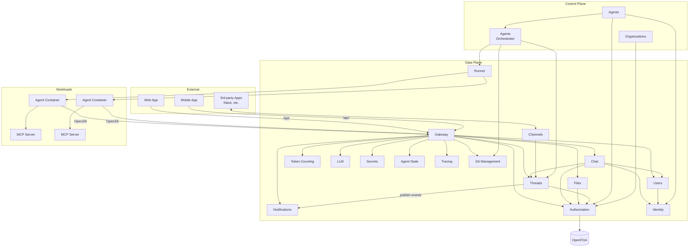

# System Overview

Agyn is a Kubernetes-native AI agent orchestrator. It manages the lifecycle of AI agents that communicate with humans and each other through threaded conversations, with tools provided via MCP (Model Context Protocol). The platform uses [organizations](organizations.md) to group configuration resources, with [ReBAC](authz.md) for fine-grained access control on all resources. See [Authentication](authn.md) for identity types.

## Component Diagram

## Component Summary

| Component | Responsibility |
|-----------|---------------|
| **Identity** | Central identity registry. Maps `identity_id` to `identity_type` for all identity types |
| **Users** | User identity records and profiles. Provisions users on first OIDC login, serves profiles for display |
| **Organizations** | Organization lifecycle (CRUD) and listing accessible organizations for an identity (queries Authorization for organization IDs, enriches with organization details) |
| **Chat** | Built-in web/mobile app chat experience. Thread lifecycle, unread counts. Built on top of Threads |
| **Channels** | Bidirectional interface connecting 3rd-party products (Slack, etc.) with Threads. Each channel creates and manages its own threads |
| **Threads** | Generic messaging between participants. Stores messages, tracks participants by ID, provides message acknowledgment. Participant-type-agnostic |
| **Files** | File upload, metadata storage, and pre-signed download URL generation. Backed by S3-compatible object storage |
| **Token Counting** | Per-message token counting for LLM messages |
| **LLM** | Manages LLM providers and models. Proxies LLM API calls from agents to providers with injected credentials |
| **Secrets** | Manages secret providers and secrets. Resolves secret values from external providers at runtime |
| **Notifications** | Real-time event fanout via persistent connections (socket). All services publish state change events through Notifications |
| **Authorization** | Fine-grained access control. Thin proxy to OpenFGA — centralizes configuration, adds observability. Services call Authorization for permission checks and relationship writes |
| **[Agents Orchestrator](agents-orchestrator.md)** | Reconciles agent workloads for threads with unacknowledged messages |
| **Agent State** | Long-term agent context persistence (APSS) |
| **Tracing** | Ingestion and query of tracing data. Extended OpenTelemetry protocol for real-time in-progress events |
| **[Agents](agents-service.md)** | Management of agent resources: agents, volumes, MCP servers, skills, hooks, etc. |
| **Runner** | Executes workloads. Implementations: docker-runner, k8s-runner |
| **Gateway** | Exposes platform methods for external usage via [ConnectRPC](gateway.md#connectrpc) (gRPC + HTTP/JSON). Accessible at `gateway.agyn.dev` (subdomain) and `agyn.dev/api/` (path-based, prefix stripped) |
| **Ziti Management** | Manages OpenZiti identities, services, and policies. Encapsulates all OpenZiti Controller API interactions |

## Data Stores

| Store | Current Usage |
|-------|--------------|
| PostgreSQL | Primary relational store (agent state, platform data, user records, identity registry, organizations) |
| Redis | Pub/sub for notifications, caching |
| Filesystem | Graph store (agent graph definitions persisted as filesystem dataset) |
| Object Storage (S3) | Media file storage (MinIO locally, any S3-compatible in production) |
| OpenFGA | Relationship-based access control (authorization model and relationship tuples). PostgreSQL-backed |

## Repository Map

| Repository | Contents | Language | Status |
|------------|----------|----------|--------|
| `agynio/api` | API schemas: protobuf (internal gRPC + external gateway ConnectRPC) | Proto | Active |
| `agynio/notifications` | Notifications service | Go | Standalone service |
| `agynio/gateway` | Gateway service | Go | Standalone service |
| `agynio/agent-state` | Agent State (APSS) service | Go | Standalone service |
| `agynio/openfga-model` | OpenFGA authorization model and Terraform module | DSL, HCL | Planned |
| `agynio/authorization` | Authorization service (thin proxy to OpenFGA) | Go | Planned |
| `agynio/identity` | Identity registry service | Go | Planned |
| `agynio/users` | Users service | Go | Planned |
| `agynio/organizations` | Organizations service | Go | Planned |
| `agynio/agents` | Agents service (agent resource management) | Go | Planned |
| `agynio/agyn-cli` | Platform CLI — Gateway API access | Go | Planned |
| `agynio/agynd-cli` | Agent wrapper daemon — bridges agent CLIs with platform | Go | Planned |
| `agynio/agn-cli` | Agent loop implementation — LLM reasoning with tool use | Go | Planned |
| `agynio/k8s-runner` | Kubernetes-native Runner implementation | Go | Planned |
| `agynio/terraform-provider-agyn` | Terraform provider for agent resource management | Go | Planned |
| `agynio/architecture` | This documentation | Markdown | — |
