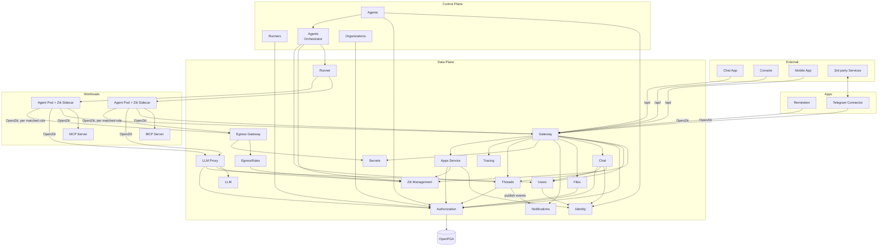

# System Overview

Agyn is a Kubernetes-native AI agent orchestrator. It manages the lifecycle of AI agents that communicate with humans and each other through threaded conversations, with tools provided via [MCP](mcp.md) (Model Context Protocol). The platform uses [organizations](organizations.md) to group configuration resources, with [ReBAC](authz.md) for fine-grained access control on all resources. See [Authentication](authn.md) for identity types.

## Component Diagram

## Component Summary

| Component | Responsibility |
|-----------|---------------|
| **Identity** | Central identity registry. Maps `identity_id` to `identity_type` for all identity types |
| **Users** | User identity records and profiles. Provisions users on first OIDC login, serves profiles for display |
| **Organizations** | Organization lifecycle (CRUD), membership management (invites, direct membership, role assignment), and listing accessible organizations for an identity |
| **Chat** | Built-in web/mobile app chat experience. Thread lifecycle, unread counts. Built on top of Threads |
| **Threads** | Generic messaging between participants. Stores messages, tracks participants by ID, provides message acknowledgment. Participant-type-agnostic |
| **Files** | File upload, metadata storage, and pre-signed download URL generation. Backed by S3-compatible object storage. File content is accessed by agents via [files-mcp](files-mcp.md) |
| **LLM** | Manages LLM providers and models. Provides model resolution (model ID → provider endpoint, token, remote name) for the LLM Proxy |
| **[LLM Proxy](llm-proxy.md)** | Exposes an OpenAI-compatible Responses API endpoint for agents. Authenticates callers, resolves models via LLM service, forwards requests to external providers |
| **Secrets** | Manages secret providers and secrets. Resolves secret values from external providers at runtime |
| **Notifications** | Real-time event fanout via persistent connections (socket). All services publish state change events through Notifications |
| **Authorization** | Fine-grained access control. Thin proxy to OpenFGA — centralizes configuration, adds observability. Services call Authorization for permission checks and relationship writes |
| **[Agents Orchestrator](agents-orchestrator.md)** | Reconciles agent workloads for threads with unacknowledged messages |
| **Tracing** | Span ingestion and query. Implements standard OTLP TraceService/Export with upsert semantics for in-progress spans. Captures full LLM call context for observability |
| **[Agents](agents-service.md)** | Management of agent resources: agents, volumes, MCP servers, skills, hooks, etc. |
| **[Runners](runners.md)** | Manages runner registrations and workload runtime state. Central registry of runners (cluster-scoped and org-scoped) and running workloads |
| **Runner** | Executes workloads. Current implementation: [k8s-runner](k8s-runner.md) |
| **Gateway** | Exposes platform methods for external usage via [ConnectRPC](gateway.md#connectrpc) (gRPC + HTTP/JSON). Accessible at `gateway.agyn.dev` (subdomain) and `agyn.dev/api/` (path-based, prefix stripped) |
| **Ziti Management** | Manages OpenZiti identities, services, and policies. Encapsulates all OpenZiti Controller API interactions |
| **[Apps Service](apps-service.md)** | Apps, installations, profiles, and enrollment. Manages the lifecycle of [apps](apps.md) — both apps (owned by organizations) and per-org installations (permissions bridge + configuration) |
| **[Apps](apps.md)** | Independently deployed services that interact with threads on behalf of external systems or platform capabilities. Includes bidirectional bridges to 3rd-party products ([Telegram Connector](apps/telegram-connector.md)) and platform-provided capabilities ([Reminders](apps/reminders.md)) |
| **[Egress Gateway](egress-gateway.md)** | Data-plane MITM proxy for agent outbound HTTP/HTTPS. Terminates TLS with a platform CA, evaluates [EgressRules](egress-rules-service.md) attached to the agent, injects credentials, forwards upstream |
| **[EgressRules](egress-rules-service.md)** | Control-plane service for `EgressRule` resources and their attachments. Provisions per-rule OpenZiti services and per-attachment Dial policies. Reconciles drift |

## Data Concerns

The platform separates three distinct data concerns, each with its own storage and lifecycle:

| Concern | What it stores | Storage | Lifetime |
|---------|---------------|---------|----------|
| **Chat / Threads** | User messages and agent responses — the conversation record | PostgreSQL ([Threads](threads.md)) | Long-lived |
| **Agent state** | Internal working memory managed by each agent implementation | Disk (persistent volume) | Lives as long as the volume exists |
| **Tracing** | Full LLM call context (complete request bodies) for observability and debugging | PostgreSQL ([Tracing](tracing.md)) | Shorter retention due to data volume |

See [Agent State](agent/state.md) for the persistence model.

## Data Stores

| Store | Current Usage |
|-------|--------------|
| PostgreSQL | Primary relational store (platform data, user records, identity registry, organizations, tracing) |
| Redis | Pub/sub for notifications, caching |
| Persistent Volumes | Agent state — managed by each agent implementation on disk |
| Object Storage (S3) | Media file storage (MinIO locally, any S3-compatible in production) |
| OpenFGA | Relationship-based access control (authorization model and relationship tuples). PostgreSQL-backed |

## Services Inventory

The canonical inventory of deployable long-running services lives in [Services](services.md). That page links each service to its repository and service-specific architecture documentation.
