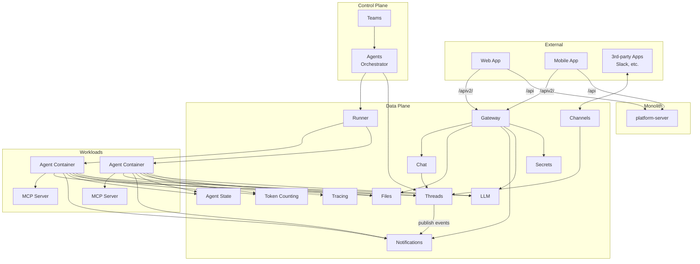

# System Overview

Agyn is a Kubernetes-native AI agent orchestrator. It manages the lifecycle of AI agents that communicate with humans and each other through threaded conversations, with tools provided via MCP (Model Context Protocol).

## Component Diagram

## Component Summary

| Component | Responsibility |
|-----------|---------------|
| **Chat** | Built-in web/mobile app chat experience. Thread lifecycle, unread counts. Built on top of Threads |
| **Channels** | Bidirectional interface connecting 3rd-party products (Slack, etc.) with Threads. Each channel creates and manages its own threads |
| **Threads** | Generic messaging between participants. Stores messages, tracks participants by ID, provides message acknowledgment. Participant-type-agnostic |
| **Files** | File upload, metadata storage, and pre-signed download URL generation. Backed by S3-compatible object storage |
| **Token Counting** | Per-message token counting for LLM messages |
| **LLM** | Manages LLM providers and models. Proxies LLM API calls from agents to providers with injected credentials |
| **Secrets** | Manages secret providers and secrets. Resolves secret values from external providers at runtime |
| **Notifications** | Real-time event fanout via persistent connections (socket). All services publish state change events through Notifications |
| **Agents** | Orchestrator that spins up agent workloads for threads with unacknowledged messages |
| **Agent State** | Long-term agent context persistence (APSS) |
| **Tracing** | Ingestion and query of tracing data. Extended OpenTelemetry protocol for real-time in-progress events |
| **Teams** | Management of team resources: agents, workspaces, MCP servers, etc. |
| **Runner** | Executes workloads. Implementations: docker-runner, k8s-runner |
| **Gateway** | Exposes platform methods for external usage. Accessible at `gateway.agyn.dev` (subdomain) and `agyn.dev/apiv2/` (path-based, prefix stripped) |

## Data Stores

| Store | Current Usage |
|-------|--------------|
| PostgreSQL | Primary relational store (agent state, platform data) |
| Redis | Pub/sub for notifications, caching |
| Filesystem | Graph store (agent graph definitions persisted as filesystem dataset) |
| Object Storage (S3) | Media file storage (MinIO locally, any S3-compatible in production) |

## Repository Map

| Repository | Contents | Language | Status |
|------------|----------|----------|--------|
| `agynio/api` | API schemas: protobuf (internal gRPC) and OpenAPI (external) | Proto, YAML | Active |
| `agynio/platform` | Monolith: platform-server, LLM package, platform-ui | TypeScript | Active (being decomposed) |
| `agynio/docker-runner` | Docker Runner service | TypeScript | Active |
| `agynio/notifications` | Notifications service | Go | Standalone service |
| `agynio/gateway` | Gateway service | Go | Standalone service |
| `agynio/agent-state` | Agent State (APSS) service | Go | Standalone service |
| `agynio/architecture` | This documentation | Markdown | — |
