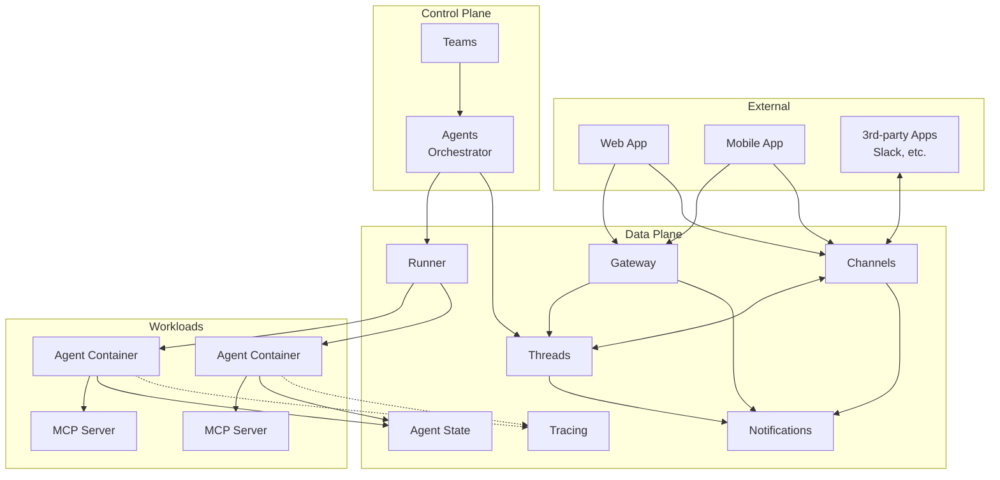

# System Overview

Agyn is a Kubernetes-native AI agent orchestrator. It manages the lifecycle of AI agents that communicate with humans and each other through threaded conversations, with tools provided via MCP (Model Context Protocol).

## Component Diagram

## Component Summary

| Component | Responsibility |
|-----------|---------------|
| **Channels** | Bidirectional interface connecting 3rd-party products (Slack, etc.) and own apps (web, mobile) with Threads |
| **Threads** | Conversation messaging between multiple participants (humans and agents) |
| **Notifications** | Real-time event fanout via persistent connections (socket). Delivers events to relevant clients |
| **Agents** | Orchestrator that spins up agent workloads for threads with pending messages |
| **Agent State** | Long-term agent context persistence (APSS) |
| **Tracing** | Ingestion and query of tracing data. Extended OpenTelemetry protocol for real-time in-progress events |
| **Teams** | Management of team resources: agents, workspaces, MCP servers, etc. |
| **Runner** | Executes workloads. Implementations: docker-runner, k8s-runner |
| **Gateway** | Exposes platform methods for external usage |

## Data Stores

| Store | Current Usage |
|-------|--------------|
| PostgreSQL | Primary relational store (agent state, platform data) |
| Redis | Pub/sub for notifications, caching |
| Filesystem | Graph store (agent graph definitions persisted as filesystem dataset) |

## Repository Map

| Repository | Contents | Language | Status |
|------------|----------|----------|--------|
| `agynio/api` | API schemas: protobuf (internal gRPC) and OpenAPI (external) | Proto, YAML | Active |
| `agynio/platform` | Monolith: platform-server, docker-runner, LLM package, platform-ui | TypeScript | Active (being decomposed) |
| `agynio/notifications` | Notifications service | Go | Standalone service |
| `agynio/gateway` | Gateway service | Go | Standalone service |
| `agynio/agent-state` | Agent State (APSS) service | Go | Standalone service |
| `agynio/architecture` | This documentation | Markdown | — |
