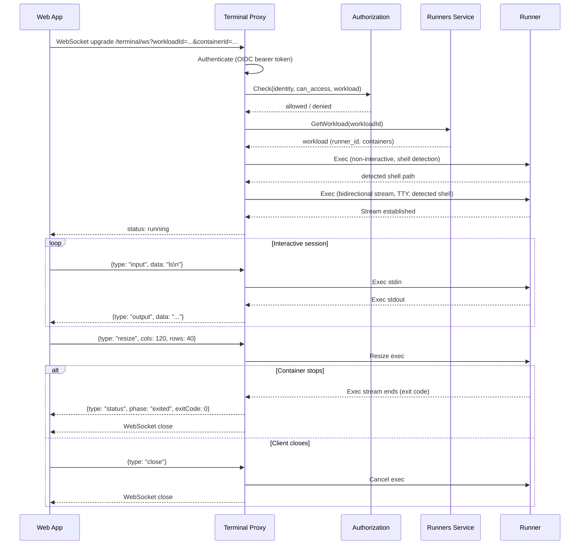

# Terminal Proxy

## Overview

The Terminal Proxy is a standalone service that provides interactive web-based terminal access to running workload containers. It accepts WebSocket connections from the UI, authenticates callers, and bridges each session to the [Runner](runner.md)'s `Exec` RPC via [OpenZiti](openziti.md).

## Responsibilities

| Responsibility | Description |
|---------------|-------------|
| **WebSocket endpoint** | Accept WebSocket upgrade requests for terminal sessions |
| **Authentication** | Authenticate callers via OIDC bearer token (same mechanism as the [Gateway](gateway.md)) |
| **Authorization** | Call the [Authorization](authz.md) service to verify the caller can access the workload |
| **Runner resolution** | Query the [Runners](runners.md) service to resolve which runner hosts the target workload |
| **Shell detection** | Execute a non-interactive command via Runner `Exec` to detect the available shell before starting the interactive session |
| **Exec bridging** | Open a bidirectional streaming `Exec` RPC to the Runner and bridge stdin/stdout between the WebSocket and the exec stream |

## Classification

The Terminal Proxy is a **data plane** service — it carries live interactive terminal traffic.

## WebSocket Endpoint

```
/terminal/ws?workloadId={workloadId}&containerId={containerId}
```

| Parameter | Type | Description |
|-----------|------|-------------|
| `workloadId` | string (UUID) | The workload to connect to |
| `containerId` | string | The specific container within the workload (main container or a sidecar) |

### Protocol

The client connects via WebSocket with a Bearer token for authentication. After authentication and authorization, the Terminal Proxy opens a bidirectional streaming `Exec` RPC to the Runner via OpenZiti and bridges the two streams.

#### Client → Terminal Proxy (JSON messages)

| Message | Fields | Description |
|---------|--------|-------------|
| `input` | `type: "input"`, `data: string` | Keyboard input from the terminal |
| `resize` | `type: "resize"`, `cols: int`, `rows: int` | Terminal dimensions changed |
| `ping` | `type: "ping"`, `ts: int` | Keepalive |
| `close` | `type: "close"` | Client requests session end |

#### Terminal Proxy → Client (JSON messages)

| Message | Fields | Description |
|---------|--------|-------------|
| `output` | `type: "output"`, `data: string` | Terminal output (stdout/stderr) |
| `status` | `type: "status"`, `phase: string`, `exitCode?: int`, `reason?: string` | Session lifecycle events. Phases: `starting`, `running`, `exited`, `error` |
| `error` | `type: "error"`, `code: string`, `message: string` | Error notification |
| `pong` | `type: "pong"`, `ts: int` | Keepalive response |

### Flow



### Exec Configuration

The Terminal Proxy starts the Runner `Exec` RPC with:

- **TTY mode** enabled (interactive shell).
- **Shell** auto-detected: the Terminal Proxy executes a shell detection command via a non-interactive `Exec` call before starting the interactive session. Prefers `/bin/bash`, falls back to `/bin/sh`.
- **No wall timeout** — sessions remain open as long as the WebSocket is connected and the container is running.

### Workload Container Selection

A workload consists of multiple containers (main container, MCP server sidecars, hook sidecars). The `containerId` parameter identifies which container to exec into. The Terminal Proxy passes this to the Runner's `Exec` RPC, which targets the specified container within the workload's pod.

The Terminal Proxy resolves the hosting runner by calling `GetWorkload` on the [Runners](runners.md) service, which returns the `runner_id`. The Terminal Proxy then dials that specific runner via OpenZiti to issue the `Exec` RPC.

## Authentication

The Terminal Proxy authenticates callers by validating the OIDC `access_token` JWT signature against the IdP's JWKS endpoint and extracting the `sub` claim. The resolved identity is used for authorization checks.

The WebSocket upgrade request carries the token as a query parameter or in the `Authorization` header (browsers cannot set headers on WebSocket connections, so the query parameter path is the primary mechanism for the terminal endpoint).

## Authorization

The Terminal Proxy delegates authorization to the [Authorization](authz.md) service. After authentication, it calls `Check` to verify the caller can access the workload. The authorization logic is defined in the [authorization model](authz.md#authorization-model).

## OpenZiti Identity

The Terminal Proxy participates in the OpenZiti overlay to reach Runners. It obtains its identity at runtime via [self-enrollment](openziti.md#service-identity-self-enrollment) through [Ziti Management](openziti.md#ziti-management-service).

| Aspect | Detail |
|--------|--------|
| Role attributes | `["terminal-proxy-hosts"]` |
| Enrollment | Self-enrollment via Ziti Management at pod startup |
| SDK usage | Dials the `runner` OpenZiti service to issue `Exec` RPCs |

### Static Policies

| Policy | Type | Identity Roles | Service Roles | Purpose |
|--------|------|---------------|---------------|---------|
| `terminal-proxy-dial-runner` | Dial | `#terminal-proxy-hosts` | `@runner` | Terminal Proxy can reach Runners |

The Terminal Proxy does not bind any OpenZiti service — it only dials Runners. The UI reaches the Terminal Proxy via standard ingress, not OpenZiti.

## Ingress

The Terminal Proxy is accessible via a path-based route on the platform domain:

| Path | Backend | Use case |
|------|---------|----------|
| `agyn.dev/terminal/` | `terminal-proxy:8080` (prefix stripped) | UI WebSocket connections |

The ingress route is defined as an Istio VirtualService in `agynio/bootstrap`. Using a path on the same origin as the web app avoids CORS for WebSocket upgrades.

## Configuration

| Field | Source | Description |
|-------|--------|-------------|
| `RUNNERS_SERVICE_ADDRESS` | Deployment config | gRPC address of the [Runners](runners.md) service |
| `AUTHORIZATION_SERVICE_ADDRESS` | Deployment config | gRPC address of the [Authorization](authz.md) service |
| `ZITI_MANAGEMENT_ADDRESS` | Deployment config | gRPC address of the [Ziti Management](openziti.md) service |
| `OIDC_ISSUER` | Deployment config | OIDC issuer URL for token validation |
| `LISTEN_ADDRESS` | Deployment config | HTTP listen address (e.g., `:8080`) |

## Implementation

| Aspect | Details |
|--------|---------|
| Repository | `agynio/terminal-proxy` |
| Language | Go |
| HTTP framework | Standard `net/http` with `nhooyr.io/websocket` for WebSocket handling |
| OpenZiti | Embedded SDK (`openziti/sdk-golang`) for dialing Runners |
| Internal calls | Standard gRPC clients for Runners, Authorization, and Ziti Management |
