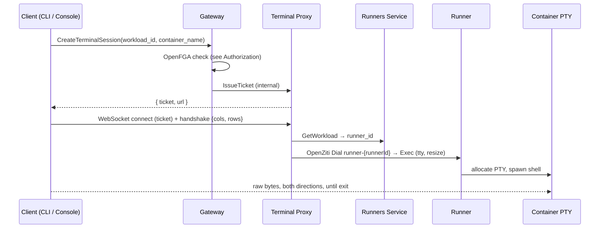

# Terminal Proxy

## Overview

The Terminal Proxy bridges interactive terminal sessions between clients (the Console's browser terminal, the `agyn` CLI) and the container they target. It is a transparent byte pipe: the client speaks WebSocket, the hosting runner speaks the [`Runner.Exec`](runner.md#execution) bidirectional gRPC stream, and the proxy translates between them without interpreting the bytes.

Primary consumers:

- **[Sandboxes](../product/sandboxes/sandboxes.md)** — `agyn sandbox start`/`connect` attach shells through the proxy.
- **Console workload inspection** — the terminal on the Workload Detail and Sandbox Detail pages ([Container](../product/concepts.md) terminal access).

## Classification

| Aspect | Detail |
|--------|--------|
| **Plane** | Data |
| **Language** | Go |
| **Repository** | `agynio/terminal-proxy` |
| **API** | WebSocket (external, via ingress) + gRPC (internal ticket issuance) |
| **State** | None — sessions are in-memory; tickets are self-contained signed tokens validated by any replica |
| **External dependencies** | [Runners](runners.md) (workload → runner resolution, activity reporting), [OpenZiti](openziti.md) (dial runners), [Authorization](authz.md) (checks at ticket issuance, via Gateway), [Agents](agents-service.md) (sandbox session bookkeeping) |

## Session Establishment

Terminal sessions are established in two steps — an authorized ticket issuance over the normal API path, then a WebSocket connect that never carries the caller's long-lived credentials:

```mermaid
sequenceDiagram
    participant C as Client (CLI / Console)
    participant G as Gateway
    participant TP as Terminal Proxy
    participant RS as Runners Service
    participant R as Runner
    participant K as Container PTY

    C->>G: CreateTerminalSession(workload_id, container_name)
    G->>G: OpenFGA check (see Authorization)
    G->>TP: IssueTicket (internal)
    TP-->>C: { ticket, url }
    C->>TP: WebSocket connect (ticket) + handshake {cols, rows}
    TP->>RS: GetWorkload → runner_id
    TP->>R: OpenZiti Dial runner-{runnerId} → Exec (tty, resize)
    R->>K: allocate PTY, spawn shell
    C-->>K: raw bytes, both directions, until exit
```

1. **`CreateTerminalSession`** (Gateway RPC): the caller requests a session for `(workload_id, container_name)`. The Gateway performs the authorization check, then asks the Terminal Proxy to issue a **ticket** — single-use, bound to the caller's identity and the target, expiring in 30 seconds. The response carries the ticket and the proxy's WebSocket URL. Long-lived auth tokens never appear in WebSocket URLs (same reasoning as the [Media Proxy](media-proxy.md)'s avoidance of tokens in `GET` URLs).
2. **WebSocket connect**: the client opens the WebSocket with the ticket, sends a JSON handshake carrying **only the initial terminal size**, and the proxy resolves the hosting runner via `Runners.GetWorkload`, dials it over OpenZiti (`runner-{runnerId}` — see [Runners — Terminal Proxy Integration](runners.md#terminal-proxy-integration)), and opens `Runner.Exec` with TTY enabled.

The command is fixed at ticket issuance, never at attach time. The default is a login shell resolved inside the container: `/bin/sh -c 'exec ${SHELL:-sh} -l'`; `CreateTerminalSession` accepts an optional command override (used by the Console for non-shell inspection commands), which is authorized and bound into the ticket by the Gateway. The WebSocket handshake carries no command — a client cannot escalate beyond what the ticket was issued for.

Tickets are **self-contained signed tokens** (key shared across proxy replicas), so any replica can validate a ticket issued via any other. Single-use is enforced per replica (best-effort under horizontal scaling); the 30-second expiry and the binding to `(identity, workload, container, command)` bound the replay window.

## Wire Protocol

One WebSocket per session. Frames:

| Frame | Direction | Content |
|---|---|---|
| Binary | client → proxy | Raw input bytes for the PTY (keystrokes, pastes, escape sequences) |
| Binary | proxy → client | Raw PTY output bytes |
| Text (JSON) | client → proxy | Control: `{"type":"resize","cols":N,"rows":N}` |
| Text (JSON) | proxy → client | Control: `{"type":"exit","code":N,"reason":"completed\|cancelled\|error"}` — final message before close |
| Ping/Pong | both | Liveness, every 30s; a peer missing two intervals is considered gone |

## Terminal Semantics

The proxy provides SSH-parity terminal behavior. Explicit guarantees:

- **8-bit clean, zero interpretation.** The data path carries raw bytes. No line buffering, no encoding validation or transformation, no filtering of escape sequences. Colors (16/256/truecolor), alternate screen, cursor addressing, mouse reporting, bracketed paste — anything the container-side program emits and the client-side terminal understands passes through untouched. Full-screen TUIs (`vim`, `htop`, `tmux`) work.
- **A real PTY.** The runner allocates a PTY in the container (Kubernetes `pods/exec` with `tty: true`); the shell runs as a proper foreground process group. Job control, signals-as-bytes (`Ctrl-C` → `^C` → SIGINT via the line discipline), `isatty()` — all behave as on a local terminal.
- **Resize propagation.** The handshake carries the initial size; `resize` control messages are forwarded to the PTY (the k8s exec resize channel), delivering SIGWINCH to the foreground process. The CLI sends one on every SIGWINCH; the Console on every pane resize.
- **No session caps.** Terminal sessions have no wall timeout, no idle timeout, and no output size limit at the exec level (`Runner.Exec` timeouts are disabled for terminal sessions). Session lifetime is bounded only by workload lifetime and explicit policy (a sandbox's own idle timeout counts *detached* time — an attached session keeps it alive indefinitely).
- **Backpressure, not truncation.** Flow control is end-to-end: WebSocket and gRPC stream backpressure propagate to the PTY, which blocks the writer — output is never dropped or truncated by the proxy.
- **Concurrent sessions.** Multiple sessions may target the same container (subject to the same authorization); each gets its own PTY, like multiple SSH connections to one host.
- **Exit propagation.** When the shell exits, the proxy sends the `exit` control message and closes. The `agyn` CLI exits with the same code.

What is deliberately *not* provided: session persistence across disconnects. A dropped WebSocket ends the exec — the PTY closes and the foreground process group receives SIGHUP, exactly like a dropped SSH connection. The container (and anything backgrounded with `nohup`/`setsid`, or running under `tmux`/`screen` from the image) keeps running; `agyn sandbox connect` opens a fresh shell. Server-side session multiplexing is a client-image concern (`tmux`), not a platform feature.

## CLI Behavior (`agyn sandbox start` / `connect`)

- Puts the local terminal into raw mode for the duration of the session and restores termios state on exit, including abnormal exits.
- Forwards SIGWINCH as `resize` control messages; sends the initial size in the handshake.
- Forwards all input bytes verbatim — there is no client-side escape character in v1 (nothing is stolen from the byte stream; detach by ending the shell or closing the terminal).
- Propagates the remote exit code as its own exit code; prints a one-line notice on abnormal session termination (workload stopped, connection lost) to distinguish it from a normal shell exit.

The Console uses xterm.js over the same wire protocol.

## Sandbox Activity Reporting

The Terminal Proxy is the component that knows whether a session is attached, so it owns sandbox idle signaling. The accounting is deliberately **per-session, not per-proxy** — no replica coordination, shared session counts, or sticky routing is needed:

- Each attached session to a sandbox workload independently drives `Runners.TouchWorkload` every 10 seconds (the same activity path [`agynd`](agynd-cli.md) uses for agent workloads; concurrent touches are idempotent). The [Agents Orchestrator](agents-orchestrator.md)'s existing idle-timeout machinery then applies unchanged: a sandbox is stopped when `now − last_activity_at` exceeds its `idle_timeout`, which can only happen once **no session on any replica** is touching anymore.
- On every session detach, the proxy sets `last_session_at` on the [Sandbox](resource-definitions.md#sandbox) via an internal Agents service RPC (display/bookkeeping only — idle enforcement uses workload activity, so there is no need to detect the "final" detach).
- A crashed proxy replica needs no cleanup protocol: its sessions' touches simply stop, and the idle clock starts running from the last touch.

Agent workloads get no activity touches from terminal sessions — inspecting an agent container does not keep it alive, and the orchestrator may stop it mid-session (the session ends with `reason: cancelled`).

## Authorization

Checks run at ticket issuance (Gateway → OpenFGA):

| Target | Check |
|---|---|
| Sandbox workload | Caller is the sandbox's `owner`. Org owners can manage sandboxes but **cannot** attach — see [Sandboxes — Permissions](../product/sandboxes/sandboxes.md#permissions) |
| Agent workload container | `can_edit_config` on the agent class — a terminal grants nothing a config editor couldn't already obtain by editing the agent's configuration |

The WebSocket itself is authenticated solely by the ticket. Ticket properties: single-use, 30-second expiry, bound to `(identity, workload_id, container_name, command)`.

## OpenZiti Identity

The Terminal Proxy dials runners over the overlay, so it holds an identity of its own. It is an infrastructure service and follows [Service Identity Self-Enrollment](openziti.md#service-identity-self-enrollment): each pod requests an ephemeral identity from Ziti Management at startup, renews its lease on a timer, and terminates if the identity is lost.

The identity is per-pod and is never mounted from a Secret. This service is designed to run several replicas — the ticket signing key is shared precisely so any replica can validate a ticket issued by another — and a mounted identity would be shared by all of them, outliving the pods that used it.

Its identity carries the `terminal-proxy-hosts` role attribute, which the static `terminal-proxy-dial-runners` policy grants against `#runner-services`. See [Runners — Terminal Proxy Integration](runners.md#terminal-proxy-integration).

## Failure Modes

| Failure | Behavior |
|---|---|
| Proxy restart | All sessions drop (stateless service). Clients reconnect via a fresh `CreateTerminalSession` |
| Runner unreachable (Ziti dial fails) | Session fails to establish; client receives a close with an error reason |
| Proxy's Ziti identity lost (lease GC'd) | Pod terminates; the replacement enrolls a fresh identity. See [Identity Loss](openziti.md#identity-loss) |
| Workload stopped mid-session | Exec stream ends; client receives `exit` with `reason: cancelled` |
| Client vanishes (missed pongs) | Proxy cancels the exec (`CancelExecution`), releasing the PTY |

## Related

- [Runner — Execution](runner.md#execution)
- [Runners — Terminal Proxy Integration](runners.md#terminal-proxy-integration)
- [Sandboxes](../product/sandboxes/sandboxes.md)
- [OpenZiti Integration](openziti.md)
- [agyn-cli — Sandbox Commands](agyn-cli.md#sandbox-commands)
