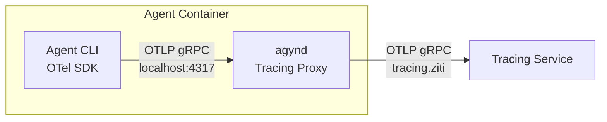

# Tracing

## Overview

The Tracing service ingests, stores, and queries span data. It implements the standard [OpenTelemetry](https://opentelemetry.io/) Collector `TraceService/Export` gRPC interface with one behavioral extension: **upsert semantics for in-progress spans**. Standard OpenTelemetry assumes spans are exported once after completion. Agyn needs visibility into ongoing agent operations, so producers export the same span multiple times — first while in progress, then again when completed. The Tracing service detects duplicates by `(trace_id, span_id)` and patches the existing record instead of inserting a new one.

Tracing captures the **full LLM call context** — the complete request body (all messages sent to the model) for each LLM call. This makes tracing the primary source for debugging and inspecting what the model saw at each step. Due to the volume of data, tracing has shorter retention than conversation records in [Threads](threads.md). See [Agent State — Isolation](agent/state.md#isolation) for how this fits into the platform's data separation model.

## Responsibilities

- **Ingest** spans via the standard OTLP gRPC interface with upsert semantics.
- **Store** spans in PostgreSQL.
- **Query** traces and spans for the observability UI (list, filter, detail).
- **Push notifications** on span creation and update so the UI receives real-time changes without polling.

## Integration

Tracing is an **optional** dependency for agents. Agents can run without a tracing endpoint configured.

## Ingestion

### Protocol

The Tracing service implements the standard OTLP Collector gRPC interface:

```
opentelemetry.proto.collector.trace.v1.TraceService/Export
```

| Field | Type | Description |
|-------|------|-------------|
| `resource_spans` | repeated `ResourceSpans` | Standard OTLP envelope — resources → scopes → spans |

Standard OTel SDK exporters (Go, Python, JS, etc.) can point their OTLP gRPC exporter at the Tracing service endpoint without modification.

### Upsert Semantics

For each span in the request, the service performs an upsert keyed on `(trace_id, span_id)`:

- **No existing record** → insert.
- **Existing record** → patch all fields with the incoming values.

This allows producers to export a span multiple times during its lifecycle. The first export creates the record; subsequent exports update it as the operation progresses (new attributes, events, status changes, end time).

### In-Progress Detection

A span is considered **in-progress** when `end_time_unix_nano = 0`. A non-zero `end_time_unix_nano` indicates the span is **completed**.

Producers set `end_time_unix_nano = 0` on intermediate exports and set the real end time on the final export.

### Response

The service returns the standard `ExportTraceServiceResponse`:

| Field | Type | Description |
|-------|------|-------------|
| `partial_success.rejected_spans` | int64 | Number of spans rejected (0 = fully accepted) |
| `partial_success.error_message` | string | Human-readable explanation if spans were rejected |

## Data Model

### Span (stored)

Each span is stored as a row in PostgreSQL. The schema follows the [OTel Span](https://buf.build/opentelemetry/opentelemetry/docs/main:opentelemetry.proto.trace.v1#opentelemetry.proto.trace.v1.Span) data model.

| Field | Type | Description |
|-------|------|-------------|
| `trace_id` | bytes (16) | Trace identifier |
| `span_id` | bytes (8) | Span identifier |
| `trace_state` | string | W3C trace-context trace state |
| `parent_span_id` | bytes (8) | Parent span identifier (empty for root spans) |
| `flags` | uint32 | W3C trace flags + OTel span flags |
| `name` | string | Operation name |
| `kind` | enum | `UNSPECIFIED`, `INTERNAL`, `SERVER`, `CLIENT`, `PRODUCER`, `CONSUMER` |
| `start_time_unix_nano` | fixed64 | Span start time (nanoseconds since epoch) |
| `end_time_unix_nano` | fixed64 | Span end time (0 = in-progress) |
| `attributes` | repeated KeyValue | Span attributes |
| `events` | repeated Event | Timestamped span events |
| `links` | repeated Link | Links to other spans |
| `status` | Status | Status code (`UNSET`, `OK`, `ERROR`) and message |
| `dropped_attributes_count` | uint32 | Number of dropped attributes |
| `dropped_events_count` | uint32 | Number of dropped events |
| `dropped_links_count` | uint32 | Number of dropped links |

**Resource** and **InstrumentationScope** metadata from the OTLP envelope are stored alongside the span (flattened or as JSONB columns — implementation detail).

Query API responses use the standard OTel envelope hierarchy (`ResourceSpans` -> `ScopeSpans` -> `Span`) to return Resource and InstrumentationScope context alongside each span. This avoids custom wrapper types and follows the same pattern as Jaeger v3 QueryService.

Primary key: `(trace_id, span_id)`.

### Indexes

| Index | Purpose |
|-------|---------|
| `(trace_id)` | Fetch all spans for a trace |
| `(start_time_unix_nano)` | Time-range queries and ordering |
| `(parent_span_id)` | Tree reconstruction |

## Query API

Defined in `agynio/api` at `proto/agynio/api/tracing/v1/tracing.proto`.

| RPC | Description |
|-----|-------------|
| `ListSpans` | Paginated span listing with filters |
| `GetSpan` | Single span by `(trace_id, span_id)` |
| `GetTrace` | All spans for a `trace_id` |

### ListSpans

Returns a paginated list of spans matching the provided filters.

**Request:**

| Field | Type | Description |
|-------|------|-------------|
| `filter` | `SpanFilter` | Filter criteria (all optional, AND-combined) |
| `page_size` | int32 | Maximum number of spans to return |
| `page_token` | string | Pagination cursor from previous response |
| `order_by` | enum | `START_TIME_DESC` (default), `START_TIME_ASC` |

**SpanFilter:**

| Field | Type | Description |
|-------|------|-------------|
| `trace_id` | bytes | Filter by trace |
| `parent_span_id` | bytes | Filter by parent span |
| `name` | string | Filter by operation name (exact match) |
| `kind` | SpanKind | Filter by span kind |
| `start_time_min` | fixed64 | Start time lower bound (inclusive) |
| `start_time_max` | fixed64 | Start time upper bound (inclusive) |
| `in_progress` | optional bool | `true` = only in-progress, `false` = only completed, unset = both |

**Response:**

| Field | Type | Description |
|-------|------|-------------|
| `resource_spans` | repeated `ResourceSpans` | Matching spans in the standard OTel envelope hierarchy (ResourceSpans -> ScopeSpans -> Span). Spans sharing a Resource and InstrumentationScope are grouped. Page size applies to total Span count. |
| `next_page_token` | string | Cursor for next page (empty = no more results) |

### GetSpan

Returns a single span.

**Request:**

| Field | Type | Description |
|-------|------|-------------|
| `trace_id` | bytes (16) | Trace identifier |
| `span_id` | bytes (8) | Span identifier |

**Response:**

| Field | Type | Description |
|-------|------|-------------|
| `resource_spans` | repeated `ResourceSpans` | The span in its OTel envelope (one ResourceSpans -> one ScopeSpans -> one Span) |

### GetTrace

Returns all spans belonging to a trace.

**Request:**

| Field | Type | Description |
|-------|------|-------------|
| `trace_id` | bytes (16) | Trace identifier |

**Response:**

| Field | Type | Description |
|-------|------|-------------|
| `resource_spans` | repeated `ResourceSpans` | All spans in the trace, grouped by Resource and InstrumentationScope |

## Notifications

On every span insert or update, the Tracing service publishes an event to the [Notifications](notifications.md) service.

| Event | Room | Published when |
|-------|------|----------------|
| `span.created` | `trace:{trace_id}` | A new span is inserted |
| `span.updated` | `trace:{trace_id}` | An existing span is patched via upsert |

The UI subscribes to `trace:{trace_id}` to receive real-time updates for all spans within a trace being viewed. This enables live visualization of in-progress operations without polling.

## External API

The [Gateway](gateway.md) exposes the Tracing query API via `TracingGateway`:

| Gateway RPC | Internal RPC |
|-------------|-------------|
| `ListSpans` | `TracingService.ListSpans` |
| `GetSpan` | `TracingService.GetSpan` |
| `GetTrace` | `TracingService.GetTrace` |

The ingestion endpoint (`TraceService/Export`) is not proxied through the Gateway. Producers (agents) connect to the Tracing service via its own [OpenZiti service](#ingestion-authentication) (`tracing.ziti`). The [`agynd` tracing proxy](#agynd-tracing-proxy) inside the agent container enriches spans with platform context before forwarding to the Tracing service.

## Authentication and Authorization

### Ingestion Authentication

The Tracing service participates in the OpenZiti overlay. It obtains its identity at runtime via [self-enrollment](openziti.md#service-identity-self-enrollment) through [Ziti Management](openziti.md#ziti-management-service), the same pattern as the Gateway and LLM Proxy.

| Aspect | Detail |
|--------|--------|
| Role attributes | `["tracing-hosts"]` |
| Service name | `tracing` |
| Enrollment | Self-enrollment via Ziti Management at pod startup |
| SDK usage | `zitiContext.ListenWithOptions("tracing", ...)` — binds the `tracing` service |

Agents connect to the Tracing service via the `tracing.ziti` OpenZiti hostname, transparently intercepted by the pod's Ziti sidecar. Authentication is mTLS — the Tracing service extracts the caller's OpenZiti identity from the connection via `conn.GetDialerIdentityId()` and resolves it to a platform identity via [Ziti Management](openziti.md) `ResolveIdentity`, the same mechanism as the [Gateway](gateway.md) and [LLM Proxy](llm-proxy.md).

Any authenticated agent can export spans. There is no authorization check on the ingestion path — if the agent has a valid OpenZiti identity, it can export. Per-span attribute verification is described in [Attribute Injection and Verification](#attribute-injection-and-verification).

#### Static Policies

Two new static policies at bootstrap:

| Policy | Type | Identity Roles | Service Roles | Purpose |
|--------|------|---------------|---------------|---------|
| `agents-dial-tracing` | Dial | `#agents` | `@tracing` | Agents can reach Tracing service |
| `tracing-bind` | Bind | `#tracing-hosts` | `@tracing` | Tracing service hosts the `tracing` service |

### Query Authorization

The query API is proxied through the [Gateway](gateway.md) via `TracingGateway`. The Gateway authenticates the caller (OIDC, API token, or OpenZiti). Query results are scoped by organization — a caller must be a member of an organization to view traces attributed to that organization:

```
Check(identity:<callerId>, member, organization:<orgId>) → allowed: bool
```

The `organization_id` filter is a required parameter on `ListSpans`. `GetTrace` and `GetSpan` check the caller's membership in the organization associated with the returned trace data.

### Attribute Injection and Verification

Producers (agent CLIs) do not set platform-specific resource attributes. The Tracing service derives and injects identity-based attributes from the authenticated connection, and verifies the one self-asserted attribute (`agyn.thread.id`).

#### Injected by the Tracing service (from connection identity)

On each `Export` request, the Tracing service resolves the caller's identity chain and **overwrites** the following resource attributes on every `ResourceSpans` in the request:

| Resource Attribute | Source | Description |
|--------------------|--------|-------------|
| `agyn.identity.id` | OpenZiti mTLS → `ZitiManagement.ResolveIdentity` | Platform identity UUID |
| `agyn.agent.id` | `Agents.ResolveAgentIdentity(identity_id)` | Agent resource UUID |
| `agyn.organization.id` | `Agents.ResolveAgentIdentity(identity_id)` | Organization UUID |

These attributes are never trusted from the producer. The Tracing service always overwrites them with values derived from the verified network identity. This prevents a compromised agent pod from misattributing spans to a different agent or organization.

#### Verified by the Tracing service (from producer)

The `agynd` tracing proxy (see [agynd Tracing Proxy](#agynd-tracing-proxy)) injects `agyn.thread.id` as a resource attribute on all exported spans. The Tracing service verifies this attribute against the [Authorization](authz.md) service:

```
Check(identity:<identity_id>, can_read, thread:<thread_id>) → allowed: bool
```

If the check fails, the Tracing service rejects the entire `Export` request. If `agyn.thread.id` is absent, spans are stored without thread attribution.

#### Resolution Caching

The identity chain resolution (`identity_id → agent_id, organization_id`) and thread authorization checks are cached in an LRU cache.

| Aspect | Detail |
|--------|--------|
| Cache type | LRU |
| Cache keys | `identity_id` (for identity chain), `(identity_id, thread_id)` (for thread authorization) |
| Max entries | Configurable, default `1000` |
| Invalidation | TTL-based. Agent pod identities are ephemeral — entries expire naturally |

### Agents Service: ResolveAgentIdentity

The [Agents](agents-service.md) service provides a new method for resolving an agent's identity to its resource metadata:

| Method | Description |
|--------|-------------|
| `ResolveAgentIdentity` | Given an `identity_id`, return the agent's resource ID and organization ID |

**Request:**

| Field | Type | Description |
|-------|------|-------------|
| `identity_id` | string (UUID) | Platform identity UUID |

**Response:**

| Field | Type | Description |
|-------|------|-------------|
| `agent_id` | string (UUID) | Agent resource UUID |
| `organization_id` | string (UUID) | Organization the agent belongs to |

Returns `NOT_FOUND` if the identity does not correspond to an agent. This method is internal — not exposed through the Gateway.

## agynd Tracing Proxy

`agynd` runs a local OTLP gRPC proxy inside the agent container. Agent CLIs export spans to this local endpoint instead of connecting to the Tracing service directly.

### Why

Agent CLIs (Codex, Claude Code, `agn`) are the OTel span producers, but they have no knowledge of platform-specific resource attributes (`agyn.thread.id`). `agynd` is the only process in the agent container that has the full platform context (agent ID, thread ID). Rather than requiring each agent CLI to inject platform attributes — which is impossible for third-party binaries — `agynd` intercepts span exports and enriches them.

### Design



1. `agynd` starts a gRPC server on `localhost:4317` implementing `TraceService/Export` (standard OTLP Collector interface).
2. Agent CLI's OTel SDK is configured to export to `http://localhost:4317` (the default OTLP gRPC endpoint).
3. On each `Export` request, `agynd` injects `agyn.thread.id` as a resource attribute on every `ResourceSpans` in the request. The value comes from the `THREAD_ID` environment variable.
4. `agynd` forwards the enriched request to the Tracing service at `tracing.ziti` using a standard OTLP gRPC exporter. The Ziti sidecar transparently intercepts this connection.

### What agynd injects

| Resource Attribute | Source | Description |
|--------------------|--------|-------------|
| `agyn.thread.id` | `THREAD_ID` environment variable | Thread UUID this workload serves |

`agynd` does **not** inject `agyn.agent.id`, `agyn.identity.id`, or `agyn.organization.id`. These are derived and injected by the Tracing service from the verified OpenZiti connection identity. This separation ensures that even if `agynd` is compromised, it cannot forge agent or organization attribution — only thread attribution, which is independently verified by the Tracing service.

### Agent CLI Configuration

`agynd` configures the agent CLI's OTel exporter endpoint as part of its [environment preparation](agynd-cli.md#responsibilities). The mechanism is agent-specific:

| Agent CLI | Configuration |
|-----------|--------------|
| **Codex** | `OTEL_EXPORTER_OTLP_ENDPOINT=http://localhost:4317` environment variable |
| **Claude Code** | `OTEL_EXPORTER_OTLP_ENDPOINT=http://localhost:4317` environment variable |
| **agn** | `OTEL_EXPORTER_OTLP_ENDPOINT=http://localhost:4317` environment variable |

Standard OTel SDK environment variables are supported by all three agent CLIs. No agent-specific tracing configuration is needed.

### Proxy Behavior

- The proxy is **pass-through** — it does not interpret span content beyond injecting the `agyn.thread.id` resource attribute.
- If `THREAD_ID` is not set (should not happen in normal operation), the proxy forwards spans without injecting `agyn.thread.id`. The Tracing service stores them without thread attribution.
- If the Tracing service is unreachable, the proxy returns the standard OTLP error response. Agent CLIs handle export failures according to their OTel SDK retry configuration. Tracing is an optional dependency — export failures do not affect agent operation.

## Configuration

| Field | Source | Description |
|-------|--------|-------------|
| `ZITI_MANAGEMENT_ADDRESS` | Deployment config | gRPC address of the [Ziti Management](openziti.md) service |
| `AGENTS_SERVICE_ADDRESS` | Deployment config | gRPC address of the [Agents](agents-service.md) service |
| `AUTHORIZATION_SERVICE_ADDRESS` | Deployment config | gRPC address of the [Authorization](authz.md) service |
| `IDENTITY_RESOLUTION_CACHE_SIZE` | Deployment config | Max LRU cache entries for identity chain resolution (default: `1000`) |
| `THREAD_AUTH_CACHE_SIZE` | Deployment config | Max LRU cache entries for thread authorization checks (default: `1000`) |

## Classification

| Aspect | Detail |
|--------|--------|
| **Plane** | Data |
| **API** | gRPC — OTLP `TraceService/Export` (ingestion via OpenZiti) + `TracingService` (query) |
| **State** | PostgreSQL |
| **Scaling** | Scales with ingestion volume and query traffic |
| **Failure impact** | Temporary loss drops incoming spans; existing data remains queryable after recovery |
