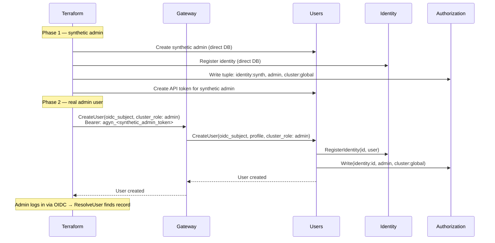
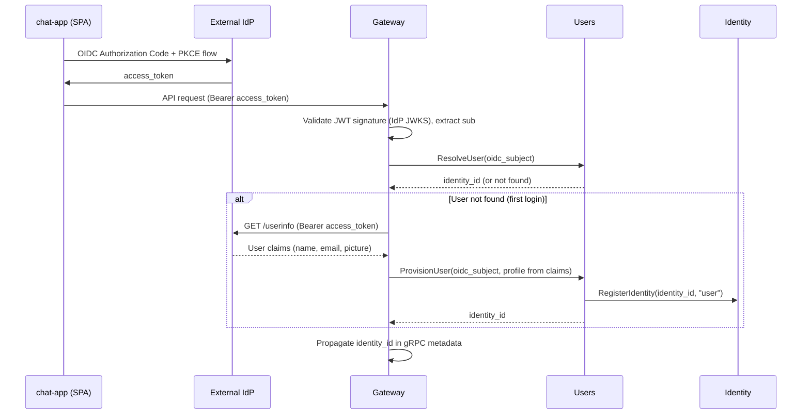

# Users

## Overview

The Users service manages user identity records and user profiles. It is the source of truth for user existence and user-facing metadata (name, nickname, photo).

User records are system-wide — not scoped to an organization. User-to-organization membership is managed through [Authorization](authz.md) (OpenFGA relationship tuples). See [Organizations](organizations.md).

## Responsibilities

| Concern | Description |
|---------|-------------|
| **User resolution** | Resolve an OIDC subject to a platform `identity_id` |
| **User provisioning** | Create a user record on first login. Maps the IdP subject to a platform `identity_id`. Registers the identity in the [Identity](identity.md) service |
| **User profile** | Store and serve user profile data (name, nickname, photo URL) |
| **User lookup** | Resolve a user by `identity_id` or by OIDC subject |
| **Batch profile resolution** | Return profiles for a list of identity IDs |
| **API token management** | Create, list, revoke, and resolve [API tokens](api-tokens.md) for programmatic access |

## User Model

| Field | Type | Description |
|-------|------|-------------|
| `identity_id` | string (UUID) | Platform identity identifier |
| `oidc_subject` | string | Subject claim (`sub`) from the IdP. Unique. Used to match returning users |
| `name` | string | Display name |
| `nickname` | string | Short name or handle |
| `photo_url` | string | Profile photo URL |
| `created_at` | timestamp | When the user was first provisioned |
| `updated_at` | timestamp | Last profile update |

## Internal Interface

Internal methods are called over Istio by other platform services. They are not exposed through the [Gateway](gateway.md).

| Method | Description |
|--------|-------------|
| **ResolveUser** | Look up a user by OIDC subject. Returns `identity_id` if found, not-found otherwise |
| **ProvisionUser** | Provision a new user record from OIDC subject and profile claims. Registers the identity in the [Identity](identity.md) service. Returns `identity_id`. Called by the Gateway during OIDC auto-provisioning |
| **GetUser** | Return a user profile by `identity_id` |
| **BatchGetUsers** | Return profiles for a list of identity IDs |
| **CreateAPIToken** | Create an [API token](api-tokens.md) for the calling user. Returns the plaintext token once |
| **ListAPITokens** | List API tokens for the calling user. Returns metadata only (never the token value) |
| **RevokeAPIToken** | Delete an API token by ID. Caller must own the token |
| **ResolveAPIToken** | Look up an API token by hash. Returns `identity_id` if valid. Called by the Gateway |

## Admin User Management

The Users service provides CRUD methods for cluster administrators to manage platform users. These methods are exposed through the [Gateway](gateway.md) via `UsersGateway`. All require `cluster:global admin` authorization — the Users service checks `Authorization.Check(identity:<callerId>, admin, cluster:global)` before proceeding.

| Method | Description |
|--------|-------------|
| **CreateUser** | Create a user with OIDC subject, profile fields, and optional cluster role. Registers identity. Returns `identity_id` |
| **GetUser** | Get a user by `identity_id`. Returns profile and cluster role |
| **ListUsers** | List all platform users. Paginated, filterable |
| **UpdateUser** | Update profile fields and cluster role |
| **DeleteUser** | Delete user record, identity registration, and cluster role tuple |

### CreateUser

**Request:**

| Field | Type | Required | Description |
|-------|------|----------|-------------|
| `oidc_subject` | string | Yes | OIDC subject claim. Must be unique |
| `name` | string | No | Display name |
| `nickname` | string | No | Short name or handle |
| `photo_url` | string | No | Profile photo URL |
| `cluster_role` | enum | No | `admin`. If set, writes OpenFGA tuple: `identity:<id>, admin, cluster:global` |

**Behavior:**

1. Create user record with `oidc_subject` and profile fields.
2. Register identity in the [Identity](identity.md) service (`identity_type: user`).
3. If `cluster_role` is set, write OpenFGA tuple: `identity:<id>, admin, cluster:global`.
4. Return the created user with `identity_id`.

Organization membership is managed by the [Organizations](organizations.md) service.

When the user logs in via OIDC, `ResolveUser` finds the record — `ProvisionUser` is not called.

### UpdateUser

Updates profile fields and/or `cluster_role`. Organization membership is managed by the [Organizations](organizations.md) service.

### DeleteUser

Deletes the user record, the identity registration in the [Identity](identity.md) service, and all OpenFGA relationship tuples for the user (cluster admin, organization memberships). This is a hard delete — the user must be re-created to regain access.

### Bootstrap Flow

The first cluster admin is provisioned during Terraform bootstrap via `CreateUser`:

## Resolution and Provisioning Flow

The Gateway calls the Users service on every authenticated user request. Resolution and provisioning are separate operations:

**ResolveUser** is called on every request. It is a fast lookup by OIDC subject — the hot path.

**ProvisionUser** is called only when `ResolveUser` returns not-found (first login). The Gateway fetches profile claims from the IdP's [UserInfo endpoint](https://openid.net/specs/openid-connect-core-1_0.html#UserInfo) and passes them to `ProvisionUser`. The Users service generates an `identity_id`, registers it in the [Identity](identity.md) service, and stores the user record.

Initial profile fields (name, email, picture) are populated from the IdP UserInfo response at provisioning time.

## Consumers

| Consumer | Usage |
|----------|-------|
| **Gateway** | Resolve OIDC subject → `identity_id` on every request (`ResolveUser`). Provision new users on first login (`ProvisionUser`). Resolve [API tokens](api-tokens.md) → `identity_id` (`ResolveAPIToken`) |
| **Chat** | Resolve user profiles for message display (sender name, photo) |
| **[Console](console.md)** | User management (CRUD), profile display. Cluster admin only |
| **[Terraform Provider](operations/terraform-provider.md)** | `agyn_user` resource — create and manage users as code |

## Data Store

PostgreSQL. System-wide `users` and `user_api_tokens` tables. See [API Tokens](api-tokens.md) for the token model.

## Classification

**Data plane** — on the hot path for user authentication and profile resolution.
