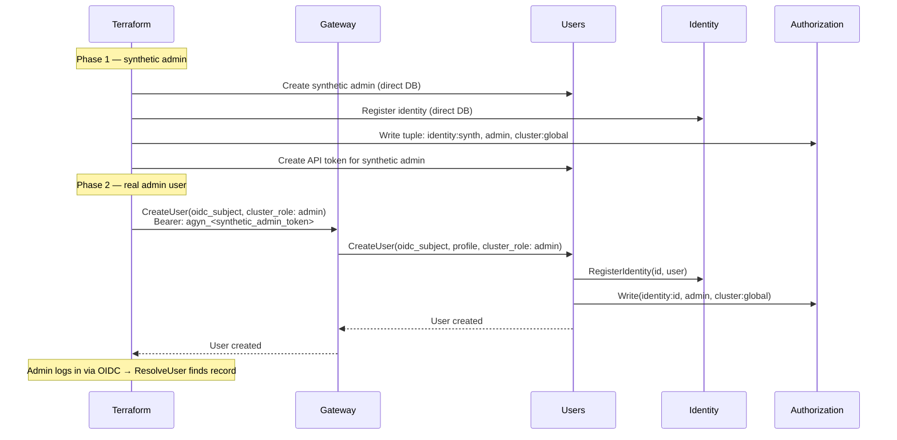
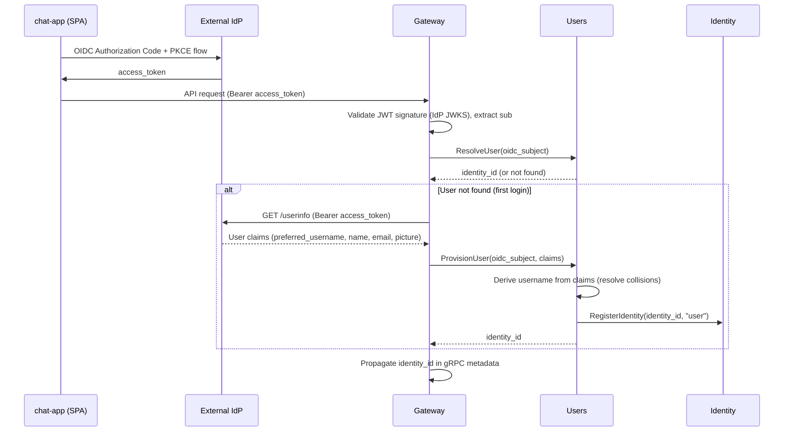
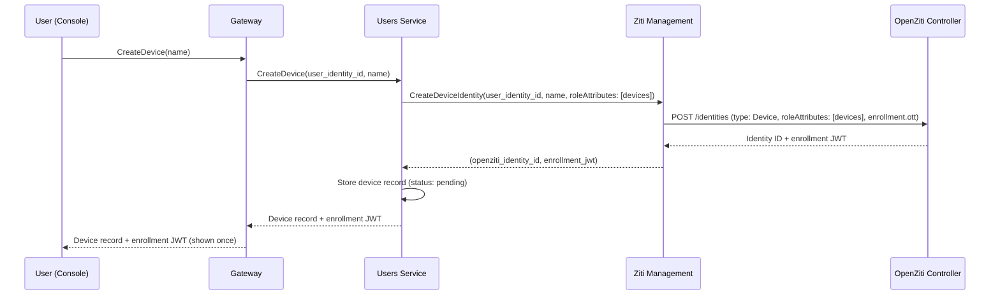

# Users

## Overview

The Users service manages user identity records and user profiles. It is the source of truth for user existence and user-facing metadata (name, username, nickname, photo).

User records are system-wide — not scoped to an organization. User-to-organization membership is managed through [Authorization](authz.md) (OpenFGA relationship tuples). See [Organizations](organizations.md).

## Responsibilities

| Concern | Description |
|---------|-------------|
| **User resolution** | Resolve an OIDC subject to a platform `identity_id` |
| **User provisioning** | Create a user record on first login. Maps the IdP subject to a platform `identity_id`. Registers the identity in the [Identity](identity.md) service. Assigns a cluster-wide `username` (see [Username](#username)) |
| **User profile** | Store and serve user profile data (name, username, nickname, photo URL) |
| **User lookup** | Resolve a user by `identity_id` or by OIDC subject |
| **User search** | Prefix-search platform users by `username` for discovery in invite flows |
| **Batch profile resolution** | Return profiles for a list of identity IDs |
| **API token management** | Create, list, revoke, and resolve [API tokens](api-tokens.md) for programmatic access |

## User Model

| Field | Type | Description |
|-------|------|-------------|
| `identity_id` | string (UUID) | Platform identity identifier |
| `oidc_subject` | string | Subject claim (`sub`) from the IdP. Unique. Used to match returning users |
| `username` | string | Cluster-wide handle. Unique. Pattern `^[a-z0-9_-]+$`, max 32 chars. See [Username](#username) |
| `name` | string | Display name |
| `photo_url` | string | Profile photo URL |
| `created_at` | timestamp | When the user was first provisioned |
| `updated_at` | timestamp | Last profile update |

A user's `@mention` handle (`nickname`) is per-organization and independent of `username`. It is updated via the standard profile update method with an `org_id` + `nickname` field. Uniqueness within the org is enforced by the [Identity](identity.md) service. When a user first becomes an active member of an organization, their current `username` is copied into `org_nicknames` as a default (see [Organizations — Members Management](organizations.md#members-management)).

## Username

`username` is a cluster-wide unique handle used for user discovery in invite flows and as the default per-organization nickname. It is distinct from `nickname`, which is always org-scoped.

| Property | Value |
|----------|-------|
| Scope | Cluster-wide |
| Uniqueness | Unique across all users |
| Pattern | `^[a-z0-9_-]+$` |
| Max length | 32 characters |
| Renameable | Yes, freely by the user |
| Rename cascade | None — existing `org_nicknames` entries are independent and unchanged |

### Derivation at Provisioning

`ProvisionUser` assigns a `username` deterministically from the OIDC claims, in this order of precedence:

1. `preferred_username` claim, if present and non-empty
2. Local part of the `email` claim (everything before `@`)
3. `name` claim
4. `user-<first 8 hex chars of sha256(oidc_subject)>`

The selected value is then normalized:

1. Lowercase.
2. Replace any character outside `[a-z0-9_-]` with `-`.
3. Collapse consecutive `-` characters into a single `-`.
4. Strip leading and trailing `-`.
5. Truncate to 32 characters.

If the normalized value is empty after step 5, fall back to option 4 above.

### Collision Handling

If the normalized value is already taken, append `-2`, `-3`, …, `-99` and retry. If all numeric suffixes are taken, append `-` followed by 4 random lowercase alphanumeric characters and retry up to 5 times. If all attempts fail, provisioning returns an error — the user must be created manually via admin `CreateUser` with an explicit `username`.

### Rename

Users rename their `username` via the standard profile update method. The service validates the new value against the pattern and uniqueness constraint. Renames do not propagate to existing `org_nicknames` rows — users or org owners update those separately if desired.

## Internal Interface

Internal methods are called over Istio by other platform services. They are not exposed through the [Gateway](gateway.md).

| Method | Description |
|--------|-------------|
| **ResolveUser** | Look up a user by OIDC subject. Returns `identity_id` if found, not-found otherwise |
| **ProvisionUser** | Provision a new user record from OIDC subject and profile claims. Registers the identity in the [Identity](identity.md) service. Assigns a `username` derived from the claims (see [Username — Derivation at Provisioning](#derivation-at-provisioning)). Returns `identity_id`. Called by the Gateway during OIDC auto-provisioning |
| **GetUser** | Return a user profile by `identity_id` |
| **BatchGetUsers** | Return profiles for a list of identity IDs |
| **CreateAPIToken** | Create an [API token](api-tokens.md) for the calling user. Returns the plaintext token once |
| **ListAPITokens** | List API tokens for the calling user. Returns metadata only (never the token value) |
| **RevokeAPIToken** | Delete an API token by ID. Caller must own the token |
| **ResolveAPIToken** | Look up an API token by hash. Returns `identity_id` if valid. Called by the Gateway |

## Current User

The Users service exposes a method for the calling user to retrieve their own profile and cluster role. Exposed through the [Gateway](gateway.md) via `UsersGateway`. Requires only that the caller is authenticated — no additional authorization.

| Method | Description |
|--------|-------------|
| **GetMe** | Return the calling user's profile and cluster role. Identity is resolved from the request context — no `identity_id` parameter. Returns the same shape as admin `GetUser`: profile fields and `cluster_role` |

## User Directory

The Users service exposes a prefix-search endpoint so any authenticated caller can discover other platform users by `username`. Used primarily by the [Console](console.md) invite form in [Members Management](organizations.md#members-management) to resolve a username to an `identity_id`.

| Method | Description |
|--------|-------------|
| **SearchUsers** | Prefix-search platform users by `username`. Exposed through the [Gateway](gateway.md) via `UsersGateway`. Requires only that the caller is authenticated — no additional authorization |

### SearchUsers

**Request:**

| Field | Type | Required | Description |
|-------|------|----------|-------------|
| `prefix` | string | Yes | Username prefix. Must be at least 1 character, max 32. Matched case-insensitively against `username`. No wildcard syntax |
| `limit` | int | No | Maximum number of results. Default 10, maximum 20 |

**Response:** A list of redacted user profiles. Each entry contains `identity_id`, `username`, `name`, and `photo_url`. `oidc_subject`, `email`, and `cluster_role` are never returned by this method.

**Behavior:**

1. Validate the prefix against the pattern `^[a-z0-9_-]+$` (same pattern as `username`). Reject otherwise.
2. Return users whose `username` starts with the prefix, ordered by `username` ascending. Exact matches are returned first.
3. Rate-limit per caller to mitigate directory enumeration.

Search scope is limited to `username` only. Searching by `name`, `email`, or `oidc_subject` is not supported.

## Admin User Management

The Users service provides CRUD methods for cluster administrators to manage platform users. These methods are exposed through the [Gateway](gateway.md) via `UsersGateway`. All require `cluster:global admin` authorization — the Users service checks `Authorization.Check(identity:<callerId>, admin, cluster:global)` before proceeding.

| Method | Description |
|--------|-------------|
| **CreateUser** | Create a user with OIDC subject, profile fields, and optional cluster role. Registers identity. Returns `identity_id` |
| **GetUser** | Get a user by `identity_id`. Returns profile and cluster role |
| **GetUserByOIDCSubject** | Get a user by `oidc_subject`. Returns profile and cluster role. Used by the [Terraform Provider](operations/terraform-provider.md) data source to resolve existing users |
| **ListUsers** | List all platform users. Paginated, filterable |
| **UpdateUser** | Update profile fields and cluster role |
| **DeleteUser** | Delete user record, identity registration, and cluster role tuple |

### CreateUser

**Request:**

| Field | Type | Required | Description |
|-------|------|----------|-------------|
| `oidc_subject` | string | Yes | OIDC subject claim. Must be unique |
| `username` | string | No | Cluster-wide handle. If omitted, derived from `oidc_subject` using the [provisioning algorithm](#derivation-at-provisioning). Must match the username pattern and be unique |
| `name` | string | No | Display name |
| `photo_url` | string | No | Profile photo URL |
| `cluster_role` | enum | No | `admin`. If set, writes OpenFGA tuple: `identity:<id>, admin, cluster:global` |

**Behavior:**

1. Assign `username`: use the provided value if any, otherwise derive from `oidc_subject` and apply [collision handling](#collision-handling).
2. Create user record with `oidc_subject`, `username`, and profile fields.
3. Register identity in the [Identity](identity.md) service (`identity_type: user`).
4. If `cluster_role` is set, write OpenFGA tuple: `identity:<id>, admin, cluster:global`.
5. Return the created user with `identity_id`.

Organization membership is managed by the [Organizations](organizations.md) service.

When the user logs in via OIDC, `ResolveUser` finds the record — `ProvisionUser` is not called.

### GetUserByOIDCSubject

**Request:**

| Field | Type | Required | Description |
|-------|------|----------|-------------|
| `oidc_subject` | string | Yes | OIDC subject claim to look up |

**Response:** Same shape as `GetUser` — user profile fields, `identity_id`, and `cluster_role`.

**Behavior:** Look up a user by `oidc_subject`. Returns the user if found, not-found error otherwise. Requires `cluster:global admin` authorization (consistent with other admin user methods).

### UpdateUser

Updates profile fields and/or `cluster_role`. Organization membership is managed by the [Organizations](organizations.md) service.

### DeleteUser

Deletes the user record, the identity registration in the [Identity](identity.md) service, the cluster admin OpenFGA tuple (if any), and all organization memberships via the [Organizations](organizations.md) service. This is a hard delete — the user must be re-created to regain access.

### Bootstrap Flow

The first cluster admin is provisioned during Terraform bootstrap via `CreateUser`:

## Resolution and Provisioning Flow

The Gateway calls the Users service on every authenticated user request. Resolution and provisioning are separate operations:

**ResolveUser** is called on every request. It is a fast lookup by OIDC subject — the hot path.

**ProvisionUser** is called only when `ResolveUser` returns not-found (first login). The Gateway fetches profile claims from the IdP's [UserInfo endpoint](https://openid.net/specs/openid-connect-core-1_0.html#UserInfo) and passes them to `ProvisionUser`. The Users service generates an `identity_id`, derives a `username` from the claims (see [Derivation at Provisioning](#derivation-at-provisioning)), registers the identity in the [Identity](identity.md) service, and stores the user record.

Initial profile fields (name, photo) are populated from the IdP UserInfo response at provisioning time.

## Consumers

| Consumer | Usage |
|----------|-------|
| **Gateway** | Resolve OIDC subject → `identity_id` on every request (`ResolveUser`). Provision new users on first login (`ProvisionUser`). Resolve [API tokens](api-tokens.md) → `identity_id` (`ResolveAPIToken`) |
| **Chat** | Resolve user profiles for message display (sender name, photo) |
| **[Console](console.md)** | Current user context via `GetMe` (profile, cluster admin status). User management (CRUD) for cluster admins. Device management (create, list, delete). User discovery via `SearchUsers` for the [Members Management](organizations.md#members-management) invite form |
| **[Organizations](organizations.md)** | Read the current `username` of an activating member to seed a default `org_nicknames` entry |
| **[Terraform Provider](operations/terraform-provider.md)** | `agyn_user` resource — create and manage users as code. `data.agyn_user` data source — look up existing users by OIDC subject |

## Devices

Users register devices to access [exposed agent ports](expose-service.md) from their machines. Device management is part of the Users service because devices are user-scoped identity resources — similar to API tokens.

### Device Model

| Field | Type | Description |
|-------|------|-------------|
| `id` | string (UUID) | Unique device identifier |
| `user_identity_id` | string (UUID) | Owning user's identity ID |
| `name` | string | User-provided device name |
| `openziti_identity_id` | string | OpenZiti identity ID for this device |
| `enrollment_jwt` | string (nullable) | Enrollment JWT. Stored until enrollment completes, then cleared |
| `status` | enum | `pending` (JWT generated, not yet enrolled) or `enrolled` |
| `created_at` | timestamp | Creation time |

### Device Interface

| Method | Description |
|--------|-------------|
| **CreateDevice** | Register a device. Creates an OpenZiti identity via [Ziti Management](openziti.md) and returns the device record with enrollment JWT |
| **ListDevices** | List devices for the calling user |
| **DeleteDevice** | Delete a device and its OpenZiti identity. Caller must own the device |

### Device Enrollment Flow

The user copies the JWT and uses it in their Ziti tunnel client (Ziti Desktop Edge or `ziti-edge-tunnel`). The OpenZiti Controller handles enrollment directly — when the user's tunnel enrolls with the JWT, the Controller issues an x509 certificate. The Users service does not participate in the enrollment step.

Device status transitions from `pending` to `enrolled` when the Ziti tunnel enrolls. The Users service queries the OpenZiti Controller (via Ziti Management) to check enrollment status — this can be done on `ListDevices` calls or via a background check.

### Device OpenZiti Identity

| Field | Value |
|-------|-------|
| `name` | `device-<deviceId>` |
| `type` | `Device` |
| `roleAttributes` | `[devices]` |
| `externalId` | `<user_identity_id>` |
| `enrollment` | `{ ott: true }` |

The `devices` role attribute is used by Dial policies on exposed services. All enrolled devices can access all exposed services — scoped access control is not implemented in this version.

The enrollment JWT is shown once at creation time and cannot be retrieved again. If the user loses the JWT before enrolling, they must delete the device and create a new one.

### Ziti Management API Additions

| RPC | Caller | Description |
|-----|--------|-------------|
| `CreateDeviceIdentity` | Users Service | Create an OpenZiti identity for a user device with `roleAttributes: [devices]` and `enrollment.ott: true`. Returns the identity ID and enrollment JWT |
| `DeleteDeviceIdentity` | Users Service | Delete a device's OpenZiti identity |

## Data Store

PostgreSQL. System-wide `users`, `user_api_tokens`, and `user_devices` tables. See [API Tokens](api-tokens.md) for the token model.

## Classification

**Data plane** — on the hot path for user authentication and profile resolution.
