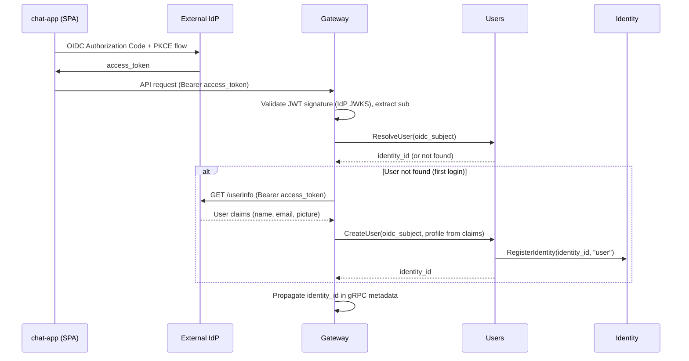

# Users

## Overview

The Users service manages user identity records and user profiles. It is the source of truth for user existence and user-facing metadata (name, nickname, photo).

User records are system-wide — not scoped to an organization. User-to-organization membership is managed through [Authorization](authz.md) (OpenFGA relationship tuples). See [Organizations](organizations.md).

## Responsibilities

| Concern | Description |
|---------|-------------|
| **User resolution** | Resolve an OIDC subject to a platform `identity_id` |
| **User provisioning** | Create a user record on first login. Maps the IdP subject to a platform `identity_id`. Registers the identity in the [Identity](identity.md) service |
| **User profile** | Store and serve user profile data (name, nickname, photo URL) |
| **User lookup** | Resolve a user by `identity_id` or by OIDC subject |
| **Batch profile resolution** | Return profiles for a list of identity IDs |

## User Model

| Field | Type | Description |
|-------|------|-------------|
| `identity_id` | string (UUID) | Platform identity identifier |
| `oidc_subject` | string | Subject claim (`sub`) from the IdP. Unique. Used to match returning users |
| `name` | string | Display name |
| `nickname` | string | Short name or handle |
| `photo_url` | string | Profile photo URL |
| `created_at` | timestamp | When the user was first provisioned |
| `updated_at` | timestamp | Last profile update |

## Interface

| Method | Description |
|--------|-------------|
| **ResolveUser** | Look up a user by OIDC subject. Returns `identity_id` if found, not-found otherwise |
| **CreateUser** | Provision a new user record from OIDC subject and profile claims. Registers the identity in the [Identity](identity.md) service. Returns `identity_id` |
| **GetUser** | Return a user profile by `identity_id` |
| **BatchGetUsers** | Return profiles for a list of identity IDs |

## Resolution and Provisioning Flow

The Gateway calls the Users service on every authenticated user request. Resolution and provisioning are separate operations:

**ResolveUser** is called on every request. It is a fast lookup by OIDC subject — the hot path.

**CreateUser** is called only when `ResolveUser` returns not-found (first login). The Gateway fetches profile claims from the IdP's [UserInfo endpoint](https://openid.net/specs/openid-connect-core-1_0.html#UserInfo) and passes them to `CreateUser`. The Users service generates an `identity_id`, registers it in the [Identity](identity.md) service, and stores the user record.

Initial profile fields (name, email, picture) are populated from the IdP UserInfo response at provisioning time.

## Consumers

| Consumer | Usage |
|----------|-------|
| **Gateway** | Resolve OIDC subject → `identity_id` on every request (`ResolveUser`). Provision new users on first login (`CreateUser`) |
| **Chat** | Resolve user profiles for message display (sender name, photo) |
| **UI** | Display user profile, profile editing |

## Data Store

PostgreSQL. System-wide `users` table.

## Classification

**Data plane** — on the hot path for user authentication and profile resolution.
