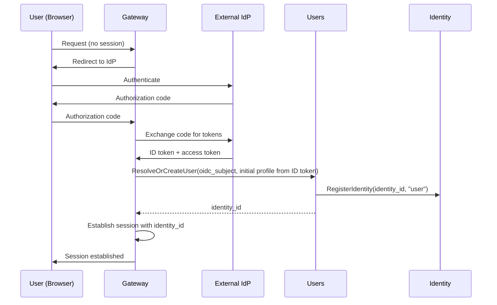

# Users

## Overview

The Users service manages user identity records and user profiles. It is the platform's source of truth for user existence and user-facing metadata (name, nickname, photo).

The Users service does not manage credentials — authentication is handled by an external OIDC provider via the [Gateway](gateway.md). It does not manage tenant access — that is determined by relationships in [OpenFGA](authz.md). It does not manage non-user identities — agents, channels, and runners are owned by the services that create them ([Teams](teams.md), [Channels](channels.md), etc.).

All user records are system-wide (not scoped to a tenant). A user exists independently of any tenant and may have access to zero or more tenants.

## Responsibilities

| Concern | Description |
|---------|-------------|
| **User provisioning** | Create a user record on first OIDC login. Maps the IdP subject to a platform `identity_id` |
| **User profile** | Store and serve user profile data (name, nickname, photo URL) |
| **User lookup** | Resolve a user by `identity_id` or by OIDC subject |
| **Batch profile resolution** | Return profiles for a list of identity IDs. Used by Chat, UI, and other consumers that display user information |

## User Model

| Field | Type | Description |
|-------|------|-------------|
| `identity_id` | string (UUID) | Platform identity identifier. Used as `identity_id` in request context and authorization |
| `oidc_subject` | string | Subject claim from the OIDC ID token. Unique. Used to match returning users |
| `name` | string | Display name |
| `nickname` | string | Short name or handle |
| `photo_url` | string | Profile photo URL |
| `created_at` | timestamp | When the user was first provisioned |
| `updated_at` | timestamp | Last profile update |

## Provisioning Flow

When a user authenticates via OIDC for the first time, the Gateway calls the Users service to provision a user record:

On subsequent logins, `ResolveOrCreateUser` returns the existing `identity_id` without creating a new record.

Initial profile fields (name, photo) are populated from the OIDC ID token claims at provisioning time. The user can update their profile later.

The Users service registers the identity in the [Identity](identity.md) service during provisioning. This allows other services to resolve the identity type from the opaque `identity_id`.

## Consumers

| Consumer | Usage |
|----------|-------|
| **Gateway** | Resolve OIDC subject → `identity_id` on every user authentication |
| **Chat** | Resolve user profiles for message display (sender name, photo) |
| **UI** | Display user profile, profile editing |

## Data Store

PostgreSQL. The `users` table is system-wide (not partitioned by tenant).

## Classification

The Users service is a **data plane** service — it is on the hot path for user authentication (Gateway calls it on every OIDC login) and profile resolution (Chat and UI call it to display user information).
