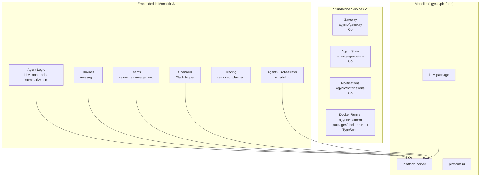

# Current State

Inventory of existing services and how they map to the target architecture.

## Service Status

## Standalone Services

### Gateway — `agynio/gateway`

| Aspect | Details |
|--------|---------|
| Language | Go |
| API | REST (OpenAPI 3.0.3), proxy to platform-server |
| Current scope | Team Management API (`/team/v1/`) with request/response validation. Proxies `/api/*` and `/health` to upstream platform-server |
| Ingress | `gateway.agyn.dev` (subdomain) and `agyn.dev/apiv2/` (path-based, prefix stripped). The UI uses the path-based route |
| Helm chart | `charts/gateway/` |
| Dependencies | Platform-server (upstream proxy target) |
| Gap | Currently proxies most routes to monolith. Needs to route to individual services as they are extracted |

### Agent State (APSS) — `agynio/agent-state`

| Aspect | Details |
|--------|---------|
| Language | Go |
| API | gRPC (`AgentStateService`) |
| Store | PostgreSQL |
| Helm chart | `charts/agent-state/` |
| Dependencies | PostgreSQL |
| Gap | Fully functional standalone service. Agent in monolith needs to be updated to use it remotely |

### Notifications — `agynio/notifications`

| Aspect | Details |
|--------|---------|
| Language | Go |
| API | gRPC (Publish, Subscribe), Socket.IO (external) |
| Store | Redis (pub/sub) |
| Helm chart | `charts/notifications/` |
| Dependencies | Redis |
| Gap | Fully functional standalone service |

### Docker Runner — `agynio/platform` (`packages/docker-runner`)

| Aspect | Details |
|--------|---------|
| Language | TypeScript |
| API | gRPC (`RunnerService`) |
| Auth | HMAC shared secret |
| Helm chart | `charts/docker-runner/` |
| Dependencies | Docker Engine (socket mount) |
| Gap | Lives in the platform monorepo but deploys independently. No k8s-runner equivalent yet |

## Embedded in Monolith

These components exist inside `agynio/platform` (`packages/platform-server`) and need extraction:

| Component | Current Location | Target |
|-----------|-----------------|--------|
| Agent logic (LLM loop, tools, summarization) | `packages/platform-server/src/nodes/agent/`, `packages/llm/` | Standalone agent container |
| Threads (messaging) | `packages/platform-server/src/agents/threads.controller.ts` | Standalone Threads service |
| Teams (resource management) | Partially extracted (Gateway proxies to platform-server) | Standalone Teams service |
| Channels (Slack trigger) | `packages/platform-server/src/nodes/` (trigger nodes) | Standalone Channels service |
| Agents orchestrator | `packages/platform-server/src/agents/` | Standalone control plane service. See [Agents Orchestrator](../architecture/agents-orchestrator.md) |
| Tracing | Removed (issue #760). Historical references remain | New standalone Tracing service |

### Platform UI — API Consumption

The web app (platform-ui) consumes two API base paths on the same origin (`agyn.dev`):

| Base Path | Backend | Content |
|-----------|---------|---------|
| `/api` | platform-server (monolith) | Legacy REST API — all current platform functionality |
| `/apiv2/` | gateway (new services) | New REST API — Team Management, future extracted services |

As services are extracted from the monolith and exposed through the gateway, endpoints migrate from `/api` to `/apiv2/`. The `/api` path will be removed when the monolith is fully decomposed.

## Monolith Components

### Platform Server — `packages/platform-server`

The current monolith that bundles most functionality:
- Graph runtime (live diff/apply engine)
- Agent execution (LLM loop, tools, MCP)
- Thread management
- REST API + Socket.IO
- Container lifecycle management (via docker-runner gRPC)

### Platform UI — `packages/platform-ui`

Web frontend (React/TypeScript):
- Agent builder (graph editor)
- Thread/conversation views
- Container monitoring

### LLM Package — `packages/llm`

Core LLM abstractions: `Loop`, `Reducer`, `Router`, `FunctionTool`, message types. Will move with the agent extraction.

## Infrastructure

| Component | Implementation |
|-----------|---------------|
| PostgreSQL | Primary store for platform-server, agent-state |
| Redis | Notifications pub/sub |
| Filesystem | Graph definitions (filesystem dataset at `GRAPH_REPO_PATH`) |
| Docker Engine | Workspace containers (via docker-runner) |
