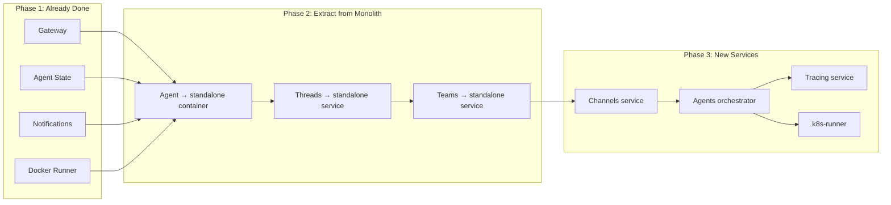

# Migration Roadmap

Steps to move from the current monolith (`agynio/platform`) to the target architecture.

## Migration Phases

## Phase 1 — Standalone Services (Done)

These services are already extracted and running independently:

| Service | Repo | Notes |
|---------|------|-------|
| Gateway | `agynio/gateway` | Serves Team API, proxies remaining to monolith |
| Agent State (APSS) | `agynio/agent-state` | gRPC service with PostgreSQL |
| Notifications | `agynio/notifications` | gRPC + Socket.IO, Redis pub/sub |
| Docker Runner | `agynio/platform` (separate deploy) | gRPC, HMAC auth, Helm chart |

## Phase 2 — Extract from Monolith

### Agent Extraction

Extract the agent from `platform-server` into a standalone container:

- **Move**: `packages/llm/` (Loop, Reducer, Router, FunctionTool, messages) and agent node logic from `packages/platform-server/src/nodes/agent/`.
- **Connect**: Agent State service (remote gRPC) for state persistence.
- **Connect**: MCP servers for tools.
- **Define**: Agent container interface and wrapper for 3rd-party CLI agents. See [open question](../open-questions.md#agent-protocol).

### Threads Extraction

Extract messaging from `platform-server` into a standalone Threads service:

- **Define**: gRPC API for Threads (CreateThread, ArchiveThread, AddParticipant, SendMessage, GetThreads, GetMessages).
- **Move**: Thread/message persistence from platform-server to dedicated service.
- **Update**: Gateway to route thread operations to the new service.

### Teams Extraction

Complete the extraction of team resource management:

- **Move**: Resource CRUD from platform-server to a standalone Teams service with its own data store.
- **Update**: Gateway to route directly to Teams service (remove platform-server proxy).

## Phase 3 — New Services

### Channels Service

New service implementing the channel interface:

- Bidirectional message translation (external ↔ threads).
- Channel configuration management (control plane side).
- Live connections to 3rd-party APIs (data plane side).
- Replace Slack trigger node from platform-server.

### Agents Orchestrator

New control plane service:

- Watch for threads with pending messages.
- Reconcile agent workloads via Runner.
- Manage agent lifecycle (start, monitor, stop).

### Tracing Service

New service replacing the removed tracing stack:

- Extended OpenTelemetry protocol for real-time in-progress events.
- Ingestion and query APIs.

### k8s-runner

Kubernetes-native Runner implementation:

- Same gRPC interface as docker-runner.
- Creates pods instead of Docker containers.
- Native volume, network, and scaling support.

## Gateway Evolution

As services are extracted, the Gateway evolves:

| Phase | Gateway Behavior |
|-------|-----------------|
| Current | Team API validated locally; everything else proxied to monolith |
| Phase 2 | Routes threads, teams to their standalone services |
| Phase 3 | Routes all traffic to individual services; monolith proxy removed |
