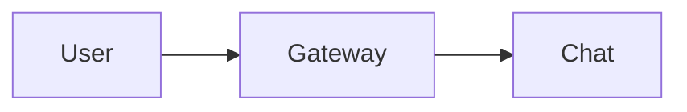

# Charts and Diagrams

## Purpose

Agents communicate analytical and structural information through charts and diagrams rendered inline in messages. Users read data visualizations and architecture sketches directly in the conversation without following a link or opening an attachment.

## Sources

Charts and diagrams appear in messages as fenced code blocks authored by agents (or users) in markdown:

1. **Charts** — a code block tagged `vega-lite` containing a [Vega-Lite](https://vega.github.io/vega-lite/) JSON specification. Used for bar charts, line charts, scatter plots, histograms, and other data visualizations.
2. **Diagrams** — a code block tagged `mermaid` containing [Mermaid](https://mermaid.js.org/) source text. Used for flowcharts, sequence diagrams, state diagrams, class diagrams, Gantt charts, and entity-relationship diagrams.

Example:

~~~markdown


```vega-lite
{
  "data": {"values": [{"x": 1, "y": 2}, {"x": 2, "y": 5}]},
  "mark": "bar",
  "encoding": {
    "x": {"field": "x", "type": "ordinal"},
    "y": {"field": "y", "type": "quantitative"}
  }
}
```
~~~

## Rendering

Charts and diagrams render inline where the code block appears in the message body, replacing the raw source. The rendered output fills the message column width and scales down on narrow viewports.

### Charts

Vega-Lite specifications render to SVG. Charts are interactive — tooltips appear on hover, and legends toggle series visibility. Axes, titles, and legends follow the chat theme (light/dark) automatically.

### Diagrams

Mermaid source renders to SVG. Diagrams follow the chat theme. Diagrams are not interactive beyond standard browser behavior (text selection, scrolling).

## Loading States

Rendering libraries (Vega-Lite, Mermaid) are loaded lazily on first appearance of a chart or diagram in the viewport. Until the library loads, the code block is displayed verbatim as a plain fenced code block.

## Error States

If a specification is invalid — malformed JSON for Vega-Lite, unparseable DSL for Mermaid — the renderer falls back to displaying the raw code block with an inline error banner explaining what failed. The message is never dropped or hidden.

## Copying

The rendered SVG can be saved via the browser's right-click "Save image as" action.

## Security

Chart and diagram rendering is fully client-side. No data leaves the browser during rendering.

- **No external data loading.** Vega-Lite specs that reference external `url` data sources are blocked — only inline `values` data is rendered. Agents embed data directly in the specification.
- **No remote fonts or images.** Mermaid and Vega-Lite are configured to use only fonts and images already available in the chat UI.
- **Sandboxed HTML output.** The SVG produced by each renderer is passed through the same sanitization schema used for the rest of the markdown pipeline before insertion.
- **No script execution.** Neither renderer evaluates arbitrary JavaScript from the source.

## Composer

The chat composer accepts `mermaid` and `vega-lite` fenced code blocks just like any other markdown. Users can paste a spec and see it rendered after sending.

## Constraints

- Rendering depends on the browser. Older browsers without SVG or modern JavaScript features fall back to the raw code block.
- Very large specifications (e.g., Vega-Lite with thousands of data points, Mermaid diagrams with hundreds of nodes) may render slowly. A size limit applies — above the limit, the raw code block is shown with a notice.
- Only `mermaid` and `vega-lite` are recognized as visualization languages. Other code block languages render as syntax-highlighted code.

## Related architecture

- [Product to architecture map (Chat)](../../maps/product-to-architecture.md#chat)
- [Chat — Message Rendering](../../architecture/chat.md#message-rendering)
